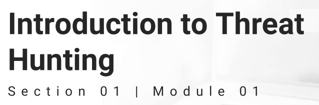
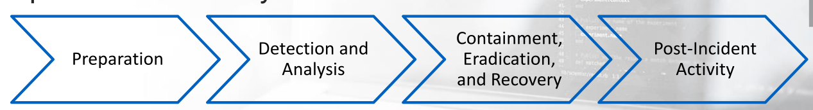
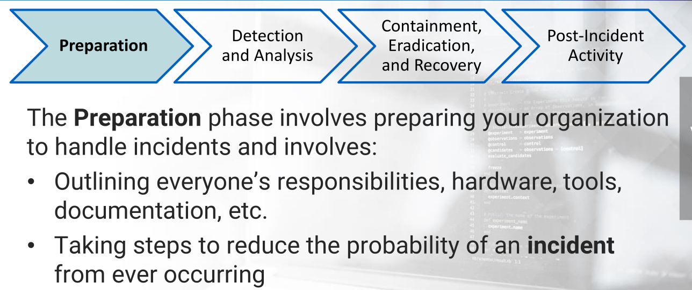
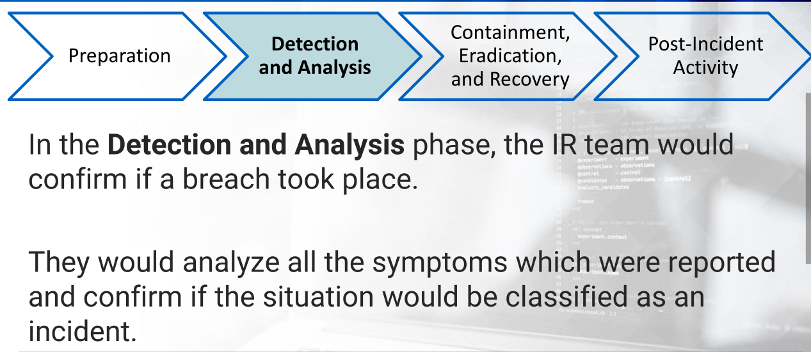
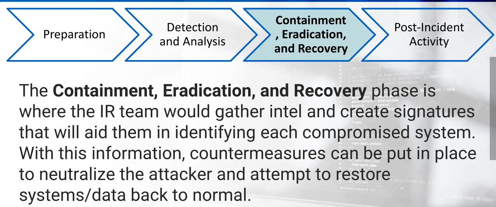
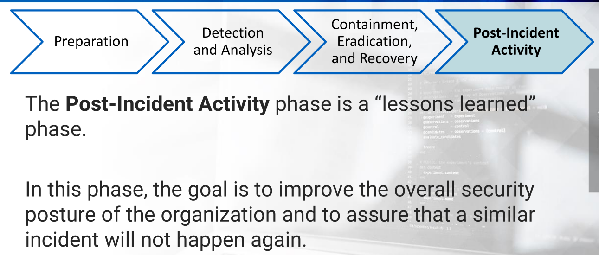
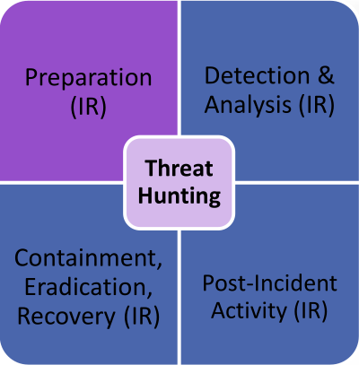

---

* IR = Incident Response

* TH = Threat Hunting

* **Threat Hunting** =>

  * is the human-centric process of proactively searching data and discovering cyber threats.
  * So, can say TH is the practice of searching for cyber threats

* The Hunter detects threats that nothing else detected

* Threat Hunting main aim => to reduce the dwell time by identifying threats in a very early stage of the infection

  * By this, it may be possible to prevent attackers from gaining a stronger foothold in the environment and remove them from the network

* Hunting Process 

  * begins by identifying potentially targeted systems or data and categorizing which behavioral techniques the attackers may use.
  *  The hunter attempts to locate and confirm abnormal activity.

* Hunting:

  * Is an offensive-based strategy
  * Requires the hunter to think like an attacker
  * Requires strong practical understanding of cyber threats and the cyber-kill chain
  * Requires you to know your environment
  * Is easier with quality data and resources

* Incident Response Process defined by NIST

  * 
  * 
  * 
  * 
  * 

* **Incident** =>

  * violation or imminent threat of violation of computer security policies

* 

* A Threat Hunter can't operate without Rules of Engagement

  * Organization provides documents to TH [documentation  which having policies and procedures]

* So, a TH investigate to get the indicate about having incident or not

* **Risk Assessment**

  * A risk assessment is the process of *assessing*    **threats,vulnerabilities and  their likelihood of occurring to the organization's assets.**
  * A risk assessment report will list all the vital systems / processes and the impact to the organization, if anything would happen to these systems.
  * This report provides the hunter with an idea as to what systems/processes an intruder would most likely go after.
  * With a risk assessment report, a hunter can determine where his/her focus should be
    * this way a Hunter will  not look for system again and again i.e. overlook
  * There are other documents that might assist the hunter in determining which systems/processes require more focus than others
  * Those documents would be a threat assessment report or a business impact analysis report.

* In large organization, it is not the job for TH to conduct Risk Assessment

* ### Threat Hunting Teams

  * Ad-hoc hunter =>

    * > Have multiple roles in the org. and hunt occur less frequently
      >
      > This type of hunter is primarily found in organizations with no formal security team.

  * Analyst and hunter =>

    * > Most common, in which SOC analysts also have the responsibility to perform hunting.
      >
      > a good hunter is a great analyst
      >
      > This type of hunter is often found in small organizations

  * Dedicated hunting team

    * > most specialized one - a team of few members whose sole purpose is to **hunt**
      >
      > well experienced members
      >
      > This type of hunter is often found in a large organization or governmental organizations.

---

