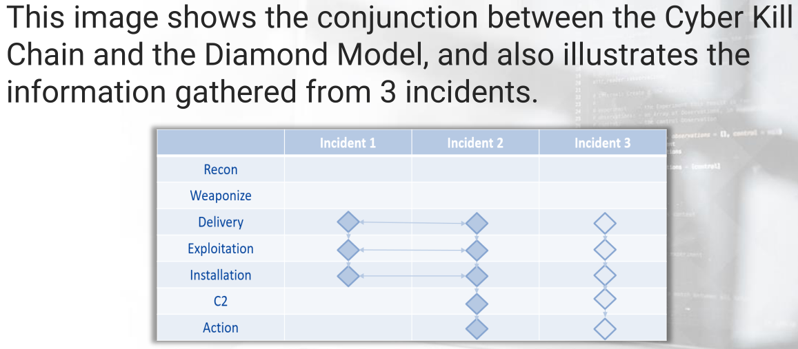
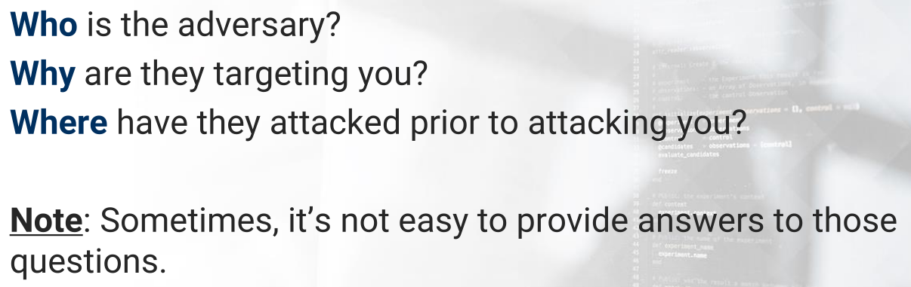
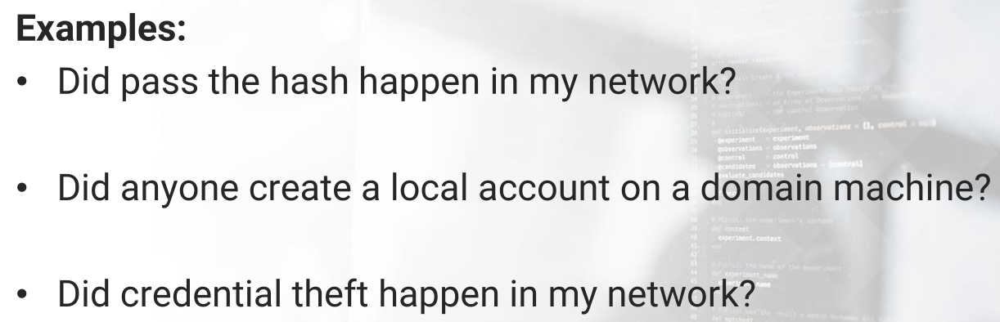

---

* ### APT => Advance Persistent Threat

  * APTs are **groups** or **nations-states** that have a significant amount of resources and infrastructure to conduct their malicious activities.

  * Their targets are in various industeries such as *governments*, *health care systems*, and *defense systems*

  * ### Stuxnet

    * **Stuxnet** was  a cyberweapon -  malicious software targeting  **IRAN's** nuclear weapon
    * It was designed to target Siemens Step7 software on computers controlling a PLC [programmable logic controller]

  * Naming convention => **APT 1** and so on

    * 

  * 

  * **APT 1** => Chinese-based cyber espionage group,  a **nation-state**

    * APT 1 is **the 2 nd Bureau of the People’s Liberation Army General Staff Department’s 3 rd Department**
    * this particular military unit referred to as **The People’s Liberation Army (PLA)**
    *  PLA Unit 61398.

  * A spreadsheet on  a list of APT Groups and operations => https://goo.gl/QEayyo

* ### Tactics, Techniques & Procedures [TTP]

  * or can say **Tools, Techniques and Procedures**

  * ### Tactics =>

    * are the employment and ordered arrangement of forces in relation to each other, which defines the adversary's tactical objective.
    * It is the "**why**" behind the
      reason for performing an action.

  * ### Techniques =>

    * are non-prescriptive ways or methods used to perform missions, functions, or tasks
    * this defines "how" the adversary achieves a tactical objective by performing an action

  * ### Procedures =>

    *  are standard, detailed steps that prescribe how to perform specific tasks
    *  It is the actual implementation of each Technique.

  * 

  * ### TTP - IOCs [Indicators of Compromise]

    * **IOCs** 
      * are artifacts that were gathered from an active intrusion or previous intrusion that are used to identify a particular adversary.
    * These artifacts include
      * MD5 hashes, IP addresses, names of EXEs used, etc.
    * APT 1 uses two custom utilities to steal emails from their victims :
      * 
      * 
      * 

* ### Pyramid of Pain

  * a visual that will layer the potential usefulness of indicators that will aid us in detecting an adversary

  * It also measures how difficult it will be to obtain that particular indicator or indicators, as well as the impact on  obtaining the intelligence on them.

  * Created by *David Bianco (FireEye)*

    * https://www.youtube.com/watch?v=zlAWbdSlhaQ

  * 

  * ### 1. Hash Values

    * According to Microsoft => 

      * > a hash value is a numeric value of a fixed length that uniquely identifies data

      * > We use these alphanumeric values as signatures.

    * When we download a binary (EXE) file, there we can get hash value of binary

    * We then use that hash value of the binary that was downloaded and compare it to the value on the developer’s site

      * this will confirm the authenticity of the binary we downloaded and verify that it has not been tampered with.

    * 

    * 

    * 

    * 

  * ### 2. IP Addresses

    * The probability that an adversary is using some sort of anonymity channel to mask their actual IP address is high.
    * Anonymity => proxy,VPN or TOR etc
    * IP Addresses are easy to change
    * 
    * So, its mean we need to know about 
      * Decimal
      * Hex
      * Octacl
    * If the IP addresses are hardcoded, then these IPs can be blacklisted and prevented from making outbound communications
      * this will make it more difficult for the adversary because now the tools and scripts will have to point to a new IP addresses.
      * Case only if the IP Addresses are **hardcoded**

  * ### 3. Domain Names

    * Domain Names are :

      * Dynamic DNS providers help the updating process with APIs.
      * Easy to change

    * 

    * So, a domain name can be displayed or accessed in various fashions.

    * ### What is Punycode

      * **Punycode** is a special encoding used to convert Unicode characters to ASCII
      * Punycode is used to encode **IDNs**    [Internationalized Domain Names]
      * 

    * ### IDN Homograph Attacks

      * 
      * They above look identical or same but actually they are not same
      * In an IDN Homograph Attack, malicious threat actors will exploit the fact that many different characters look alike
        * this is similar to another concept known as **typosquatting.**
      * http://www.blackhat.com/presentations/bh-usa-09/WEBER/BHUSA09-Weber-UnicodeSecurityPreview-SLIDES.pdf

  * ### 4. Network/Host Artifcats

    * The clues which the adversary left for us within network packets and on the endpoint systems.
    * 
    * 
    
  * ### 5. Tools
  
    * An APT group will most likely stick to a consistent set of tools. Use tools of our own preferences
    * 
  
  * ### 6. TTPs
  
    * TTPs represent the methods or signatures of the adversary.
    * https://www.youtube.com/watch?v=zlAWbdSlhaQ
    * David Bianco defines TTPs => expression of the attacker’s training.
    * 

* ### Cyber Kill Chain Model

  * The military term is kill chain

  * Kill chain refers to the different stages of an attack.

  * http://www.lockheedmartin.com/us/what-we-do/aerospace-defense/cyber/cyber-kill-chain.html

  * a sample attack scenario.

    * 

  * ### 1. Recon

    * Involve passive scanning + OSINT [i.e. social media, search engine etc]
    * It can also involve active scanning of public-facing IPs.

  * ### 2. Weaponize

    * RAT [Remote Access Tool] is added to exploit
    * The exploit can reside on a web page or a malicious macro-based document attached to an email
    * In this stage, the adversary also considers the method of delivery.

  * ### 3. Deliver

    * It covers the delivery of the weaponized tool
    * There are a few methods for delivery, including via *email, social media, or a watering hole attack*

  * ### 4. Exploit

    * This phase is the actual exploitation
    * This is when a user opens the document attached to an email, clicks a link, etc.
      * This can be 2-step process where a loader is used to download the actual RAT
    * The loader will typically be small in size and reside only in memory.

  * ### 5. Install

    * Additional tools are installed via the **RAT**
    * Other tools can be a network scanner, a keylogger, etc.

  * ### 6. C&C

    * **command & control (C2) phase** = C&C
    * This is when the victim’s machine will call out to an IP or domain and  provide the adversary command-line remote access to the compromised machine.

  * ### 7.Action

    * 

  * **2 things** to remember => Cyber Kill Chain *is a cyclical process* , **not a linear** 

    * This means that once  a  adversary gets a foothold on a box (machine), they will not stay there
    * 
    * Most likely, the box they’ll establish the C2 channel with will not be the initial box they exploited.

  * As a **Defender** , our **GOAL** is =>  to stop the adversary from progressing up the kill chain.

    * Doing this in one of the **early stages ** of the chain is always preferred

  * As a **Hunter**, our **GOAL** is =>   to detect the adversary before their objective is achieved, not just at code execution.

* ### The Diamond Model

  * The paper which describe about Diamond Model was released in 2013 by T**he Center for Cyber Intelligence Analysis and Threat Research.**

  * https://apps.dtic.mil/docs/citations/ADA586960

  * 

  * 

  * > for every intrusion event there
    > exists an adversary taking a step towards an intended goal
    > by using a capability over infrastructure against a victim to
    > produce a result.

  * The Diamond Model can be used in conjunction with the *Cyber Kill Chain model.*

  * 

  * 

  * 

  * Always remember to  make own methodology and model that works for us.

  * Everything within cybersecurity should follow some methodology.

* 

* A TH has one of two mindsets

* One hunter will rely mostly on *indicator-based* detection through **threat intelligence**

* Another Hunter will rely mostly on *Technique* or *anomaly-based detection* through **Digital Forensics**

* ### What is threat intelligence?

  * It is data on threats
  * The information will come in various forms and could be obtained through multiple channels, such as
    * open-source
    * social-media
    * vendor reports
    * etc
  * Data can be
    * IP Addresses
    * Netblocks
    * Domains
    * MD5 Hashes
    * etc
  * Threats can be
    * APTs
    * Cybercrime groups
    * Hacktivists
    * etc
  * We focus on alerting based on the specific use of those identified bad tools or resources
  * For the information to be intelligence, it has to be *analyzed*
    * Once it's analyzed and it becomes actionable, then it’s categorized as intelligence, because there is context around the information
    * Some data might not apply with out organization

* ### 3 Types of Threat Intelligence

  * 1. Strategic: Who, Why, and Where
    2. Tactical: What and When
    3. Operational: How
  * 
    * 
  * 
    * 
  * 
  * Operational Intelligence can merge into Tactical Intelligence
  * **ISACs** => Information Sharing and Anlysis Centers
    * ISACs  are one of several avenues to assist with obtaining this subset of intelligence.
  * As Hunters => more focus on Tactical and Operational Intelligence
    *  how the adversary does what they do, so we can detect it and prevent further escalation through the attack chain.
    * This type of hunter will be focus on **known bad** information,data that will assist him/her in the hunt.

  

  

  

* 
* This Hunter focus on =>  the host, network and memory forensics in their hunt while hunting for the **unknown**
* 
* Still use **TH** but, not solely rely on that
* Instead take this step further and analyze digital artifacts to see if there is any indication of a threat
* Don't wait for an *alert* from one of the appliances regarding a potential threat
* These Hunter actually are proactively hunting!
* Goal of hunting is to transform successful hunts into automated detection, the outcome of it may be an initial observation of a threat, which starts a forensic investigation.
* 
* We need to identify variations of a specific attack, not only example of attach technique by source is enough
* Think about process **masquerading**
  
  * if a certain attack appears to be running as *svchost.exe* (except that it is from an odd location),   our hunt should aim to expand the detection on other processes that may be victims of this type of attack.
* 
* 
* In this, we search for evidence whether or not a specific attack has occured in the environment.
* We can define this as by ask =>
  
  * 
* 
* 
* In this, we look at a set of data and try to  see if anything stands out.
  
  * It is therefore,  crucial to know what is normal.
* We can define this by ask :
  
  * 
* 

* 
* The data utilized in either of the hunting methods can be split into **3 distinctive hunting periods:**
  * 
* 
  * **Point in Time** => only detects what is happening on a system at a point in time.
  * It doesn't identify the activity that  occurred before or after that point in time.
  * Easy to perform,  as no additional tool installing is required
    * however, there is a high likelihood of missing short-lived volatile data.
* 
  * **Real Time** => detects activity that is occurring in real time.
  * The data collection agent is required to be installed , and the collected data is sent to SIEM
  * A custom configuration for the collected data is recommended.
* 
  * **Historic** =>  utilizes logs to identify activities that occurred in the past.
  * Logging must be configured ahead of time.

* 
  * Hunter also reverse engineer binaries, to see if the binary is legitimate or malicious

* 
* TH is broad topic and requires many skills
* **Threat Hunting Simulations ** => this for hunter to practice and train  so that hunt effectively.

---

  

