---

* **“Threat Intelligence is data on threats.”**
* For data to become intelligence, it has to be *processed, analyzed, and become actionable*
* The data will include context,not just indicators
* Intelligence may contain 
  * more than IP Addresses
  * File Hashes
  * etc
* It may contain TTPs => advice on how to stop their attack
* This type of hunter is relying on the information of **known** threats
* **SIEM =>** Security Information and Event Management solution
  * Centralized collection point where all logs (firewall,network, application,event etc)  are collected
    * so that Security Analyst can analyze them in once place, instead of logging into various consoles to view log data.
  * The logs can also contain external data.
* We need to gather  internal data using a SIEM  before start looking for threat intel externally

---

* Several trusted third-parties collect and gather cyber intel data and release **Threat Intelligence reports**
* These reports cover
  * malicious activity that was observed and explain specific threat actors associated with that activity.
* As a hunter, we need to read these reports
* 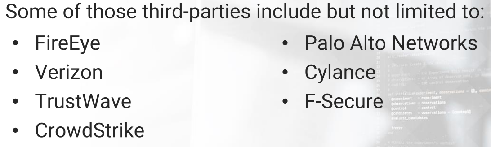
* For **FireEye** => Reports can be found in 
  * https://www.fireeye.com/current-threats/threat-intelligence-reports.html
  * These reports focus on intelligence regarding threat actors => APT28 and threat groups => FIN6
    * https://www.fireeye.com/current-threats/apt-groups/rpt-apt28.html
    * https://www.fireeye.com/solutions/financial-services/rpt-fin6.html
  * Naming convention for Financial Threats known as => **FIN** groups
  * **FIN6** => a cybercrime group that steals credit card and sells it in underground markets
    * They target PoS (Point of Sale) systems in the retail and hospitality sectors.
    * FIN6 group is also known as **G0037** under **MITRE's** naming convention
  * Annual report from FireEye => called **M-Trends**
    * https://www.fireeye.com/current-threats/annual-threat-report/mtrends.html
  * 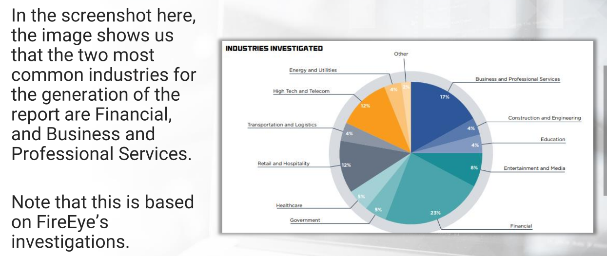
  * 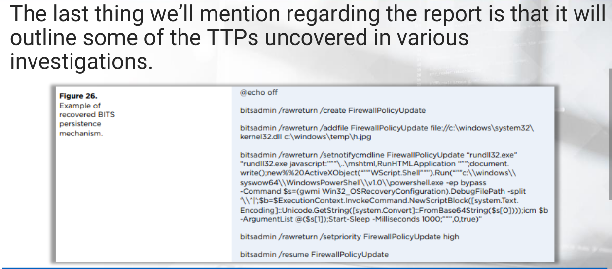
  * FireEye also publishes threat intelligence reports by industry
* Many researcher publish new research reports on emerging threats, often containing IOCs
  * Example => 
    * https://unit42.paloaltonetworks.com/unit42-nexuslogger-new-cloud-based-keylogger-enters-market/
    * https://unit42.paloaltonetworks.com/
* 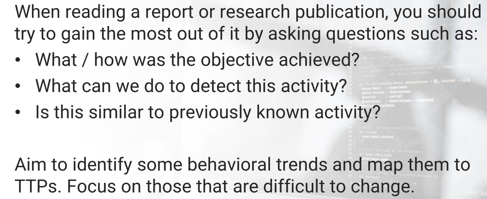
* 
* 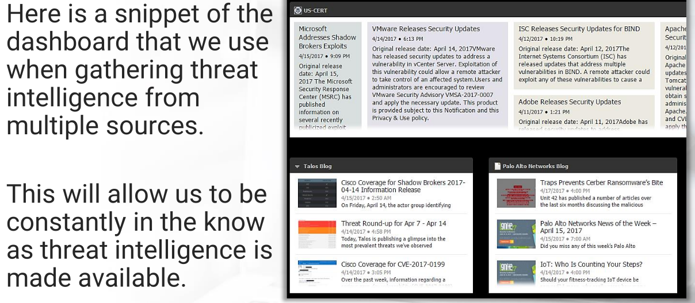

---

* 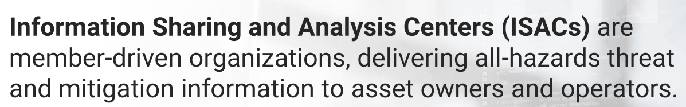
* 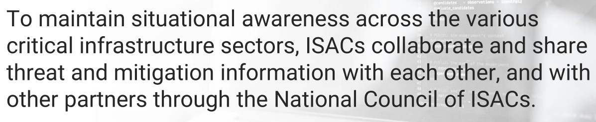

* 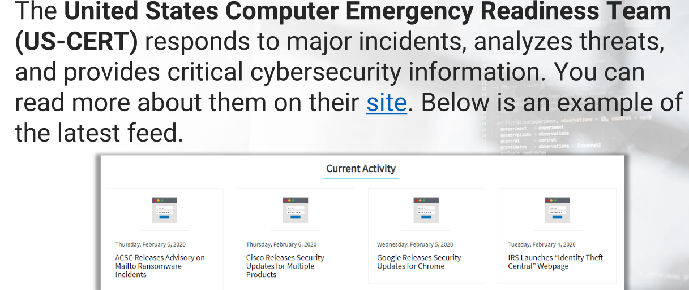

* 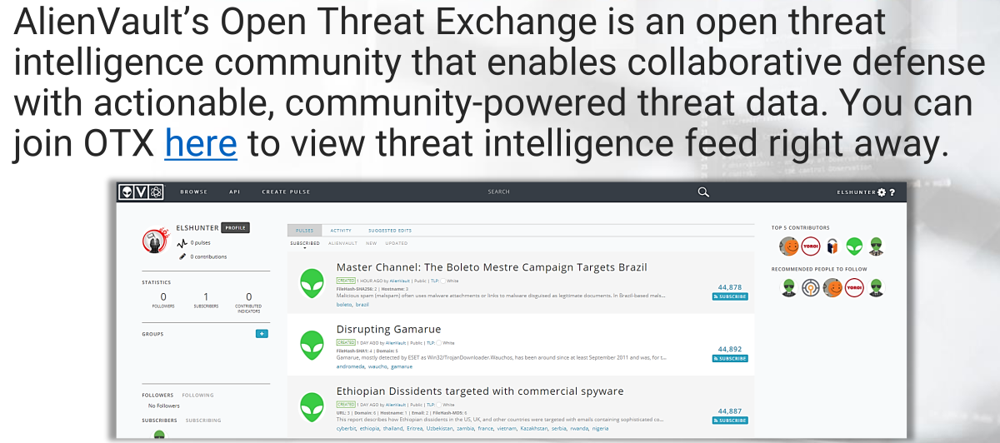

> ### 4. Threat Connect

* Similar to OTX
* 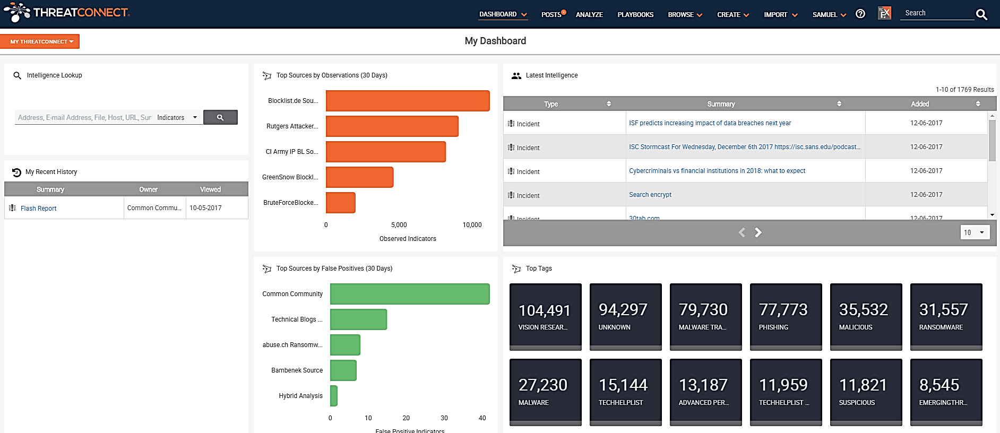

> ### 5. MISP

* MISP => Malware Information Sharing Platform
* 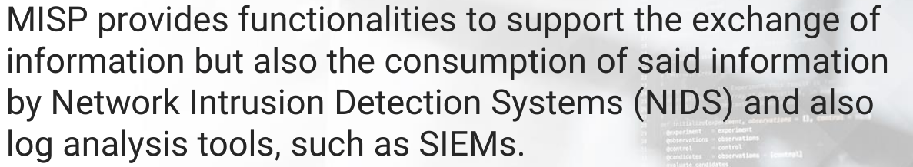

---

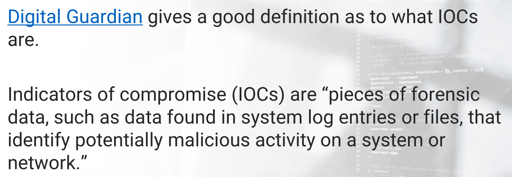

* 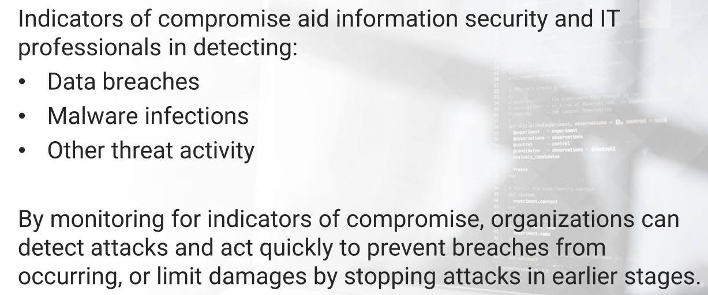
* 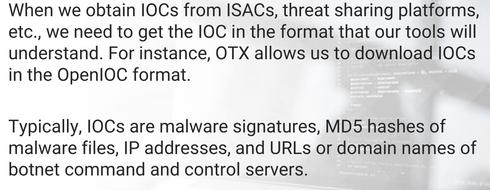
* 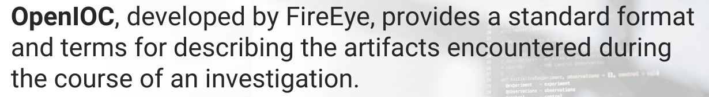
* We use => **IOC Editor** tool
* It provides an interface for managing data and manipulating the logical structures of IOCs.
* IOCs => are XML documents that help security professionals capture diverse information about threats, including
  * attributes of malicious files, characteristics of registry changes, and artifacts in memory
* Tool => https://www.fireeye.com/services/freeware/ioc-editor.html
* Another Tool => **Redline**
  * 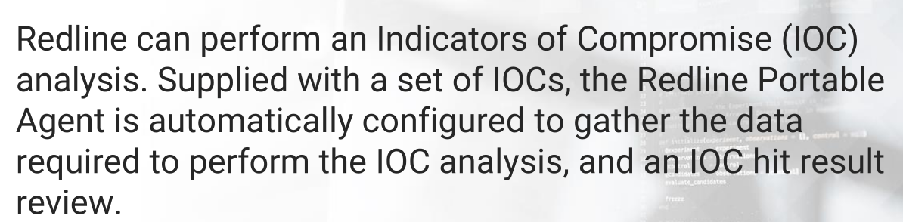
  * https://www.fireeye.com/services/freeware/redline.html
* Another Tool => **YARA**
  * It helping malware researchers to identify and classify malware samples
  * we can create descriptions of malware families based on textual or binary patterns
  * https://virustotal.github.io/yara/

---

