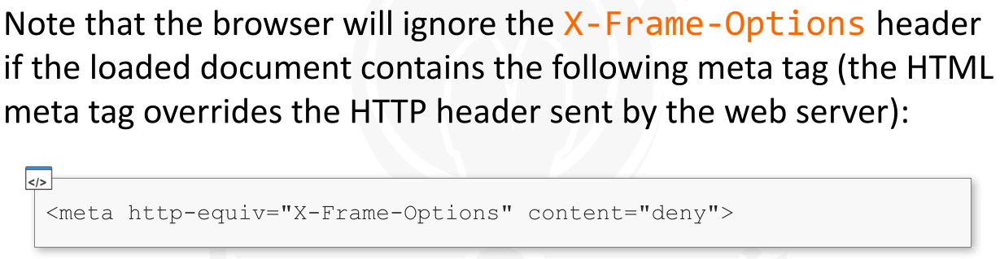
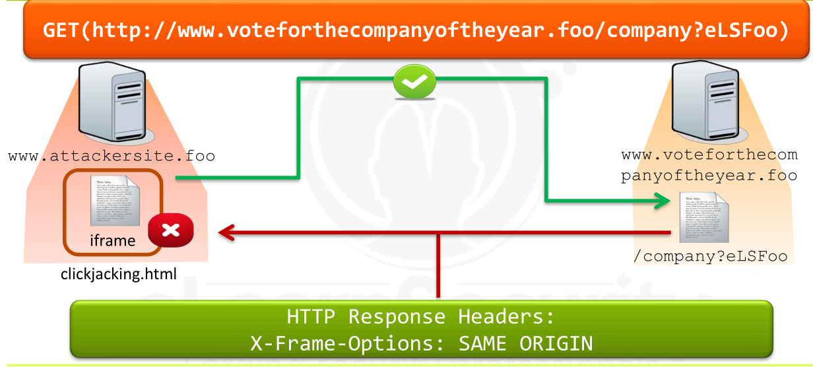
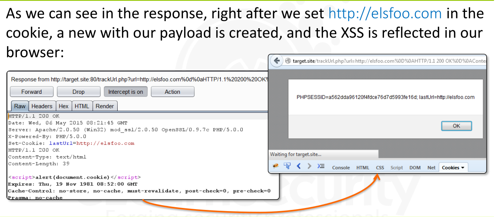

---


[TOC]


### Clickjacking


> Attacker =>  perform this attack => by crafting **malicious HTML Page**

> This **malicious HTML page**  can contain -> two overlapping layers -> One malicious + Other actual Target of the click


> The **malicious layer** is => visible to the  *victim*  and contains => an innocuous resource [it could be the Play button of a video] that the victim should feel secure clicking on


> Target Layer -> included via an **iframe** , is **invisible** to the victim and will contain the *resource*  that will actually be **clicked**
>
> 
>
> This layer usually contains ->  a button or a link -> that will perform an operation that the victim would be unwilling to commit or perform under normal circumstances.


> ### Practical Example


* Suppose a website named => "Vote for the company of the year"

* This website collects votes from internet users and uses them to elect a winning company

* 

* 

* The attacker will build a malicious web page and will trick their users into clicking the button, “Vote for eLSFoo,” unwittingly.

* ### Feasibility Study

  * In this step, the attacker analyzes the page containing the target resource that he wants the victim to click.

  * The purpose of this step is to understand whether or not the resource can be clickjacked

  * A necessary condition for this purpose is that the target page can be included through an iframe element inside any HTML pages.

  * To verify this condition

    * the attacker creates a simple test HTML or PHP page [http://clickjacking.site/index.php]  and includes the target page, using an iframe, by using the following code

      * ```
        <html>
        <body>
        	<frame src="[TargetPage]"> </frame>
        <body>
        </html>
        ```

    * Code for Attacker's page

      * 

  * 

  * ### Case 1 - Clickjacking is possible

    * 

  * ### Case 2 - Clickjacking is NOT Possible

    * In the second case, the iframe is not shown inside the test page.
      * Most likely, the website, “Vote for the company of the year,” has forbidden the vote page from being included in an iframe; therefore, we cannot perform clickjacking today.
    * 


* ### Building of a Malicious Web Page

  * suppose that the iframe can be loaded. 
  * The attacker must build a web page by combining two layers:
    * 
  * 
  * 
  * 
  * 
  * 
  * 
  * 
    * 
    * 


* ### Spreading the Malicious LInk

  * In this step, the attacker will publish the link to his malicious web page in order to induce people into clicking the “Bring me to Google” button.
  * Maybe a more enticing call to action would be more appropriate
  * 


* ### Waiting for the Victim Click

  * This last step must be run by the victim.
  * After opening the malicious web page, the victim must click on the seemingly innocuous button (in our case the Bring me to Google button)
  * Once this occurs, eLSFoo will have obtained a new vote.


* Clickjacking can be leveraged to perform a wide number of attacks such as :

  * forcing users to click on ads (leveraging something like Facebook)
    * or
  * performing any action that only requires clicking on a website.

* 

* 

* 

* First, for a successful clickjacking attack, the condition must be fulfil like

  * including the target resource
    to be clicked on, needs to be able to be included through an
    iframe.
  * Without this condition, the attack cannot occur!

* The old school way uses JavaScript code to prevent a document from being shown inside an iframe.

* Below is an example of JavaScript code put in the iframe:

  * ```
    <script>
    	if(top != window) {
    		top.location = window.location
    	}
    </script>
    ```

* The previous code block acts like an iframe killer:

  * if the document containing that code is included as an iframe, it will load itself in the parent browser window

* In other words, the browser window will contain only the document itself, and it will not be able to include any other layers crafted by an attacker.

* **BUT**, This protection is weak, because

  * the top level window (the one which the iframe tried to change its location) could prevent this change.

* An example of how to accomplish this is by waiting for the DOM event **onbeforeunload**  to be triggered by the instruction **top.location**  inside the iframe.

* Note that the top-level window is the malicious page, crafted by the attacker, so it is under attacker control anyway.


* ### The NEW Shool Protection way

  * 

  * Modern browsers support the **X-Frame-Options** header.

  * This header is sent over HTTP web server responses to prevent a document from being shown inside an iframe.

  * 

  * 

  * 

  * ### Example 1

    * 
    * 
    * 

  * ### Example 2

    * 
    * 
    * 


* ### Likejacking in Facebook

  * Clickjacking on the famous *Facebook Like button* is called **Likejacking**

* ### Cursorjacking

  * **Cursorjacking** is a clickjacking technique that consists of using a custom cursor icon to change the actual position of the pointer, tricking users into clicking on something other than what they intended to click on.
  * Browser security plugins (like NoScript) cannot detect this sort of attack


* ### More Information about the clickjacking are =>

  * http://javascript.info/tutorial/clickjacking#defences-and-the-ways-to-break-through
  * Frame Busting =>
    * http://web.archive.org/web/20170119181502/http:/w2spconf.com/2010/papers/p27.pdf


---


### HTTP Response Splitting


> HTTP Response Splitting =>  is a type of **Header Injection**

> This attack occurs when an attacker sends arbitrary data to the server, and this data is returned as part of the *HTTP response.*


> Goal of this attack => to split the response into two parts by means of special characters such as:
>
> 
>
> * **CR (Carriage Return) – [ \r ]**
> * **LF (Line Feed) – [ \n ]**

> These characters **[\r  and \n ]** => strictly related to how the HTTP Protocol determines the beginning of a new HTTP response header; 
>
> this affects all browsers.

> The goal of the attacker is to craft an HTTP response by sending malicious input including the crafted headers and the special delimiting characters.


* Let’s use a simple example to explain **HTTP Response Splitting.**
* 
* 
* 
* 
* 
* 
* 
* 


* 
* 
* 
* 
* 
* 


* 
* HTML5 has introduced new origin headers to extend the origin concept.
* The attacker can inject these headers into the response and will be able to access the response body via JavaScript
* 
* 
  * Here attacker's GOAL -> is not to split the response, but  to actually inject a couple of new headers
  * 
  * The attacker owns a personal website and must build a malicious page with this URL http://attacker.site/evil.php.
  * The attacker’s goal is to steal the victim’s personal data that appears in the vulnerable webpage.
  * 
  * 
  * 
  * 
  * 
  * 
  * This attack requires that the attacker  sends a link (http://attacker.site/evil.php) to his victim and that the  victim opens it.
  * In this case, we are accessing personal data because there was an open session between the user and the website
    * http://target.site/getPersonalData.php.
  * However, the attack will always allow the attacker to bypass Same Origin Policy and read the contents of the AJAX request.
  * 


* 

* The simplest way to defend against header injection is to filter the  input data and to remove these characters from the user input:

  * CR (Carriage Return) – [ \r ]
  * LF (Line Feed) – [ \n ]

* These characters are only responsible for this type of attack, and they must be filtered if they will ever be reflected as part of the HTTP response header.

* Note that their URL-encoded form is **%0d** and **%0a** so beware of any encoding going on in the application.

* ### Defense in PHP

  * PHP offers a safe function named header, which is used to send a raw HTTP header.

  * For example,

    * if we want the page we are developing to redirect to the page **elsfoo.com** , we should use the following code:

      * ```
        <?php
        	header(“Location: elsfoo.com”);
        	die();
        ?>
        ```

  * With **header** function , **PHP v5.1.4**, both critical characters **CR** and **LF**  have been *denied*

    * So, **header**, is considered safe against HTTP response splitting attacks
    *  there is no need to filter the CR and LF characters

  * Before **PHP v5.1.4**,  we must explicitly filter the special characters  from all user input.

  

  

---


### Business Logic Flaw


> **Business Logic Flaws** => are vulnerabilities that  involve => application logic and they exist regardless of any broken controls


> The best way to detect them is by analyzing the transaction chart of all the processes that the web application provides.


* ### Example with a Vulnerable Application - Bank application

  * Bank application permit log-in users to perform a money transfer
  * The money transfer process suffers from a logic flaw because the process begins without checking whether funds are available in the sender’s checking account.
  * 
  *  


* 
* Finding this type of vulnerability is difficult.  
* A web developer should statically analyze all processes which comprise his web application and draw a transaction chart for each of them.
* Finally, each process should be compliant with business rules and specifications that should be available in the requirements documentation.
* Logic flaws will be visible when a transaction can be made to permit a behavior that is not allowed by the web application requirements.
* Business developers use a similar approach to design their processes.


---


### Denial Of Service [DOS]


> 


> Web applications, like any other system, can be attacked via DoS attacks. 
>
> DoS attacks are difficult to prevent.


> A typical DoS attack occurs when a web application receives too many requests per second, and the web server is unable to respond to all of them; this generally occurs because some server resource is overloaded (RAM, CPU, HD, bandwidth, etc.).


* Due to the attack’s nature, defense is critical.
* A reliable defense method does not exist but, the effects of an attack can be mitigated by using some simple precautions.
* 


---


