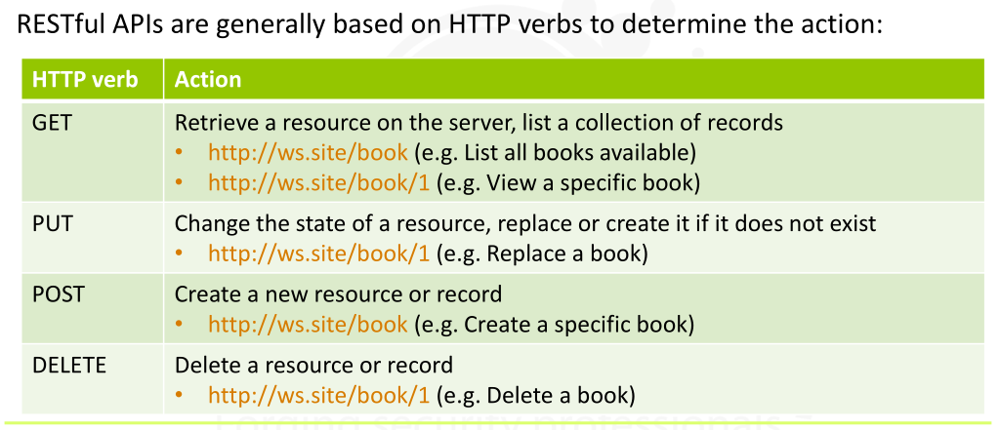
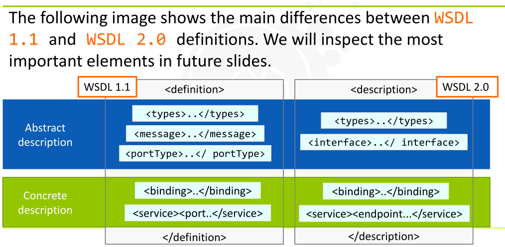
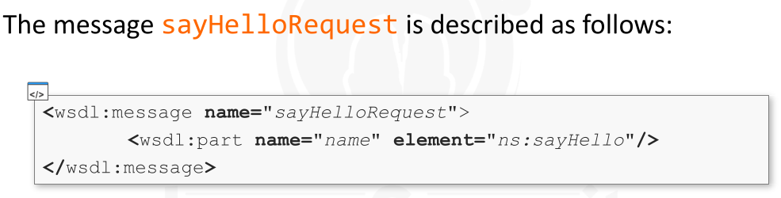

---

[TOC]

### Introduction

> A web-service => a server-side program =>  that provides = > **functionalities** => that can be *invoked* and used programmatically.

> Main purpose =>  to have an => interoperable architecture that is able to connect different devices and different pieces of software together

> Protocols used by web services are well-known by all the heterogeneous applications on the Internet.

> The primary goal of a web service is **to expose/advertise its services**.

> We can think of a service as a server application processing parameters and  returning a result to each client requesting it.

> Business processes and operations are closely related to web services.
>
> we can associate each service to a given business

> 

---

### Web Services Implementations

* ### 1. XML-RPC

  * created in 1998
  * First web service protocol
  * It works by sending HTTP Requests that call a single method implemented on the remote system.
  * Body of the request is in **XML** , thus it can be used to send complex record and list  structures
  * 
    * http://xmlrpc.scripting.com/spec.html

* ### 2. JSON-RPC

  * Similar to XML-RPC
  * It provides more human-readable messages and takes less space to send the same message **XML-RPC** sends
  * The message sent to invoke a method is a request with a single object serialized using JSON.
  * It has 3 Properties:
    * **method:**  name of the method to invoke
    * **params: ** an array of objects to pass as arguments
    * **id: ** request ID used to match the responses/requests
  * 

* ### 3. SOAP

  * Simple Object Access Protocol - SOAP
  * Successor of XML-RPC
  * SOAP Provides - more  functionalities such as -> **encryption, digital signature,  and routing of SOAP messages**
  * SOAP Web service -> also provide a **Web Services Definition Language [WSDL]** declaration that specifies how they  may be used
  * 

* ### 4. RESTful

  * REST -> Representational State Transfer
  * Not a protocol
  * It is  a **set of principle**  to  build web services that focuson system's resources
  * It generally use -> JSON or XML
  * But any other message transport format  (such as plain-text) is possible
  * 

---

### WSDL Language

> A web service is characterized by:
>
>
> 

* WSDL -> Web Servics Description Language

* Web Services -> such as -> SOAP, use the WSDL language to formally describe the provided services (the methods)

* Through the WSDL specifications , any endpoint software knows what services are provided by the server application, their location and the structure of the messages needed to request a service

* In Technical terminology

  * WSDL is an XML-based interface description language
  * The description -> contains -> different objects depending on the WSDL Version
  * the objects decribe the -> **messages**, **the services**, **how they can be requested**, **how they can be transported**

* WSDL Version

  * 1.1
  * 2.0 - current version
  * But still many web services still using **1.1**

* ### WSDL Language

  * 

  * 

  * ### Interaction Between Client and Web Service

    * 

  * ### Objects in WSDL

    * Let's see a server application offering a **sayHello** service.

    * The service gets the name and surname of the person requesting it then returns a custom hello response.

    * ### Binding - element

      * The binding element describes -> **how** to access the service.
      * It defines the message format and protocol details for - **operations**,**messages** (v 1.1) and - **interfaces** (v 2.0)
      * 

    * ### PortType - element

      * The **PortType** (v 1.1) element -> **defines** 
        * the web service, the operations a client is allowed to request, the messages passed to each operation and the returned messages
      * 

    * ### Operation

      * The **Operation** object -> **defines**
        * the SOAP actions and the encoding of each message, for example , "literal"
        * An operation can be thought of as a method n a traditional programming language.
      * 

    * ### Interface 

      * Instead of **portType**, WSDL v2.0 uses **interface** elements which **define** *a set of operations* representing an interaction
        * between the client and the service
      * Each **operation** specifies the  types of messages that the service can send or receive
      * Unlike the old **portType**, **interface** elements do not point to **messages**  anymore [t does not exist in v. 2.0]
        * Instead, they point to the schema elements contained within the **types** element

    * ### Message

      * The *Message object* (available only in v 1.1) contains the messages required and returned by any operation
      * For example,
        * the operation named **sayHello** requires the message
          * **sayHelloRequest** and returns the message
            * **sayHelloResponse**
      * REMEMBER ->  in v. 2.0 messages are specified in the **type** element
      * 
      * 

      

      

      

      

* ### SOAP in action

  * Let's inspect all the communications when interacting with a SOAP web service
  * To inspect the whole communication and messages sent to the web service, let's sniff the traffic with *WireShark* on both our host and server
    * this allows us to  inspect not only our Browser requests but also, its responses
  * 
  * 
  * 
  * 

*  More References
  * Understanding WSDL -> https://msdn.microsoft.com/en-us/library/ms996486.aspx#understand_topic5
  * Understanding Providing WSDL Documents -> https://docs.oracle.com/cd/E57990_01/pt853pbh2/eng/pt/tibr/concept_UnderstandingProvidingWSDLDocuments-076201.html#topofpage
  * Understanding Web Services Specifications : WSDL -> http://www.ibm.com/developerworks/webservices/tutorials/ws-understand-web-services2/ws-understand-web-services2.html

---

### Attacks

* 

* When dealing with web service security, accessing the WSDL file is the first step

  * this gives us the full list of operations and types allowed by the server as well as the correct syntax to use, inputs, outputs and all the useful information we may need to run successful attacks.

* ### WSDL Google Hacking

  * Only indexed resources are returned by Google so our WSDL must have been indexed [ If we need to use Google method]
  * Some simple Google Dorks to find **WSDL** :
    * 
  * To search all of the indexed WSDL files on the target **www.vuln.att**
    * site:www.vuln.att filetype:wsdl

* 

* 

  * **?wsdl**
  * **.wsdl**
  * **?disco**
    * 

* 
* 
* 

* 
* After find WSDL file, then start inspecting them and gather valuable information about the web service
  * this allows us to gather information such as operations, data, syntax and much more.
* 
* 
* For this attack, lets use a simple server application using web services
* The server application is a web application used by a university department to perform simple operations on information about its students.
* 
* 
* 
* 
* 
* 

* 

* Each SOAP client interacting with a web service must specify the requested operation and related parameters via SOAP messages.

* For example, the following SOAP message could be used by a SOAP client to ask for the removal of the user with the ID James.

* 

* The SOAP standard permits one to specify a **SOAPAction** header

  * this is a specific header containing the operation’s name.

* Its goal is to inform the web service what operation is contained in the SOAP Body without needing XML parsing.

* 

* It could also resemble a security issue if the firewall only processes the SOAP body.

  * For example, a firewall could allow a request with a correct SOAP body, but not a malicious **SOAPAction** header

* ### Pre-requisites for the Attack

  * 

* 

* 

* 

* 

* 

* 
* 

* 
* Any server application using a DBMS can be vulnerable to SQL Injection
* Obviously, the issue occurs when user input is not properly sanitized
* The traditional theories on SQL injection are always valid, but in this case,  the injection payload must be **encapsulated in XML** messages before being sent.
* 
* 
* 

* 
* This type of attack is an input validation attack.
* Moreover, it is important to know that since these types of Web Services use XML files and they may also be vulnerable to
  * **XPATH Injection**
  * **External Entity Attacks**
  * and all the XML Related Vulnerabilities
* To avoid them, we should **filter** or **sanitize** user input
* We can obtain this in the following ways:
  * By using parameterized SQL queries
  * By using stored procedures
  * By validating the user input directly

---

