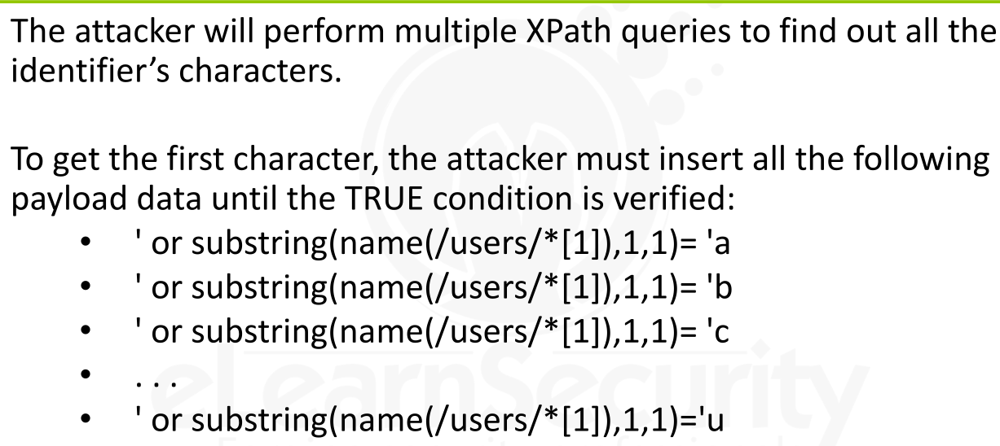
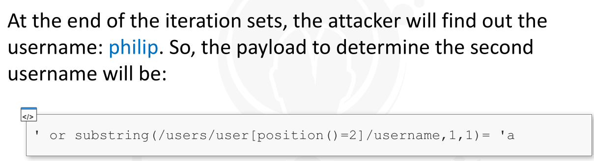

---


[TOC]


### XML Documents and Databases


> XML -> E*X*tensible *M*arkup *L*anguage -> v 1.0 -> a markup language (such as HTML) -> designed to **describe data** and *not* to **display data**

> XML Documents -> often used as databases.

> Data can be read and written through -> **queries** and the XML database looks just like an XML document


> 
>
> 
>
> 
>
> 
>
> > ```
> > <?xml version="1.0" encoding="ISO-8859-1"?>
> > ```
> >
> > This is **XML Declaration** - Although not required but if it exists, it must be the first line in the document
> >
> > 
> >
> > **XML Declaration** -> defines the current version number -> 1.0  + the encoding type
>
> 
>
> 
>
> > ```
> > <users>
> > ...
> > </users>
> > ```
> >
> >
> > This line describes the root **element**  of the document.
> >
> > XML elements -> defines the structure of the document and identify named section of information
> >
> >
> > Elements -> form a document Tree => in above example **<users>** is the parent of all other elements
> >
> >
> > Note => all elements must have a closing tag and must be properly nested
>
> 
>
> 
>
> 
>
> 
>
> > ```
> > <user id=’1’>
> > ...
> > ```
> >
> > 
> >
> > This line describes a child element. 
> >
> > Similar to HTML tag, elements  can have  attributes (**name="value"**), which are useful in defining properties of elements
> >
> > Attributes must be **quoted** and can only appear in start tags
> >
> >
> > Example -> **user** element has attribute named **id** with its value set to **1**
>
> 
>
> > ```
> > <username>jason</username>
> > ```
> >
> > 
> >
> > This element  is  child node for the element **user**.  -> This element  contains text -> this text can be consider value of the element
> >
> > If we consider a database structure , **jason** would be the text contained in the table **user**  with **id=1**
>
> 
>
> > ```
> > <!-- Comment -->
> > ```
> >
> > Similarly to HTML, XML documents can define and contain **comments**
> >
> >
> > a **comment** is defined as any type of content that is not intended for the XML parsers.


---


### XPATH


* XPATH -> **XML Path Language**
* XPATH -> is a standard language used to query and navigate XML documents.
* Latest Version -> 3.0
* XPATH -> makes use of path expressions to select nodes from an XML document
* 
* 
  * 
  * 
  * 
  * 
  * 
  * 
  * 


* 

* In SQL, we able to insert a comment expression into a query

* > 
  >
  > 
  >
  > SQL Query to match credential against the database (login operation)
  >
  >
  > 
  >
  > 

  

* Unlike SQL, the XPath language does not permit comment expressions.

* The attacker must provide a specific payload to bypass a Boolean operator present in the query.

* Unlike SQL,  XPath is a case-sensitive language

  * Therefore, this means that the keywords of the language must be specified exactly as they have been declared in the language specs.

* 


---


### Detecting XPATH Injection


* First step =>  check  whether the web application is susceptible to **XPath Injection**

  * => Web Application make use of an XML database for data storage and querying

* Detection Process is same as in SQL Injection

  * Discover each web application parameter and send specific input data (probes) to check whether it is vulnerable or not

* 

* ### EXAMPLE

  * Suppose a vulnerable web application called -> **CountryInfo**

  * This web application accepts a parameter **countryID** and uses it to query an XML document through XPath queries

  * 

  * 

  * 

  * 

    

    

    

  * 

  * In a blind injection, the attacker will try to trigger two conditions: **TRUE** and **FALSE**

  * The **TRUE** condition will be determined by an injection payload forcing an always TRUE statement, like **1=1**

  * The **FALSE**  payload => **1=2** => and web application output will be **different**  when use this **FALSE** condition payload

  * Similarly to SQL Injection, if the web application is vulnerable, it will react differently and return two different outputs.

  * 

  * The web application hides the errors but, this does not mean that it is not vulnerable.

  * 

  * 

  * 

  * 

    * > In this payload, **999999** is most likely missing **countryID** in the database and **1=1** is a Boolean expression that is always **TRUE**

    * 

  * 
* 
  

  

  
  * 
  * 
  * 
  * 
  * 
  * 
  
  
  
    
  

---


### Exploitation


> With this process, the attacker takes advantage of the vulnerability to access restricted data

> Attacker can exploits the vulnerability to perform actions such as:
>
> 
>
> * **Bypassing Authentication**
> * **Extracting the XML document structure and contents**


* 
* 
* 
* 
* 
* 
* 
* 
* 


* 

* The attacker’s main goal is to extract all the XML document data; this operation is identical to dumping a database during a SQL injection

* In an SQL Database -> **schemas**, **tables** and **columns**

* In XML Document -> **nodes**, **attributes**, and **values**

* So, attacker's GOAL -> get all the -> **nodes**,**attributes** and **values** of the XML Document that is being used as a database.

* 

* As the attacker, we do not know the *structure of the XML* document, but we need to find it out

* 

* First, attacker needs to *detect* which input data *satisfies* the **TRUE** and the **FALSE** conditions.

  * For example,  considering the password as the injectable parameter, the input data satisfying the 2 conditions would be :
    * 

* 

* 

* Suppose that in our example the identifier of the root node is **users**

* The attacker will perform multiple XPath queries to find all the identifier’s characters.

* Note that each time the condition is true, it means that the character used is correct and we can then go on with the next character

* 

* 

* So, by trying such above payloads, we can get - **users** - root node

* 

* 

* 

* 

* 

* We know the following XML document structure:

  * ```
    <users>
    	<user>
    		...
    	</user>
    </users>
    ```

* 

* Suppose, got all the node identifiers of the XML Document

  * Example -> identifiers of the nodes:  **users, user, username, password**
  * and how they appear in the hierarchy

* Now, after this we need to get the content of a node like a username record

* We can access the username using the XPAth Query =>

  * ```
    /users/user[position()==$i]/username
    ```

  * Where **$i** is a numerical placeholder ( that could iterate to discover every username in the system)

* 

* 

* 


---


### Best Defending Techniques


> The best way to protect against XPath injection is to filter all input data


---


