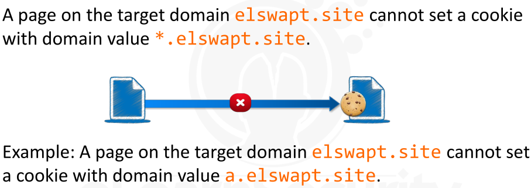

[TOC]

----


### HTTP/S Protocol Basics


* HTTP -> HyperText Transfer Protocol

  * Basic Protocol

  * Used for web browsing for communication on web

  * Client - Server protocol used to transfer web pages and web application data

    * Client - Web Browser - that starts a connection to a  server

    * Server - Web Server -> MS IIS or Apache HTTP Server

    * Client and Server exchange messages with each other in form of Request and Response

    * Client -> send Request to server

    * Server -> give Response to Client

    * ```
      Format =>
      
      HEADERS\r\n
      \r\n
      
      
      MESSAGE BODY\r\n
      
      \r -> Carriage Return -> Moves the cursors to the beginning of the line
      \n -> Line Feed -> Moves the cursor down to the next line
      \r\n -> same as the hitting enter on keyboard
      ```

  * ```
    Example ->
    
    Web Browser send an HTTP Request to web server to search www.google.com
    
    GET / HTTP/1.1
    Host: www.google.com
    User-Agent: Mozilla/5.0 (Windows NT 6.1; WOW64;rv:36.0) Gecko/20100101 Firefox/36.0
    Accept: text/html,application/xhtml+xml
    Accept-Encoding: gzip, deflate
    Connection: keep-alive
    ```

    * ```
      GET -> Request Type -> HTTP Verb -> default request type when we type a URL into the location bar of our web browser and HIT Enter
      
      Other VERBS -> POST, PUT, DELETE, OPTIONS, TRACE etc
      ```

    * ```
      / -> File we are requesting -> Home page of website is always '/' -> Root folder
      
      Other examples -> /downloads/index.php
      ```

    * ```
      HTTP/1.1 -> HTTP Protocol Version -> that our browser wants to talk with
      
      Inform the web server about which version of HTTP we would to use in any further communication
      ```

    * ```
      Host -> Host Header -> beginning of HTTP Request Headers 
      	-> The Host header allows a web server to host multiple websites at a single IP address.
      	
      Our browser is specifying in the Host header which website you are interested in.
      	
      HTTP Headers have the following structure: 
      	Header-name:Header-Value.
      	
      	
      Host value + Path combine to create the full URL we are requesting: the home page of www.google.com/
      ```

    * ```
      User-Agent -> reveals our browser version, Operating System and Language to the remote web server
      
      All web browsers have their own user-agent identification string
      ```

    * ```
      Accept -> This header is used by our browser to specify which document type is expected to be returned as a result of this request
      ```

    * ```
      Accept-Encoding ->  similar to Accept, but it restricts the content codings that are acceptable in the response
      
      Content Codings - used to allow a document to be COMPRESSED or TRANSFORMED without losing the identity of  its media type and without loss of information
      ```

    * ```
      Connection -> With HTTP 1.1 we can keep your connection to the remote web server open for an unspecified amount of time using the value "keep-alive"
      
      This indicates that all requests to the web server will
      continue to be sent through this connection without initiating a
      new connection every time (as in HTTP 1.0).
      ```

  * > HTTP Response ->
    > 
    >
    > the web server will respond with the requested resource, preceded by a bunch of new Headers
    >
    > 
    >
    > These new headers from the server will be used by our web browser to interpret the content contained in the Response content.

    * ```
      RESPONSE ->
      
      
      HTTP/1.1 200 OK
      Date: Fri, 13 Mar 2015 11:26:05 GMT
      Cache-Control: private, max-age=0
      Content-Type: text/html;charset=UTF-8
      Content-Encoding: gzip	
      Server: gws
      Content-Length: 258
      
      
      <PAGE CONTENT>
      ```

      * ```
        HTTP/1.1 200 OK 
        
        First line -> Status Line -> having HTTP Protocol (HTTP 1.1) + Status Code (200) + Textual Meaning (OK)
        
        Most Common Status Code ->
        
        200 OK -> The resource is found
        301 Moved Permanently -> Requested resource has been assigned a new Permanent URI
        302 Found -> Resoruce is Temporarily under another URI
        
        403 Forbidden -> client does not have enough PRIVILEGES and the server REFUSES to fulfill the Request
        
        404 Not Found -> server cannot find a resoruce matching the request
        
        500 Internal Server Error -> Server does not support the functionality required to fulfill the request
        ```

      * ```
        Date -> represents the date and time at which the message was originated
        ```

      * ```
        Cache-Control -> Cache Header allow the Browser and the Server to agree about caching rules
        
        Cached contents -> save bandwidth -> prevent our browser from re-requesting contents that have not changed when the same resource is to be used
        ```

      * ```
        Content-Type -> lets the client know how to interpret the body of the message
        ```

      * ```
        Content-Encoding -> extends Content-Type -> compressed with gzip or more
        ```

      * ```
        Server -> The Server header displays the Web Server banner
        
        Common Web Server -> Apache and IIS
        
        Google Web Server -> gws [ custom web server of google ]
        ```

      * ```
        Content-Length -> Indicates LENGTH, in bytes of Message Body
        ```

      * ```
        <Page Content> -> actual content of the requested resource
        
        Content -> can be HTML page, a document, or even binary file
        
        related to Content-Type
        ```

  * HTTP Content -> can be easily intercepted or mangled by an attacker on the way to its destination

  * HTTP does not provide strong authentication between the two communicating parties.


* HTTPS [HTTP Secure] or HTTP over SSL/TSL
  * method to run HTTP over SSL/TLS, a **cryptographic protocol**
  * This layering provides
    * **Confidentiality**
    * **Integrity Protection**
    * **Authentication**
  * An Attacker
    * cannot sniff the application layer protocol
    * cannot alter the application layer data
  * HTTPS => Does not **protect against Web Application FLAWS**
  * The extra encryption layer just protects data exchanged between the client and the server
  * It does not protect from an attack against the application itself.
  * Attacks like XSS and SQLI still can be happen


---


### Encoding


* Critical component of Information Technology

* Main function is to -> represent the low-level mapping of the information being handled

* Encoding -> often invisible to end users, and occurs each time an application needs to elaborate on any data.

* Understanding the encoding schemes -> can help during  the **detection and exploitation of a vulnerability**

* All of the content of the web pages are *displayed according to a **charset***

* **Character Set**

  * contains a set of characters

  * represent the set of all symbols that the end user can display in  their web browser window.

  * consists of pairs of **symbols and code points**

    * **SYMBOL**
      * what the user reads , as user sees it on the screen
    * **Code Point**
      * Numeric Index -> used to distinguish, unambiguously, the symbol within the charset

  * Symbol can be shown only *if it exists in the charset*

  * Examples charset

    * ASCII, Unicode, Latin-1

    * ASCII -> American Standard Code for Information Interchange

      * charset contains a small set of symbols

      * total of 255

      * Support only US Symbols

      * Cannot display Chinese Symbols

      * Doesn't contain -> **© † ∑ α β «**

      * Complete List os ASCII -> http://www.ascii-code.com/ 

      * Some Examples

        * ```
          CODE HEX SYMBOL
          65 41 A
          66 42 B
          67 43 C
          68 44 D
          ... ... ...
          ```

    * UNICODE -> Universal Character Set

      *  character encoding standard created to enable people around the world to use computers in any language
      * support all the world's writing systems
      * http://unicode-table.com/en/#0032
      * 

* Character Encoding

  * representation in bytes, of the symbols of a charset
  * a mapping of the symbols to a series of ordered bytes so that our data can get to us.
  * A symbol can be represented by using one or more bytes

* Unicode Encoding

  * 3 main types of implementation of character encoding

    * UTF-8, UTF-16 and UTF-32
    * UTF -> Unicode Transformation Format.
    * 8,16 and 32 are the amount of bits used to represent code points

  * ```
    SYMBOL UNICODE UTF-8 		UTF-16 				UTF-32
    ! 		U+0021 21 			00 21 				00 00 00 21
    W 	    U+0057 57 			00 57 				00 00 00 57
    ⦾ 	   U+2B80 E2 AE 80 		2B 80 				00 00 2B 80
    ⌗ 	   U+2317 E2 8C 97 		23 17 				00 00 23 17
    ```

* HTML Encoding

  * important to consider information integrity  of the URLs and ensure that User-Agent displays data correctly

  * 2 main issues to address

    * inform the user agent on which character encoding is going to be used in the document
    * and preserve the real meaning of some characters that have special significance

  * According to the HTTP 1.1 RFC -> 

    * documents transmitted via HTTP  can send a charset parameter in the header to specify the character encoding of the document sent
    * this is the HTTP Header **Content-Type**
      * HTML 4 -> <meta http-equiv="Content-Type" content="text/html;charset=ISO-8859-1">
      * HTML 5 -> <meta charset="UTF-8">
    * If Not defined, the RFC defines as default charset the ISO-8859-1:
      * **"8-bit single-byte coded graphic character sets" aka Latin 1**
      * Setting  an incorrect charset or omitting it can bring ->  unexpected behavior
      * If set incorrect charset -> our browser may not display some symbols correctly.

  * HTML Entities

    * In HTML ->  there are many characters (symbols) with special meaning

    * ```
      <   ->  start of an HTML Tag
      >   -> end of an HTML Tag
      
      These tags will not shown to end users
      
      But to show these symbols in web document and want to avoid  interpreted by browser as HTML language elements -> then need to use Related HTML Entities
      
      ```

    * HTML Entity -> is simple a string **(starting with *&* or *&#* and ending with *;* )**  that corresponds with a symbol

    *  Browser when see these above Entity -> then it will show the symbol to the user and will not ever interpret the symbol as an HTML Lang. element

    * Example

      * ```
        Character Reference 				Rule 								Encoded Character
        Named entity 				& + named character references + ; 					&lt;
        
        Numeric Decimal 			& + # + D + ;
        							D = a decimal number 								&#60;
        
        Numeric Hexadecimal 		& + #x + H + ;
        							H = an hexadecimal number (case-
        							insensitive) 										&#x3c;																							&#X3C;
        ```

    * HTML Entity -> can limit most **client side attacks like XSS**

* URL Encoding

  * URLs sent over the Internet **must contain characters in the range of the US-ASCII code character set **

    * Reference -> http://tools.ietf.org/html/rfc3986#section-2.1

  * If unsafe characters are present in the URL -> encode them is **required**

  * It limits the characters to be used in a URL to a subset of specific characters

    * **Unreserved Chars: *[a-zA-z] [0-9] [- . _ ~]***
    * **Reserved Chars (they have a specific purpose) : ** • : / ? # [ ] @ ! $ & " ( ) * + , ; = %

  * Other characters are encoding using **%** *+* **two hexadecimal digits**

  * Reserved chars must be encoded when they have no special role inside the URL.

  * ```
    Examples
    
    Character 		Purpose in URI 				Encoding
    # 				Separate anchors 			%23
    ? 				Separate query string 		%3F
    & 				Separate query elements 	%26
    + 				Indicates a space		    %2B
    ```

  * URL - Encoding is performed Automatically by our browser

    * Automatically behind the scenes while surfing  on internet
    * http://www.w3schools.com/tags/ref_urlencode.asp

  * URL-Encoding is not security feature

    * It is a method used to send data across the Internet
    * It can lower (or enlarge) the attack surface (in some cases)

  * **Web Browser** -> Automatically perform URL-Encoding

  * **Server-Side Script** -> Automatically perform URL-Decoding 

    * NOTE ->  If this script engine present Only then this happen

  * 


* Base64 

  * Binary to text encoding schema used to convert binary files and send them over internet

    * Example  
      * e-mail protocol -> makes massive use of this encoding to attach files to messages

  * HTML Languages permits the inclusion of some resources by using this encoding

    * Example
      * an image can be included in a page by inserting its binary content that has been converted to base64

  * Alphabet of base64 -> composed of

    * digits - [0-9] and Lating Letters
    * Both Upper and Lower case -> [a-zA-Z] -> for a total of 62 values
    * To complete character set to 64 there are ->  **+**  and **/** characters

  * Note : In some cases -> last two characters use **=**  

  * Example

    * ```
      <img_src="data:image/gif;base64,R0lGODlhDwAPAKECAAAAzMzM/////wAAACwAAAAA
      DwAPAAACIISPeQHsrZ5ModrLlN48CXF8m2iQ3YmmKqVlRtW4MLwWACH+H09wdGltaXplZCBi
      eSBVbGVhZCBTbWFydFNhdmVyIQAAOw=="alt="Base64 encoded image"
      width="150"height="150"/>
      ```

    * Above code show an image in a web document

    * The server will send  this image without the need to read it from another source like the file system


* Web Developer or Designer could easily create their own encoding schema


---


### Same Origin Policy


* Most important and Critical points of Web Application Security

* This **Policy** *prevents* a **script or a document** *from getting or setting properties* of *another document* that comes from a different ** origin**

* Example

  * CSS Stylesheets, images, scripts are loaded by the browser without consulting the policy

* SOP -> is consulted when

  * cross-site HTTP requests are initiated from within Client Side Scripts [e.g. Javascript] or

  * when an AJAX request is run

    

* Origin is defined by

  * Protocol : Host : Port

  * Example -> http://www.websitename.com

    * http -> Protocol

      * ```
        Origin of 
        	http://www.websitename.com 
        is different from
        	https://www.websitename.com
        	
        Because of different protocol [http is different from https]
        ```

    * ://www.website.com -> Host

      * ```
        Origin of
        	http://www.websitename.com
        is different from
        	http://admin.websitename.com
        	
        Because host is different [ www is different from admin ]
        ```

    * :80 -> Port

      * ```
        Default port of website is 80 
        
        Origin of 
        	http://www.websitename.com:80
        is different from
        	http://www.websitename.com:1234
        	
        Because port is different [80 is different from 1234]
        
        So,  when not specified, default port 80 assign automatically
        ```

* Hierarchy of domains descends from the **right to the left**

  * com -> is the Top Level Domain [TLD]
  * website name-> is the Second Level Domain [SLD]
    * subdomain of **com**
  * www -> is the Third Level Domain [TLD]
    * subdomain of **websitename**
  * and so on

* Some SOP Example

  * 

* > **Important** 
  >
  >
  > Internet Explorer [IE] -> works a bit different from other browsers
  >
  > 
  >
  > 2 Exceptions ->
  >
  > 
  >
  > * PORT: It does not consider the port as a Same Origin component
  > * Trust Zone: Same Origin is not applied to domains that are in Highly Trusted Zone [i.e. Corporate domains]

* ### What does SOP Protect from ?

  * ```
    Suppose, I am running a bank site on my browser. And then one of malicious attacker send me link to visit his own made website.
    
    Then SOP -> prevents Javascript, running on Attacker's Origin from interacting with a document from a different Origing
    
    So, Primary purpose of SOP is -> to isolate requests coming from different origin
    ```

  * ```
    What if SOP Not present ? or not exist?
    
    That evil attacker could build a crafted page, and once we clicked on that link or visit to that link, then it will get access some personal information from our bank account
    ```

  * **Main Rule of SOP is**

    * > A **document** can access (through Javascript) the properties of another **document** *only* if they have **Same Origin**

    * Browser will always performs the request successfully , but **it returns the response to the user only if the SOP is espected**

    * DOCUMENT -> it means **an HTML Page, an IFRAME included in the main page, or a Response to an AJAX Request**

    * ```
      NOTE =>
      
      images, style information (*.css) and Javascript files (*.js)  are excluded from above statement
      
      They are always accessible regardless their ORIGIN, and the browser loads them WITHOUT consulting SOP
      ```

* ### EXAMPLES

  * ```
    Example 1 =>
    
    Let us suppose that index.html on domain a.elswapt.site (referred to as origin1: http://a.elswapt.site ) 
    
    wants to access, via an Ajax request (xhr), 
    
    the home.html page on domain b.elswapt.site (referred to as origin2: http://b.elswapt.site ).
    
    mean Origin1 want to acces home.html of Origin2 using AJAX request
    
    
    The document index.html on domain a.elswapt.site cannot access, via an Ajax request (xhr) the home.html page on domain b.elswpat.site
    ```

  * 

  * > So, b.elswapt.site/home.html -> cannot access via AJAX Req [XHR] by a.elswapt.site [ Because a and b is different host]

    

  * ```
    EXAMPLE 2
    
    Let us see another example. 
    
    We have two documents: 
    
    	the main document http//www.elswapt.site/index.html 
    	
    			&
    	
    	and the  iframe document http//www.elswapt.site/iframe.html
    	
    
    index.html =>
    
    <html>
    ...
    <body>
    <iframe src="http//www.elswapt.site/iframe.html">
    </iframe>
    </body>
    </html>
    ```

  * > 2 Documents above having SAME ORIGIN :-> **http://www.elswapt.site**

  * > each document can access the other via **Javascript**

  * > So, within the main document -> JS Code Instruction would be successful
    >
    > ```
    > window.frames[0].body= "Hello world";
    > ```
    >
    >
    > Similarly, within the **iframe document** -> JS Code Instruction would be successful
    >
    > ```
    > window.parent.body= "Hello world";
    > ```

  * > But, if we **point**  the **iframe**  to **http://www.mybank.bank**  the previous JS code would fail
    >
    >
    > Because ->  the two windows do not have  the Same Origin

  * SOP often defines the **boundaries of many *client-side attacks***

  

* ### Exceptions

  * 1. **window.location**
    2. **document.domain**
    3. **Cross Window Messaging**
    4. **Cross Origin Resource Sharing**

  * ### window.location

    * > A document can always write the **location** property of another

    * > The **window.location** object can be used to get the **current page address (URL)** and to **redirect** the browser to a new page

    * Example

      * ```
        Consider 2 documents on our browser with some relationship [1st document includes the 2nd via an iframe or the 2nd document has been opened by the 1st one with a window.open call]
        
        ```

      * > Each document can **write** the **location property**   of the *other* ,
        >
        > But -> cannot **read** it
        >
        > *except* the case where the 2 documents have the Same Origin
        >
        >
        > 

      * > It's mean **location property** can always be changed [ because we can **write it and can't read it ** ], notwithstanding the same origin policy that determines whether a new document can be loaded

      * ```
        Suppose i have following script document
        
        http://www.elswapt.site/index.html
        
        
        <html>
        ...
        <body>
        <iframe src="http//www.elearnsecurity.com/index.html">
        </iframe>
        </body>
        </html>
        
        
        and within the index.html document, there is JS code Instruction ->
        
        window.frames[0].location=http://www.google.com;
        
        This code run successfully
        ```

      * > Why run successfully ?
        >
        >
        > Because as I learned that window.location property can **write** document mean  overwrite code but can't read

    * ### Security Issue

      * A document can always *update* the **location** property of another document, if they have some relationship

      * Typical relationship are

        * a document is embedded within another via an iframe element
        * one document is opened by the other via **window.open** DOM API

      * Example

        * > A document **X** included by another document **Y** via an *iframe*, can always change the location of **Y**.

        * 

        * > A document **X** opened by document **Y** through the *window.open* DOM API can always change the location of **Y**.

        * 

        

        
    
  * ### document.domain
  
    * This property describes the domain portion of the origin of the current document
  
    * > A document with the URL
      >
      > * http://subdomain.domain.com/index.html
      >
      >
      > has the **document.domain** property set to
      >
      > * subdomain.domain.com
  
    * This property can be **changed**
  
    * A document can update its own **document.domain** to a *higher level* in the domain hierarchy,
  
      * Except for the Top Level Domain -> .e.g. -> **.com**
  
    * Second Level Domain (e.g. **domain.com**) can be specified but it **cannot**  be changed
  
      * e.g. -> from **domain.com** to **whitehouse.gov**  cannot
  
    * By changing **document.domain** property, a document partially changes its own origin
  
    * E.G
  
      * > Let us say that a document with the URL
        >
        > 
        >
        > * http://a.elswapt.site/index.html
        >
        >
        > includes, via an iframe, another document belonging to a different origin
        >
        > 
        >
        > * http://b.elswapt.site/home.html
        >
        >
        > Due to SOP, the JS code running from the context of the main domain cannot access, via JS, the iframe content because the 2 documents coe from different origin
  
      * > SOP is circumvented, though, if the following  JS Code -> 
        >
        > ```
        > document.domain="elswapt.site"
        > ```
        >
        > is run by **each of the 2 documents**.
        >
        >
        > 
        >
        > 
        >
        > Both documents having **same ORIGIN**
  
  * ### Cross Window Messaging
  
    * new HTML 5 Feature
    * It permits different documents (iframes,popups,current window) to communicate with each other regardless of the Same Origin Policy by using a simple synchronous mechanism
  
  * ### Cross Origin Resource Sharing [CORS]
  
    * It is a set of specs built to allow a browser to access a few resources by bypassing the Same Origing Policy.
    * CORS architecture uses **custom HTTP Response Headers** and *relies* upon **Server-Side Components or Server-Side Languages**


​						

---


### Cookies


* HTTP is a **Stateless protocol**

  * Mean a website cannot retain the state of our visit between different HTTP Requests without mechanisms such as session or cookies
  * Each visit without a session or a cookie looks like -> *a new user to a serer and a browser*

* To overcome above problem or limitation -> in 1994 Netscape invented  **Sessions & Cookies** 

* It help **to make HTTP Stateful**

* Cookies -> **textual Information installed by a website to the ** *cookie jar*

* *Cookie Jar* -> Storage space where a web browser **stores**  the *cookies*

* They are fragments of text containing variables in the form of
  **name=value**

* 

* Above image is  **field for cookies**

* A Server  can set cookie via -> **Set-Cookie** -> HTTP Header field in a *response message*

* **DOMAIN Field**

  * ```
    A website only sets a cookie for its domain.
    • e.g. google.com sets a cookie for the domain:
    google.com or .google.com
    This means that the browser will install the cookie in
    the cookie jar and will send this cookie for any
    subsequent request to:
    • google.com
    • www.google.com
    • maps.google.com
    ```

  * > The scope of this cookie will be **.google.com*
    > **Domain A cannot set a cookie for domain B.**
    >
    > 
    >
    > The browser will sends A's cookie in accordance with the above domain scope (to A and all of its subdomains), including the path and the expiration date.
    >
    >
    > 2 Important considerations about the domain field =>
    >
    > 
    >
    > 1. a leading "." , if present , is ignored
    > 2. If the **server does not specify**  the domain attribute,  the browser will automatically set the domain as  the server domain and set the **cookie** *host-only* flag.  This means that the cookie will be sent  **only to that precise hostname**

* **Expires**

  * > **Expires** gives the cookie a time constraint.

  * > The cookie will only be sent to the server if it is
    > not expired.

  * > Session cookies expire when the session exits.

* **Path**

  * > The cookie **Path** field specifies for which requests, within that domain, the browser needs to send the cookie.
    >
    > For cookies with path =/downloads, all subsequent requests to:
    >
    > • /downloads
    > • /downloads/foo
    > • /downloads/foo/bar
    >
    > will include this cookie.
    >
    > The browser will not send this cookie for requests to
    >
    > /blog or /members

* **Content**

  * > A cookie can carry a number of values at once. 
    >
    > A server can set multiple values with a single **Set-Cookie header** by
    > specifying multiple **KEY=Value** pairs.
    >
    > For example:
    >
    > > Set-Cookie: Username="john"; Authenticated="1"

* **HTTP ONLY FLAG**

  * > The **HttpOnly** flag is used to force the browser to send the cookie *only* through
    > HTTP.

  * > This flag prevents the cookie from being *read* via **Javascript, Flash, Java and any other non-HTML technology**

  * > This protection  mechanism agaist **cookie stealing against XSS**

* **SECURE Flag**

  * > The **Secure flag** forces the browser to send the cookie only through *HTTPS (SSL).*
    >
    > 
    >
    > This prevents the cookie from being sent in the clear.


* ### Cookies Domain

  * > The **domain** attribute represents the domain value for which the cookie is valid

  * > Together with **path, secure and expires** attributes, it is useful during the process in *determining* if  a  cookie must be submitted along with a new HTTP Request

  * > **RFC6265** [http://tools.ietf.org/html/rfc6265] 

    * > It distinguishes cookies set with a specified domain value from cookies without.

    * > Important part in this RFC is -> **leading dot at the start of the domain value string.**

    * > the leading **dot (.)** has no particular significance; 
      >
      > the browser does not care about it.

    * > This means that a browser will handle cookies with these domain values the:
      >
      > **• .elswapt.site**
      > **• elswapt.site**

  * ### Cookies Domain Settings

    * There are different cookie domain settings

    * 

    * ### Specified Cookie Domain

      * 

      * > Example 1
        >
        >
        > 
        >
        > 
        >
        > Cookie domain value = **els.wapt.site**  and the target domain requested by the browser is = **els.wapt.site** [same]
        >
        >
        > If we request this page -> **http://els.wapt.site/index.php**
        >
        > because  target domain is same as cookie domain value so the **cookie will be sent**

      * > Example 2
        >
        > 
        >
        >
        > Cookie domain value = **wapt.site**  and the target domain requested by the browser is = **els.wapt.site**
        >
        > If we requested this page => **http://els.wapt.site/index.php**
        >
        > 
        >
        >
        > Because dot(.) has no particular significance so, cookie will be sent 
        >
        > Because **wapt.site** is a suffix of the string **els.wapt.site** so , cookie will be sent

      * > More Examples =>
        >
        > 
        >
        > A page on the target domain **elswapt.site** sets a cookie with domain value **elswapt.site**.
        >
        > The browser will send this cookie in HTTP requests matching the following URLs:
        >
        > ```
        > • http[s]://elswapt.site/*
        > • http[s]://www.elswapt.site/*
        > • http[s]://www.lab.elswapt.site/*
        > • http[s]://*.elswapt.site/* 
        > ```

      * ### Security Implications

        * > A page on the target domain ***.elswapt.site** can set a cookie
          > with domain value **elswapt.site**

        * > Example -> 
          >
          > A page on the target domain **a.b.elswapt.site** sets a cookie with domain value **elswapt.site**

        * > The browser will send this cookie in requests matching the
          > following URLs: 
          >
          > ```
          > http[s]://*.elswapt.site/*
          > ```

        * But -> 

        * So -> 

        * **Point to be Noted :D**

    * ### Unspecified Cookie Domain

      * When  a cookie  doesn't contain **domain value** ->  It is assumed that **host-only-flag ** is *set* to **true**

      * A cookie with **host-only-flag** value will be sent only to the target domain that set it

      * > NOTE -> RFC uses the term **host** instead of *domain*

      * If a page on the target domain **elswapt.site** sets a cookie *without the domain value*, 

        * the browser will send this cookie only in HTTP requests that exactly match the following URLs

          * ```
            http[s]://elswapt.site/*
            ```

    * ### Internet Explorer Exception

      * IE doesn't  distinguish between cookies with a *specified domain value* from ones with *unspecified values*

      * Cookies with *unspecified domain values* will be interpreted by the browser as if they had a **domain value corresponding to the** *target domain set in it*

      * > EXAMPLE
        > 
        >
        >
        > A page on the target domain **elswapt.site** sets a *cookie* **without** a *domain value*
        >
        >
        > IE differs from other browsers, and will consider sending this cookie as if its domain value was set to **elswapt.site**
        > therefore, it will send this cookie in HTTP request that match the following URLs:
        >
        > ```
        > • http[s]://elswapt.site/*
        > • http[s]://www. elswapt.site/*
        > • http[s]://www.lab. elswapt.site/*
        > • http[s]://*. elswapt.site/*
        > ```


---


### Session


* Web Developer prefers to store information on **server side**  insteaf of *client side*

* By this,  developer can hide the application logic

* **HTTP Sessions** are a simple mechanism that allows websites to store variables specific for given visit on the *server side*

* Each user session identified by  **a either  a session id or token**, which the server assigns to the client

* Difference between Cookie and Session variables

  *  cookies are stored on the client
  * session are stored on the server

* Session variables expire with the session and sessions usually expire sooner than cookies do

* Session Mechanism -> use Session Token or Session ID

* Session ID -> assigned to the client by the webserver and the client will present this ID for each subsequent request in order to be **recongnized**

* The session ID provided by the client will let the server retrieve
  both the state of the client and all of its associated variables.

* Session ID -> can be stored within **text files, databases or memory on the server**

* 

* Session Cookies => contain a single parameter formatted in a key value pair

  * ```
    SESSION=0wvCtOBWDH8w
    PHPSESSID=l3Kn5Z6Uo4pH       => PHP Language Indicating
    JSESSIONID=W7DPUBgh7kTM      => JSP Language Indicating
    ```

    

* Developer can customize its functionality  as of its own default session parameter

  * ```
    Changing PHPSESSID to PSESSID
    ```

* If needed, Servers install session cookies after a browser performs some type of activity, such as:

  * ```
    • Opening a specific page.
    • Changing settings in the web application.
    • Logging in.
    ```

  * Then the browser uses the cookie in subsequent requests

* A session could contain many variables, so sending a small cookie keeps the bandwidth usage low.

* Session ID can be sent either by 

  * POST Method [Set-Cookie: SESS=MySess1234; expires=Thu, 21-May-2015 15:25:20 GMT; path=/; domain=my.website.com] 
  * or GET Method [http://example.site/resource.php?sessid=k27rds7h8w]


---


