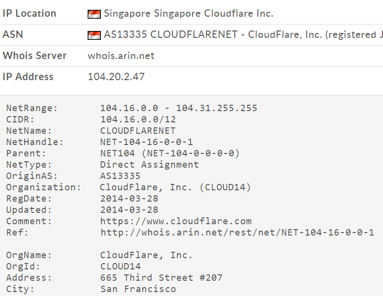
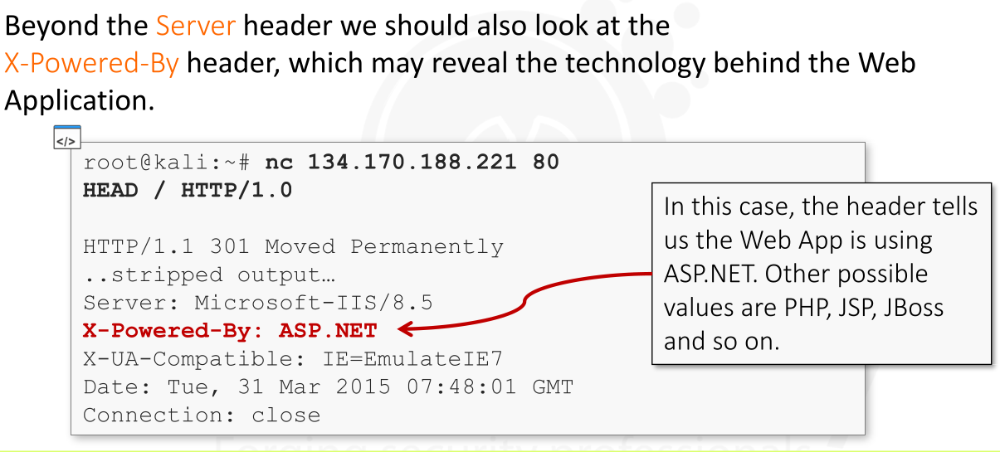
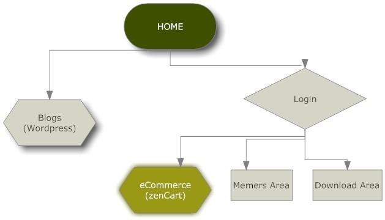
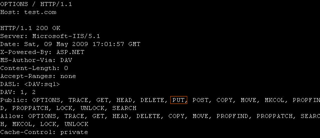

[TOC]

### Gathering Information on our Target


* First and Critical step of every penetration test

* Need to know target as much detail as possible

* Most pentesting jobs = black box test

  * black box test = penetration tester simulate external hacker attacks
  * Don't know inner processes, technology or any other internal information

* Collecting Information is useful in both understanding *application logic* and *during the attack phase*

* What Sorts of Information ?

  * Infrastructure - Web Server, CMS, Database etc
  * Application Logic
  * IPs, Subdomains, Domains
  * Virtual Hosts

* The better organized our collected information is , the easier it will be to find and exploit vulnerabilities.

* FIRST Step - Gather Information about the Organization

  * ### **WHOIS [command line interface + web-based tools]**

    * Use for look up domain Ownership Details from Different Databases

    * Web-Based WHOIS clients rely on -> WHOIS Protocol to connect  to a WHOIS server and do lookups

    * Command Line WHOIS clients -> used by System Administrators 

    * Runs on TCP Port 43

    * command -> whois <target.com> [for command line]

    * web based -> http://whois.domaintools.com/

      * WHOIS Database contains public information

      * We can Get -> 

        ```
        Administrative Contact Information
        Technical Contact Information
        IP Addresses of one of the machines of the Organization
        ```

  * ### **DNS [Domain Name System]**

    * After get IP Address from WHOIS -> Next step to get DNS of that IP

    * DNS Structures contains -> Hierarchy of Names -> The root, or Highest Level of the system is unnamed

    * TLD [Top Level Domains] -> are divided into classes based on rules that have evolved over time

      * Most TLDs have been delegated to **individual country managers** ,  whose codes are assigned from a
        table known as ISO-3166-1.
        * These are maintained by an agency of the United Nations and
        * are called **country-code Top Level Domains, or ccTLDs.**

    * Generic Top Level Domains [ gTLDs]

      * which do not have a **geographic or country designation**

    * Responsibility for procedures and policies for the assignment of Second Level Domain Names (SLDs) and lower level hierarchies of
      names has been delegated to TLD managers - subject to the policy guidance contained in ISO-3166-1

    * Country Code Domains are organized by a manager for that country -> These managers perform

      * a public service on behalf of the Internet Community

    * 

    * ```
      A Resource record starts with a domain name, usually a
      fully qualified domain name. If anything other than a
      fully qualified domain name is used, the name of the
      zone the record is in will automatically be appended to
      the end of the name.
      ```

    * ```
      Time-To-Live (TTL), in seconds, defaults to the minimum
      value determined in the SOA record.
      ```

    * ```
      Record Class-> Internet, Hesiod, or Chaos
      ```

    * ```
      Start of Authority
      
      Indicates the beginning of a zone and it should
      occur first in a zone file.
      
      
      There can be only one SOA record per zone.
      Defines certain values for the zone such as a
      serial number and various expiration timeouts
      ```

    * ```
      Name Server
      
      Defines an authoritative name server for a zone.
      Defines and delegates authority to a name server for a child zone.
      
      
      NS Records are the GLUE that binds the distributed database together.
      ```

    * ```
      Address
      
      The A record simply maps a hostname to an IP address.
      
      Zones with A records are called 'forward' zones.
      ```

    * ```
      Pointer  [PTR]
      
      
      The PTR record maps an IP address to a Hostname.
      
      Zones with PTR records are called 'reverse' zones.
      ```

    * ```
      CNAME
      
      The CNAME record maps an alias hostname to an A record hostname.
      ```

    * ```
      Mail Exchange  [MX]
      
      
      The MX record specifies a host that will
      accept email on behalf of a given host.
      
      The specified host has an associated
      priority value.
      
      
      A single host may have multiple MX
      records.
      
      The records for a specific host make up a
      prioritized list.
      ```

    * > The **domain name system (DNS)** is a distributed database arranged hierarchically.

      * Purpose -> 

        * > to provide a layer of abstraction between Internet services (web, email, etc.) and the numeric addresses (IP addresses) used to uniquely identify any five machines on the Internet.

      * Advantages

        * Permits the use of names instead of numbers to identify hosts (usually servers)
        * Names are much easier to remember
        * Permits a serer to change numeric addresses without requiring notification of everyone on the internet, by simply retargeting a name to the new numeric address
        * One name can refer to multiple hosts, to share the load

    * ### NSLOOKUP 

      * Tool to translate *hostnames* to *IP Addresses* and *Vice-Versa*

      * Command -> nslookup <target.com>

      * 

      * Above is **A** Field that is **Address** field which use to  maps a hostname to an IP Address [ Provide Domain name and DNS Returns IP Addresses for the matching hosts]

      * REVERSE LOOKUP

        * Provide an IP Address, DNS Return Domain Name associated with that IP
        * 

      * RECORDS

        * DNS Server Query to get the whole record -> 

          ```
          nslookup -querytype=ANY <target.com>
          ```

        * 

        * From above result we can get following Result

        * 

        * Need to save this information for the subsequent steps of our penetration testing engagement.

      * Every IP Address on the Internet is assigned to an organization.

      * An Organization can purchase a block of IP Addresses according to their needs and it will "own" that entire block

      * The **WHOIS** database tracks the owners of public IP addresses as well as domain names.

      * Sometimes, organizations are not actually the owners of the IP addresses they use for their presence on the internet.

      * May just rely on ISP and Hosting Companies that lease one or more smaller netblocks (among those owned) to them.

      * Our Main Target -> Find the **netblock owner** and the **ISPs our target organization relies on**

      * ### Finding Target's ISPs

        * Must to know which ISP's, hosting and IP addresses  our target organization uses.

        * Using **nslookup**  => got the IP Addresses associated to each subdomain

        * Now do **WHOIS** request to each of those IP addresses to uncover the ISPs that these IP Addresses belongs to

        * ```
          NOTE
          
          When the organization is big, net-blocks may be assigned
          directly to it, so no Hosting services are involved.
          ```

        * 1ST Step => Gather all the IP Addresses related to **domain or subdomain**

          * ```
            nslookup statcounter.com
            ```

          * 

          * 2 IP Addresses ["A" records in the DNS]  registered for that domain

          * Save this 2 IP Addresses for future use

          * Now for **www.statcounter.com**

          * ```
            nslookup www.statcounter.com
            
            This command returns other two IP addresses:
            • 93.188.134.172
            • 93.188.134.237
            ```

          * Again save this result

          * We need to check these 4 IPs 

            ```
            1. 104.20.2.47
            3. 93.188.134.172
            2. 104.20.3.47
            4. 93.188.134.237
            ```

          * Online Tools  => arin.net , whois.domaintools.com  or ripe.net [ to get ISPs]

          * ```
            104.20.2.47
            
            
            The IP address belongs to
            "CloudFlare".
            
            A netblock for this ISP is
            104.16.0.0/12.
            ```

          * 

          * ```
            104.20.3.47
            
            
            Still "Cloudflare"
            
            Netblock => 141.16.0.0/12
            
            
            So, Our target Organization uses ClodFlare ISP for above 2 IP Addresses
            ```

          * 

          * Next 2 IP Addresses now =>  **93.188.134.172** and **93.188.134.23**

          * 

          * 

          * They belonged to **CDNetworks**

          * Now as a Penetration Tester, make a table with all the IP addresses used by the organization and the ISP/Hosting these IP addresses belong to

            * This can help to map the attack surface

          * **Another Way to get ISP of target is using ** *Netcraft*

          * Using **Netcraft**  we get all the information in 1 page

          * 

          * 

* As a pentester best to keep records and make notes like mind map as example

* 


---


### Infrastructure


* Includes -> the web server that is directly involved in the execution of any web application.

* 2 Most Common web servers used on the internet today are -> **Microsoft IIS** and **Apache**

* Must to Discover what kind of web server is behind our Target Application

  * It will give Hint about what OS the server is running and what known **vulnerabilities** may apply
  * E.g. -> IIS [Internet Information Server] web server => Window Server OS
    * IIS 6.0 => Windows Server 2003 [by default]
    * IIS 7.0 => Windows Server 2008
    * IIS 8.0 => Window Serve 2012
  * Apache Web Server may run different LInux and BSD Distributions

* ### Fingerprinting the Web Server

  * Our Aim is to => get Web Server Type and Version so that we know what different attacks are there against its components

    * IIS Components => ISAPI Extensions, work as dynamic libraries, extending the functionalities of the web server and performing different tasks for the web server.

  * These include: **URL rewriting**, **load balancing**, **script engines (like PHP, Python or Perl)** and many others.

    * > A rewriter changes "ugly" web application URLs such as
      > **news.php?id=12** 
      >
      > to a more search-engine-friendly URL like **news/12.html** or a route like **news/12**.

    * > IDS => Web Application Firewall that  detects and prevents intrusions coming from the HTTP/S protocol

  * Method to get Web Server Version

    * ### HTTP headers in response to a trivial HTTP request to the web server

    * 

    * Above told Server using Apache but disclosing version

    * Let's Use - Netcraft for this purpose

    * 

      * Got Web Server Version Microsoft-IIS/8.5

    * Netcraft can also be use to collecting all available subdomains for a domain.

      * It can give information like web server version, name server and IP addresses of the different web servers in use

    * ```
      It is not uncommon to find corporations or even small businesses
      using load balancers that route our HTTP request to different
      servers that may even run different web servers versions.
      
      
      The advice here is to take note of all web server version-to-IP
      couplets for further use.
      ```

    * 

    * In addition to web server version, IP addresses and Nameservers,  Netcraft provides the following information we can capture:
      • Server version
      • Uptime stats
      • IP address owner
      • Host provider

    * Netcraft Limitation ->

      * Sometimes Netcraft does not provide us with enough information
        regarding our target web server version.

      * In Cases, there are cases where Netcraft cannot be used like in
        the case of Internal Web Servers that are not attached to Internet.

      * For such reason, **we can use both manual testing techniques**
        **and tools to identify a server.**

      * Example tools => **netcat, httprint, whatweb,wappalyzer and more**

        

    * These tools above

      * ```
        They probe the web server with a series of requests and compare
        the responses to their database of signatures in order to both find
        a match and, accurately guess the following information:
        
        • Web server version
        • Installed modules
        • Web enabled devices (routers, cable modems, etc.)
        ```

      * The most important feature of these tools is that they do not solely rely on the service banner.

      * > They are capable of fingerprinting the web server version even when the banner or the HTTP response header have been
        > manually obfuscated / altered using security modules
        > **(mod_security...).**

    * ### Netcat Tool

      * This is a simple utility that reads and writes data across network connections.

      * By using Netcat we can establish a connection to the Web **Server** and look at the **Server** field in the HTTP response header

      * 

      * 

      * 

      * ```
        Cookies are also an interesting resource that may reveal useful
        information in this phase. Each technology has its default cookies
        names therefore, we can potentially guess it by inspecting the
        cookie header. 
        
        Here is a short list of what you may encounter:
        
        Server 				Cookie
        PHP	 			PHPSESSID=XXXXX
        .NET 			ASPSSESSIONIDYYYY=XXXXX
        JAVA 			JSESSION=XXXXX
        ```

    * ### whatweb tool

      * command line tool
      * used to recognize website technologies, web server versions, blogging platforms, JavaScript libraries and much more.
      * 
      * To get above result in better format  or well organized =>
        * 

    * ### Wappalyzer - Web Browser Plugin 

      * both for firefox and chrome
      * 
      * Each icon gives you information about the Web Server, such as the
        **Operating System, The Web Server, JavaScript frameworks and**
        **much more.**
      * In order to inspect the information found, just click on an icon and
        a pop up will appear on your right, listing all the information
        gathered.

    * Beside getting Web Server Version, we can find fingerprint what modules are installed and in
      use on the server.

      * Modules => 

        * we are looking for are ISAPI modules (for IIS)
        * or Apache modules that may interfere with or alter our test results.

      * Nowdays, websites use Search Engine and Human Friendly URLs

        * "ugly"  URLs are the ones that carry query string parameters and values that are meaningful to the web server but not representative of the content on the page.

          * e.g. =>

            * www.example.com/read_doc.php?id=100

              * ```
                tells the server to query the database to fetch the document with id=100
                ```

              * > Not helpful to search engines looking for the document’s contents

        * A search engine-friendly version would be

          * www.example.com/read/Buffer_Overflow.html

        * How above 2 translated ?

          * When a user requests **read._doc.php?id=100** the server side module in charge of translating the URL will use regular expression to match a **Rewrite Rule** and will translate the URL according to the rules specified by the administrator
          * id=100 => Buffer overflow is the title field in the database of **id=100**

        * URL Rewriting => is done on Apache with the **mod_write** module or **.htaccess**

        * On IIS => It is handled by **Ionic Isapi Rewrite** or **Helicon Isapi Rewrite**

        * For penetration tester keep in mind about **URL Rewriting** during the testing phase when attempting input validation attacks

          * This type of attacks involves the use of malformed input (among the other data input) using the URL Parameter

        * 

        * Search Engine friendly URLs => **not a security Feature**

          * Input Validation attacks are still possible = If we can reverse-engineer the **Translation rules**

          * rare cases in which  the rewritten URL is easy to reverse engineer to its original form

          * ```
            Input from forms are still intact for us to tamper with
            ```

        * As A pentester  we need to play with such URL and guess it

        * Example

          * www.example.com/news_read/112
          * As a tester , make a guess by requesting
            * **www.example.com/news_read.php?id=112.**
          * If 2 pages match and No 404 error is returned => we found the URL Rewriting Rule
          * we are guessing on the parameter name, (id), which usually does not appear in the rewritten URL.

* ### Enumerating Subdomains

  * map all available subdomains within a domain name

  * This will widen our attack surface and sometimes reveal hidden management backend panels or intranet web applications that the network administrators intended to protect through the old disgraced method of security through obsecurity

  * There are lots of ways to enumerate subdomains:
    • Netcraft
    • Google
    • Crawling / Brute force
    • Tools

    • Zone Transfers

  * 

  * Google => http://www.googleguide.com/advanced_operators_reference.html

  * Tools => dnsrecon,fierce,sublist3r, nmap,dnsenum, knock,theHarvester,recon-ng

  * Zone Transfer ->

    * A Zone Transfer is the term used to refer to the process by
      which the contents of a DNS Zone file are copied from a primary
      DNS server to a secondary DNS server.

    * It is the result of  **misconfiguration** of the *remote DNS server*

      * Should be enabled only for Trusted IP Addresses [if required]

    * When zone transfers are available, we can enumerate all the DNS  records for that zone.

    * This includes all the subdomains of our domain [A Records]

    * ```
      nslookup -type=NS domain.com
      ```

    * 

    * ```
      On Unix =>
      
      dig @nameserver axfr mydomain.com
      
      nameserver is a nameserver for mydomain.com
      axfr is the mnemonic opcode for the DNS zone transfer.
      ```

    * 

* ### Finding Virtual Hosts

  * Virtual Host is

    * simply a website that shares an IP Address with one or more other Virtual Hosts
    * These hosts are domains and subdomains
    * Very common in a shared hosting environment where a multitude of websites share the same server/IP address.
    * Ex =>
      * 
    * 

    

    

    NOTE: as pentester always keep save and track our findings

    * 


---


### Fingerprinting Frameworks and Applications


* After getting list of subdomains, next is to Fingerprint Frameworks and Applications

* Look  all the webpages running on each of the subdomains

* Common applications => those piece of softwares that are available online for anyone to use

  * either be open-source or commercial
    * Interesting case for pentester when get access to their Source Code
    * Can able to read both the application logic and the security controls implemented (or not implemented at all)
  * Common Applications like => 
    * forums [phpBB, vBulletin]
    * CMS's [Joomla, Drupal, Mambo]
    * CRM's
    * Blogging Platforms [ Wordpress or Movabe Types]
    * Social networking scripts
    * and others

* Understanding what piece of commonly available software the web server is running will give us the possibility for easy exploitation by just looking for a publicly available exploit online

* **Basic steps to fingerprinting the applications involves**

  * browsing the website and looking at its URLs, appearance and logic

  * Look for the application name in the web page content

  * Look at the web page Source

    * name and version is usually included in HTML Comments or even in HTTP Headers

  * 

  * Note to remember

    * Other applications may behave differently
    * HTTP Header exposing the CMS version can be supressed 
    * So, need to examine the web page content for hints

  * Check for FOOTER of the webage

    * 

  * Sometime, need to look more in-depth to find what we are looking for

    * Need to read the web page source code and look for information in the **META tags**  and in **HTML Comments**
    * 

  * CMSs like Joomla, Drupal, Mambo have a large customer base and growing support community providing free add-ons, components and extensions which add more functionality to the core application

    * **These add-ons are usually poorly coded and contain**
      **vulnerabilities.**

* ### Fingerprinting Third Party  Add-Ons

  * Core parts of these projects are built with the best practices of secure coding, but

    * **thousands of free-to-use extensions are coded by amateurs and, most of the time, these are**
      **affected by all kinds of web application vulnerabilities.**

    * **Joomla Case**

      * Joomla URLs are made of 3 main parts:

      * ```
        index.php?option=%component_name%&task=%task_value%
        ```

        * > **index.php** -> is the only script we will ever see on Joomla. 
          >
          > It is in charge of loading the specified component passed in via the **option** parameter

        * > More **tasks** and arguments are passed to that component with subsequent parameters

      * **Example of Popular** *Docman* document manager,component

        * ```
          index.php?option=com_docman&task=doc_view&gid=100
          ```

        * > Here we are loading the **Docman** add-on, declaring that we want to view the document with id=100

        * > By looking at the **option** parameter in the URL, we can easily understand what potentially **vulnerability** 3rd party add-ons are installed and in use on the website

  * So, During **Information Gathering**, our task is not only get list of all the common applications in use, but also all the 3rd party add-ons in use on that application


* So, for now what information we get , need to save in document and need to map them in mind map like
  * 


---


### Fingerprinting Custom Applications


* When in case, we have not much common available application , then need to get look on **application logic**

* Inner-logic is unknown to us, but can be reverse-engineered with a careful analysis of its behavior

* This can be Custom Applications

* Our steps in this case will be  to consider the overall scope of the application :

  * What is it for?
  * Does it allow User Registration?
  * Does it take input from the User?
  * Does it have an Administrator Panel ?
  * What kind of input ?
  * Does it accept File Uploads ?
  * Does it use Javascript or AJAX or Flash ? and so on

* These above Questions  we need to analyze by **visiting the website and taking notes of anything we come across in the process and clicking on everything or every button**

* We need to **spider** or **crawl** all the application but with intelligent

* First *Understand*  what our *application* does and how it does

  * We may find common software with custom code while recon

* Custom Application => most common examples are -> *Forums* or *Blogs* 

  * open source
  * commercial applications implementing blogs,forums, shopping carts and a number of other Functions
  * Small company as well as corporate websites
  * Must need to recongnize them among the custom code

* So, just browse the application with a proxy in the middle of our requests, collect all the headers and responses and analyze them

  * BURPSUITE and ZAP Proxy very useful for such purpose

* 

* 

* Study The Target is our main Task or Goal

  * and for this just use web browser to study the target  to get behavioral point of view

  * Study , what the target is **made of**

  * 

  * Make a graph to analyze target to better understand like

    * 
    * Make blocks like above for every functionalities the target have
    * Like block for pages/directories
    * Like block for Functions
    * Like block for 3rd Party Applications
    * 
    * This functional graph can help us to visually spot about target and as this goes on, make notes too
    * We need to check
      * client side logic [usually Javascript code in use]
      * Flash Applications
      * Cookies [ a new cookie may be sent when browsing this area of the website]
      * Authorization required
      * Forms and so on

    

* Attack Methodology - depend on the data we collected in this phase

  * The attack surface is the area of the application on which we will
    focus all of our security testing efforts.
  * The more we know about our target web application, the wider
    the attack surface will be.

* ### Mapping the Attack Surface

  * 

  * So, make a smaller blocks and note down target's most important functionalities and features

  * Example

    * 

  * ### 1. Client Side Validation

    * > User submitted data through web forms can be
      > validated at client side, server side or both

    * > As a tester, recognize **where the validation occurs**

    * > It will allow us to manipulate the input in order to mount our input validation attacks like
      >
      > * SQL Injection
      > * Cross Site Scripting
      > * or General Logical Flaws

    * > Inspect the Web Page Source code and look for Javascript Functions

  * ### 2. Database Interaction

    * > Detecting Database Interaction will enable us to look for **SQL Injection**

    * > By database interaction, we mean that the user  input changes the appearance of the page because either different data is fetched from the database or, new data is added to it.

    * > This hints that *SQL queries* are generated starting from our input and may result in **SQL injections** if this input is not properly *sanitized*.

    * > Note down pages that make use of the *database* in an active way, while we may want to skip all those pages that, even
      > retrieving data from the database, are not directly connected to our input.

  * ### 3. File Uploading & Downloading

    * > If this Functionality, not handled correctly, then it can lead to many good attacks including -> **RFI/LFI** and **RCE** etc

    * > In this phase, not interesting in direct downloads

    * > File Upload Forms =>  very common in *forms, social networks and CMSs*

    * > Desired File Types => can be of any nature => images, documents and even executable

    * > Handling these uploads is a critical task for the web developer.

    * > Note down any page that  offers this feature

    * > If web developer make mistakes in validating these File Upload Forms, then this can lead to critical vulnerabilties

  * ### 4. Display of User Supplied Data

    * > most common features in a dynamic website

    * > Finding displayed user supplied data will bring us  to the top web application vulnerability: **Cross Site Scripting**

  * ### 5. Redirections

    * > Redirections are Server Side or Client Side directives to automatically forward the visitor of  a web page to another web page.

    * > For Server-Side perspective -  server can issue 2 different HTTP Response Codes to make a redirect => **301** or **302**

      * > **3XX** = remember it for *Redirection*

    * > For Client-Side perspective -  redirection is handled by the web browser.

      * > It recognizes the **3xx HTTP Response code**  and makes a request to the page contained in the **Location Header**

      * 

      * > Another kind of redirect or refresh is **META REFRESH**

        * > The **meta** *HTML Tags*  are used to add *metadata information* to a web page

        * > This data is usually read by *Search Engine* to better *index*  the web page

        * > **Meta redirect** , instead is a way to generate a redirect either after **x** seconds or immiediately **if x=0**

        * ```
          Example
          
          <meta http-equiv="Refresh" content="0;
          url=http://www.example.com/">
          ```

      * > Finding redirects is an important part of attacking surface as

        * > **HTTP Response Splitting**  and other **Header Manipulation** attacks can be peformed when redirects are not handled properly

  * ### 6.Access Controls & Login Protected Pages

    * Login pages will reveal the presence of restricted
      access areas of the site.
    * We can try **Authentication Bypass Techniques**  as well as **Password Brute forcing** to test the securityof the **authentication** routines in place

  * ### 7. Error Messages

    * We need to collect all the errors in the application that we may encounter while browsing it

  * ### 8. Charting

    * This place is  important for professionals or pentester and need to make a chart of all findings we got from above steps and make information well organized
    * This will let us spot the attack surface and perform our tests in a much easier and scientific
      manner.
    * Add the information found for each block visually
    * Can add the URL inside the block where we got it
    * 2 Charting Techniques =>
      * 1. Tree Based => good if there are just few blocks
        2. Table Base => 
    * 

* Examples

  * A detected interaction with a database should be tied to a test for
    a SQL Injection.
  * An access restricted page may be checked against authentication
    bypass techniques.


----


### Enumerating Resources


* What resources ?

  * subdomains
  * website structure
  * hidden files
  * configuration files
  * and any additional information leaked because of misconfiguration

* Crawl the website and enumerate all the resources and save them for future use

  * Crawling can give us the structure of the website
  * Crawler can find files and folders in a website [ because these appear in web page links, comments or forms.]
  * Use Burpsuite for such purpose

* 1st step in Burp = jump to the **TARGET** tab and then to the **SCOPE** subtab to set up our scope

  * 

* ### Finding Hidden Files

  * While crawler enumerating publicly available resources found through *links and forms*, **hidden files crawler and fuzzer** like *dirb,dirbuster,rustscan,ffuf* can be use to find files that the **web developer does want us to see**

  * These hidden files are the most important source of information we can find 

    * backup files
    * configuration files
    * etc

  * During brute forcing, append extensions like  **.php,.bak,asp** etc

  * Play with **custom User-Agent**, **Authentication**, **HTML elements** to extract links from

  * Look for **backup and source code files** which are left on a serve due to developer's mistake

    * e.g. => php.bak, asp.bak, _bak, 01

  * 

  * > The extension **.inc** stands for **include** and it has been an abused extension many times; 
    >
    > in ASP 3.0 these files were used to contain source code to be included as part of the main asp page execution.
    >
    >
    > So, look for this extension **.inc**  as well specially when target using  ASP as the server-side scripting engine

* ### Enumerating User Accounts

  * **usernames**  are  another important bit of information that may turn up useful when we have to audit an authentication mechanism.

  * > A badly designed system can reveal sensitive information even if
    > **wrong credentials have been inserted.**

    * > A web application could reveal information about the existence of a user.

  * So, it is important to note that, while determining valid user names, because it is a serious threat as user names are half of what is needed to login

    * **Login incorrect**
    * **"Username blah does not exist"**
    * are good sign while enumerating username
    * This depend on the application behavior

  * Various tools can be use for such purpose - **burp suite & patator** are one of those tools


> Till now what information we got is need to be note down in graph.

> Site directory tree, hidden files and
> usernames can be put in different TXT files


---


### Information Disclosure through Misconfiguration


* We need to look for potential mistakes in web server configuration having in web application

* Common way is to gather - information, files, source code, and misconfiguration is by looking for **open directory listings**

* **Open Directory Listings**

  * These directories have been configured to show a list of the files
    and subdirectories in paths that we can access directly.
  * 99% these are the result of misconfiguration
  * We can see interesting information and files that potentially contain database
    information, login credentials, absolute server path and so on
  * In Dirbuster
    * do a **GET** request for each directory found and look at the
      web page content to search for patterns like
      * To parent directory ,
      * Directory Listing For, 
      * Index of...
    * If the pattern is matched, we should be in front of a directory
      listing that we can navigate to using our web browser.

* **Log and Configuration Files**

  * **LOGS**

    * ```
      Logs are text files left on the web server by applications keeping
      track of different activities:
      
      
      errors
      logins
      informative messages and son
      ```

    * They usually contain valuable information

  * **Configuration**

    * ```
      Configuration files contain
      settings and preferences regarding the web applications installed
      
      
      They can contain the database username and password with which
      the application connects to the database, or other administrative
      area.
      ```

    * > Every web application has a configuration file placed somewhere
      > in the application’s folder structure.

    * ```
      For example, Joomla stores the configuration file in the application
      root folder with the name 
      
      	configuration.php.
      ```

    * This files itself can't be viewable because of **.php** extension but  we should look for backup alternatives like

      * **configuration.php.bak**
      * **configuration.php.old**

* **HTTP Verbs and File Upload**

  * Among the different mistakes an administrator can make in the configuration of the webserver, leaving a **directory writable** by
    anyone is the biggest one.

  * > Writable directories are all those directories that *allow us to*
    > *upload our own files on the server* through the **PUT HTTP verb**.

  * 

  * 1st Step is to use **OPTIONS** HTTP Verb to know is **PUT** HTTP Verb allow or not

  * 

  * 

  * After knowing **PUT** HTTP Verb is allowing our next step is to know

    * what directory, if any, we can upload to

  * We must know about  **directory privileges** and the *possibility of uploading files*

    * > if the server local user with which the website is executed has the write attribute enabled for a given folder, then we will be able to write to that folder.

  * In **IIS**,  every configured website can be run by different local users  that are assigned to the website visitor in order for him to browse the website.

  * > If the user **IUSR_test** is set as the anonymous account for *test.com* then all the directories writable by **IUSR_test** will be our target
    >
    >
    > (because we are indeed using **IUSR_test** ‘s privileges to browse the web site).

  * Looking for writable directories is a guess work.

  * There is not a straight method to verify directory privileges remotely

  * > Sometimes though , we can study the application and understand what directories are used to store **user submitted avatars, files, attachments ...**

  * 

  * **To do this we will just look for the path that brings us to these files.**

  * If we succeed , then 201 created message will come

  * > It is important to provide the **Content-length** of the payload that we want to upload in the file specified as argument of PUT. 
    >
    > The actual file content is in the request payload.
    >
    > 
    >
    > To make sure that our file has been successfully uploaded to the server we will just look for it with our favorite browser

  

  ---

  

  

### Google Hacking


* Google Hacking mean - use Google's sophisticated Search Operator for our Information Gathering Purposes

  * Find mosconfigured web servers
  * Find sensitive information left on the server that was crawled by Google Bots
  * Find password files
  * Find log files
  * Find directory listings
  * and many more

* Google Searches Lists

  * https://www.exploit-db.com/google-hacking-database/

* We can fingerprint web server using Google Queries for

  * Apache online Documentation
  * or
  * special folder added by IIS to the web root

* Examples

  * ```
    intitle:"Apache HTTP Server" intitle:"documentation"
    
    intitle:"Apache HTTP Server" intitle:"documentation" site:target.com
    
    
    "intitle" => operator will search only the title of all the pages crawled by Google
    ```

  * ```
    "Index of" bak
    
    "Directory listing for" bak
    
    Looking for Open Directory Listings containing ".bak" files
    ```

  * ```
    Looking for files with a given extension => 
    
    filetype:"bak" OR filetype:"inc"
    ```

  * > To restrict the search only to the website in our scope add
    > *site:target.com.*

* 

* > For a list of available Google Search Operators please refer to:
  >
  > http://www.googleguide.com/advanced_operators.html
  >
  > 
  >
  > Google Hacking Database is available here:
  > http://web.archive.org/web/20170923154641/http://www.hackersforcharity.org/ghdb/


----


### Shodan HQ


* Similar to Google Hacking

* Very useful for Information Gathering

* **Shodan** is a computer search engine that uses a different approach from other search engines like  **Google, Yahoo, Bing, etc**

* Instead of crawling data in web pages, **Shodan**  scans the entire Internet and interrogates ports in  order to gather information from the banners.

* > Shodan searches includes the following protocols
  >
  > 
  >
  > **• HTTP(S)**
  > **• SSH**
  > **• SNMP**
  > **• MySQL / MongoDB**
  >
  > **• RDP**
  > **• FTP**
  > **• Telnet**
  > **•  and few more**

* > We can use it to search for devices with default username and password, viewing the configuration of  a device, detect server versions and much more

* Similar to other search engine, Shodan have Boolean Operators too and **filters**  that can be used to narrow the results:

  * **[before/after] day/month/year**: 
    * search only for data that was collected before or after the given date
  * **hostname**: 
    * filters results for hosts that contain the value in their hostname
  * **port**: 
    * narrow the search for specific services
  * **OS**: 
    * search for specific operating system

* Above are just few of filters

* We need an account in shodan in order  to use more of its features

* Some Practically Examples

  * > To find all the devices running **apache** and that are in Italy (IT)
    >
    > 
    >
    > ```
    > Search Query =>
    > 
    > apache country:IT
    > ```
    >
    > 
    >
    > Result =>
    >
    > 
    >
    > 
    >
    >
    > 
    >
    > 
    >
    >
    > To get more information detailed about host, just click on **Details**
    >
    >
    > Result =>
    >
    >
    > 

  * We can refine our searches by filtering results for  specific hostname, ports and so on.


> Reference =>
>
>
> http://www.shodanhq.com/help/filters


---

