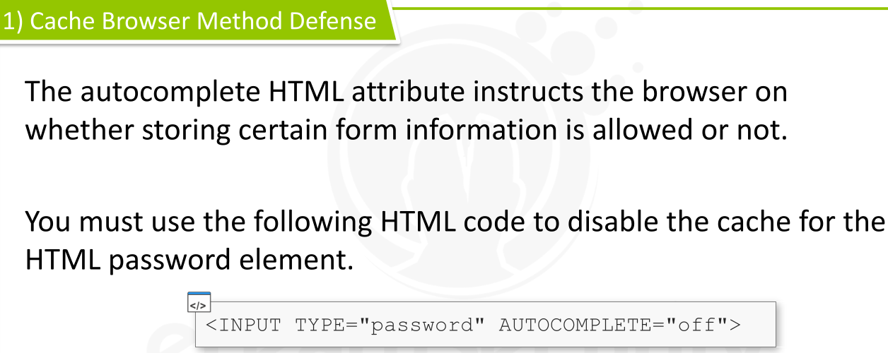

[TOC]

### Introduction


* Authentication is the process of determining whether someone is really who they claim to be.

* This protection mechanism ensures that contents are accessed only if the user or the application has the rights to do so.

* Example

  * Web Applications often rely on *username* and *password*  pair to authenticate users
  * This is the easiest way to authenticate

* Authentication VS  Authorization

  * **Authentication** 
    * is the process of verifying **who you are**
  * **Authorization**
    * is **what you are able to do**

* > Authorization attacks have to do with accessing information that the user does not have permission to access

* ### Authentication Factors

  * 
  * 

* ### Single Factor Authentication

  * **Single-Factor Authentication** method requires a user to provide *one* of the 3 authentication factors above
  * Most common method used by web applications that offer simple services
  * Require - a user provides only the password (ownership factor) for the system to authenticate them

* ### Two Factor Authentication

  * **Two-Factor** [or multi-factor authentication - *MFA*]  Authentication system requires a user to provide *two* or more of the three authentication factors
  * Example - In ATM Machine, we use 2 factors
    * Something we know = the PIN
    * Something we have = the credit/ATM Card
  * These days mobile phones are popular and web applications use it as the 2nd Factor  after the password
  * Web Application *send SMS message* to the USER [or use their own mobile application] with the PIN that the user must type on the website.
  * Real World Example -> Google's 2 step verification


---


### Common Vulnerabilities


**First with ** *single-factor* Authentication

Most commonly-used factor - **the knowledge factor**


* ### 1. Credentials Over Unencrypted Channel

  * A web application requiring authentication of its users [usually username and password pair ] must be cognizant of the way in which data is transferred in or out.
  * 

* ### 2. Inadequate Password Policy

  * Passwords represent a critical aspect of the authentication system.

  * A simple password can be easily guessed

  * short password with a special character can be easily **brute-forced**

  * Long password can be guessed, if it is a dictionary word, using a **dictionary attack**

  * So, if a password does not adhere to a strong password policy, it is exposed to attacks such as:

    * 
    * 
    * 
    * 
    * 
    * 

  * ### Defending from Inadequate password policy

    * 
    * 
    * 

* ### 3. User Enumeration

  * Web Application Authentication mechanism accept **user identifier**  and a **secret word (password)** , known by only the user
  
  * A user can correctly authenticate to the system only if the credentials [both user and password] are correct
  
  * A badly designed system can reveal *sensitive information* even if **wrong credentials have been inserted**
  
    * Example -> a web application could reveal information about the existence of a user
    * Determining valid usernames means  half battle won as then we need only the password after getting username
  
  * ### 1. User Enumeration via error messages
  
    * 
    * 
  
  * ### 2. User Enumeration via website behavior
  
    * Some applications may not display the previous messages but have a distinct behavior depending on user existence
    * An attacker that identifies these behaviors may attack the web app via user enumeration
    * Examples =>
      * 
  
  * ### 3. User Enumeration via timing attacks
  
    * Most of the time, when a user exists in the database there will be more processing.
    * Example
      * **User does not exist in the DB:** show error + abort
      * **User exists in the DB:** retrieve user, calculate password, check if the password matches
    * Because of this, it may be possible to perform user enumeration by timing how long it takes to the application to send a response
  
  * ### 4. Taking advantage of User Enumeration
  
    * This type of vulnerability can be exploited and allow an attacker to discover whether a user is present on the system.
  
    * Once this information is available to the attacker, he can perform any attack requiring the username component, such as:
  
      * A **dictionary (or brute-force)** attack against the password to discover the user's password
      * A **password reset** for that user if the system suffers from a weakness in the *password reset feature*
  
    * We can automate this username enumeration process with tools using **Burp Suite** and can be re-used for password cracking purpose once we get list of *existing usernames*
  
    * So, First we need to determine - whether the target website is vulnerable or not
  
    * 
  
      * We need to look for **differences** between 2 **Different** cases, not only  in the  web page's visible content but also the *URL, cookies or web page source*
      * Any difference can be fingerprinted and used at our disposal to differentiate a correct from an incorrect guess
      * We can use -> Burp Suite Feature -> **Burp Comparer** => that finds visual differences between 2 *responses*
  
    * ### Spot the Difference
  
      * In Burp Suite -> Define scope -> **Target** tab -> click on **Filter** -> check **show only in-scope items**
      * In browser -> make 2 subsequent login requests ->
        * one using a valid username (we should have at least one valid username to start our enumeration attack)
        * and another using a bogus one
      * 
      * 
      * 
      * 
      * 
  
    * ### Enumerating Usernames
  
      * Now, after spot the difference , lets send the request to **Burp Intruder** to fuzz the application using wordlists or brute-force attacks
      * 
      * 
      * 
      * 
      * 
      * 
      * 
      * 
      * 
      * Check in **Invalid Password** column => valid match for that pattern in the web page content/headers
      * Just save this information for later use to try brute-force passwords instead of username
  
  * ### 5. Default or Easily-Guessable User Accounts
  
    * Also take a look on Default Credentials => known usernames and passwords that may be present in some software packages and require explicit user interventions to be removed or changed
    * 
    * Many open source web applications [like CMSs] are provided with predefined user accounts. 
      * The administrator might forget to change these account credentials
      * In this case, an attacker can easily use the default credential to log in to the system by simply **reading the application documentation**
    * **In Other Cases, a web developer could create test user accounts and forget to delete them**
      * These accounts can be easily guessed if the developer applies an inadequate policy to generate the credential pair.
    * 
  
  * ### 6. Remember Me Functionality
  
    * Having users login each time is inconvenient, so for this reason  nowdays many websites implement **Remember Me** feature
  
    * When this feature is in place, and after successful user  authentication, the web application does not ask the user to log in (usually for a specified period of time)
  
    * 
  
      
  
      
  
    * ### Cache Browser Method
  
      * The password input element, as with any other sensitive information, **must not be cached.**
  
      * If the attacker can access the *browser cache*, then can be able to steal the password
  
      * Typical Scenario - public internet cafe, where a pc is accessed by different people
  
      * The cache browser method relies on **HTML Syntax**
  
        * ```
          HTML Code  to enables the browser to cache the password
          
          INPUT TYPE="password" AUTOCOMPLETE="on"
          ```
  
    * ### Cookie Method
  
      * This method makes use of cookies to store credentials; therefore , the password will be stored in a cookie and sent through the HTTP Cookie Header
      * Alternatively, a token might be stored in the Cookie, this is a better feature
        * as the token can be given an expiration that is much shorter than the expiration of the user’s password.
      * 
      * 
  
    * ### Web Storage Method
  
      * A web developer could rely on local storage to store credentials.
      * The developer would use the API call **localStorage.setItem()**  to add an item containing credential data to local web storage.
      * Web storage is a data container accessible and writable by all pages sharing the same origin
        * so, an attacker could access web storage after a successful XSS attack
      * If the password has been stored unencrypted, the attacker could obtain the victim’s password.
  
      
  
      
  
      
  
      
  
    * ### Best Defensive Techniques
  
      * 
      * 
      * 
  
    
  
    
  
    
  
    
  
    
  
  * ### 7. Password Reset Feature
  
    * Users who forget their passwords must have a proper and safe way  to reset it.
  
      * The issue, unfortunately, is that they have forgotten the only piece of data that could authenticate them against the web  application.
  
    * Depending on the criticality of the web application, there are many approaches to implementing a good reset feature.
  
    * Generally
  
      * *It is implemented by sending an email to the user with a new password*
        * OR
      * *a link to trigger the password reset function.*
  
    * As a first step, a web application could ask one or more secret questions before sending the email.
  
    * ### 1. Easily Guessable Answers
  
      * Secret questions are a critical component in authentication mechanism
      * When implemented, they are set by the account owner during the account setup phase and will be used during a password reset process.
      * They are just like "another password", and they are usually the *weakest link in the authentication system.*
      * They should be known only by the owner of the user account and should not be guessable by others
      * The secret question is chosen by the user during the setup of his account; a web application cannot control the secret question, but can suggest recommendations to the user to avoid easily guessable answers.
      * But there could be vulnerability arise
      * To avoid dictionary or brute force attacks, the web application must limit the answer attempts and then block the requests coming from a malicious user.
      * This feature can be easily implemented by counting a user’s incorrect attempts and blocking the IP after several consecutive tries.
        * But, **an IP can always be changed by the attacker through proxies or the *TOR* network.**
      * 
  
    * ### 2. Unlimited Attempts
  
      * A web application should never allow unlimited attempts to  answer a secret question.
      * An attacker could try a dictionary or brute-force attack to guess the answer.
  
    * ### 3. Password Reset Link
  
      * In many password reset implementations, the password reset protocol requires the user to click a link which triggers the password reset.
  
        * usually received via email
  
      * 
  
      * 
  
      * 
  
      * ### 1) Guessable Password Reset Link
  
        * The link triggering the password reset does not contain a random token and it is easily guessable; in most cases, it contains only reference to the user requesting the password reset action.
        * A link structured this way can be easily created by an attacker and  used to reset the password of arbitrary users.
        * 
  
      * ### 2) Recyclable Password Reset Link
  
        * In a recyclable link, the link triggering the password reset can be used more than once.
        * If an attacker obtains it, he can reset the victim’s password even if the link has been already used.
        * This means that a random token in the password reset link is not enough; it should also be discarded once it has been used.
  
      * ### 3) Predictable Password Reset Token
  
        * With a predictable token, even if a token is used within the link, if it is not a “good” random number, it is still a security issue.
        * Example ->
          * a counter would not be a good token, and the same applies to a timestamp
          * An attacker could guess which token will be assigned next and build a link to reset the victim’s password.
        * The token must be unpredictable and discarded, once used.
  
    
  
    
  
    
  
    
  
  * ### 8. Logout Weaknesses
  
    * **Logout** refers to the end of a valid web session
  
    * When User logs out from the web application then this event occur [Logout Event]
  
    * Another logout could occur when the user does not perform an action for a certain amount of time 
  
      * and the application automatically frees up the resources allocated to that session.
  
    * From the web server perspective, a logout event must correspond with the de-allocation of the session data, **including the *sessionID* **
  
    * If web server does not destroy - session data -> then it can be re-used
  
    * An attacker, after gaining a session token used by the victim, could impersonate his account even if the related session had been correctly logged out of by the victim.
  
      
  
      
  
      
  
      
  
      
  
    * ### 1) Incorrect Session Destruction
  
      * 
  
    
  
    
  
    
  
    
  
    
  
    
  
    
  
  * ### 9. CAPTCHA
  
    * CAPTCHA => **Completely Automated Public Turing test to tell Computers and Humans Apart.**
    * Purpose => **to determine and differentiate humans from bots, by having the human solve a picture puzzle**
      * 
    * Issue with CAPTCHA Challenge-response schema => not easy to create it from scratch
      * So, this introduce new security issues sometimes
      * This also applies to 3rd-party CAPTCHA schemas too
    * Weak CAPTCHA  implementations  led to 
      * **bypassing authentication**  [https://www.cvedetails.com/cve/CVE-2014-9283/]
      * **XSS**  [http://www.cvedetails.com/vulnerability-list/vendor_id-2337/product_id-12975/year-2008/opxss-1/Wordpress-Captcha.html]
      * **SQLi**  [http://www.exploit-db.com/exploits/17728/]
      * and much more
    * 
    * 


---


### Bypassing Authorization


* Here, we try to access protected contents without actually *logging in*


* ### Vulnerability 1 - Insecure Direct Object References [IDOR]

  * Web application provides 

    * = a set of public [or anonymous] pages accessible by all visitors and  
    * = a set of protected pages only accessible by authorized users  (usually after a login)

  * If Web Developer  does not set proper controls on each protected page, these resources could be accessed even by unauthorized users.

  * In IDOR

    * attacker can simply visit a link to the resource with any browser or change a parameter value that directly refers to another object

  * This type of vulnerability derives mainly from the web developer or system engineer’s negligence.

  * Very common in custom web application

  * ### Example

    * 
    * Here we are *authorized to view this report* , but not be **authorized to view other reports**
    * If by changing the **id** parameter , we able to see reports from other users, then there is **IDOR**

  * **A reference becomes insecure when the web application does not validate the related input parameters properly, and an attacker can manipulate them to access other objects.**

  * ### Best Defensive Technique

    * Each protected page must contain a prologue.
      * The prologue is a block of code written in a server-side scripting language
        * (**PHP, ASP.NET , JAVA**)
    * Goal of prologue => 
      * to determine if the users are authorized to access the resource and in case they are not terminate script execution which prevents the unauthorized access from happening
    * 

  

  

  

  

  

* ### Vulnerability 2 - Missing Function Level Access Control

  * Missing Function Level Access Control - MFLAC -> known as => **Failure to Restrict URL Access**
  * An attacker can change a parameter or the URL in order to access privileged functions
    * not an object like IDOR case
  * Attackers can usually guess links or bruteforce URLs to find unprotected pages.
  * Example 1
    * URL for the management interface of a website or for the back-end XML of a web application:
      * http://mysite.site/admin/manage.php
    * If a non-admin user can access the page, the flaw exists.
  * Example 2
    * a parameter used to specify the functions to invoke.
    * The flaw exists if there is no mechanism to enforce who can invoke specific functions.

  

  

* ### Vulnerability 3 - Parameter Modification

  * Sometimes web developers make use of fixed parameters to provide access to protected pages.

  * If no other control is provided, an attacker could take advantage of this vulnerability to access the protected contents.

  * ```
    NOTE
    
    user-controllable input in PHP would be anything coming from
    
    	$_GET , $_POST , $_FILE , $REQUEST , $_COOKIE and some sections of $_SERVER
    ```

  * #### Example 

    * Suppose there is a web application requiring credentials at
      * http://www.elsfoo.com/login
    * If user provides **correct credentials**, they will be *redirected* to the page (containing protected contents)
      * http://www.elsfoo.com/index.php?auth=TRUE
    * If user provides **no credentials or incorrect credentials**, they will be  *redirected* to the page  (containing public contents)
      * http://www.elsfoo.com/index.php?auth=FALSE

  * The fixed parameter is **auth**, in above example, and it is used by the web application to distinguish between authenticated and non-authenticated sessions

  * An attacker can easily change the *parameter* **auth** to **TRUE**.

    * Since, the web application considers only the **auth** parameter to  determine if a request is authenticated or not, the attacker will be able to access protected contents.

  

  

  

  

  

* ### Vulnerability 4 - Incorrect Redirection

  * When a user attempts to access a resource meant to be protected, it is common behavior to be redirected to a web page prompting for valid credentials or simply showing an error message.

    * this feature is implemented by using the **Location HTTP Header**, 
      * a web application that wants to redirect a user to a new page inserts this header (with the new page location) into the HTTP Response

  * ### Scenario 1 - Redirect to protect contents

    * The user requests protected contents at the following page:
      * http://www.elsfoo.com/getPersonalData.php?user=bob
    * Because the user is not authenticated, he or she will receive an HTTP response including the following header:
      * Location: http://www.elsfoo.com/login
    * The user’s browser will analyze the header of the HTTP response and will perform a new **GET**  request to the new page (**login**)  without showing the content body of the first request.
    * The web browser, after receiving the HTTP response with a **Location** header,  will not process the rest of the HTTP response and will issue a new HTTP GET request to the new page (**/login**)
    * The web browser will not show the body of the HTTP response if it contains a **Location** header, but this does not mean that the body is not there!
    * It could actually have been received by the client, and it can contain useful information for a malicious user or a penetration tester; 
      * this happens because the developer has forgotten to terminate the server script execution right after the redirect.
    * The user is requesting the page **getPersonalData.php** (the protected page) to retrieve the personal data of the user **Bob**.
    * In this case, the request was performed by a non-authenticated user
    * 
    * 

    

    

  * ### Best Defensive Technique

    * A web developer using a redirect to protect content must remember to terminate the script execution after inserting the redirect statement.
    * This can be implemented in many ways depending on the scripting language ( PHP , ASP.NET , Java , etc.).
    * 
    * 

  

  

  

  

  

* ### Vulnerability 5 - SessionID - Prediction

  * Web Application manage authentication by assigning a unique token to each  authenticated session
  * This session token => known as => **Session Identifier**
    * This token will be sent by  the server to the user after a successful login
      * then it will be re-sent by the user in subsequent HTTP requests ( embedded in the URL or in the cookie)
  * 

  

  

  

  

* ### Vulnerability 6 - SQL Injection

  * 

  

  

  

* ### Vulnerability 7 -  Local File Inclusion and Path Traversal

  * 
  * 
  * 
  * 
  * 
  * 


----


