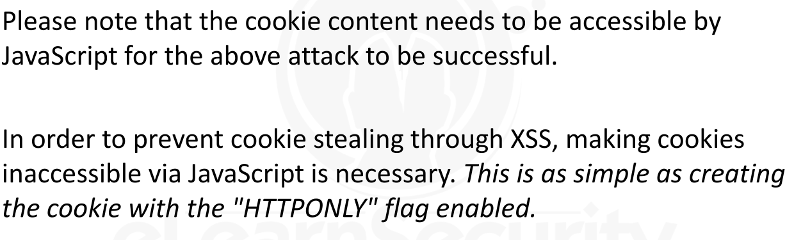
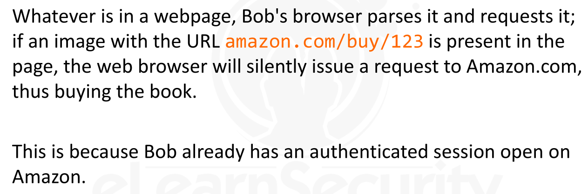

[TOC]

### Weaknesses of the Session Identifier


* Web application  use login page  and keep track User Session
  * So, that user don't login each time when visit to web application
* HTTP is a stateless protocol, so web application use
  * libraries, cookies to keep track of the user session
* 
* 
* 
* 
* 


---


### Session Hijacking


* It is the **exploitation of a valid session assigned to a user**

* The attacker can get the victim’s session identifier using a few different methods, though typically an XSS is used

  * ```
    NOTE:
    
    
    If the session identifier is weakly generated, the attacker might be able to brute-force the Session ID
    ```

* 

* 


* ### Session Hijacking via XSS

  * Session Hijacking is only **one**  of the many possibilities of a successful XSS exploit.

  * 

  * ### Example

    * Suppose we got XSS on a target - **elsfooradio.site.**  on  Comment Field
    * 
    * 

  * ### Preventing Session Hijacking via XSS

    * 
    * 
    * 
    * 
    * 
    * 
    * 


* ### Session Hijacking via Packet Sniffing

  * This attack requires the attacker to be able to sniff the HTTP Traffic of the victim
    * unlikely to happen for a remote attacker
    * but it is feasible on a local network if both the attacker and victim are present
  * If HTTP traffic is encrypted through **IPSEC** or **SSL** , the session token will be harder (if not possible) to obtain
  * 
  * 


* ### Session Hijacking via Access to the Web Server

  * Session data is stored in either the **web server's file system** or **in memory**
  * If an attacker obtains full access to the web server, the attacker can steal the session data of  all users 
    * not *just* the session identifiers
  * 
  * 
  * 
  * 


---


### Session Fixation


* Session fixation is a session hijacking attack where,  the attacker **fixates** a **sessionID** and forces the victim to use it (after the user logs in).
* The attack can be divided into two phases:
  1. The attacker obtains a valid sessionID
  2. The attacker forces the victim to use this sessionID to establish a personal session with the web server
* Attacker not interested in **~~stealing the sessionID~~**  , instead attacker creates one of its own and forces the victim to use it
* 
* 
* 
* 
* 
* 


* 
* 
* 
* 
* 


* 
* Best technique to defend application from Session Fixation attacks is to generate a **new** *sessionID* after any authenticated operation is performed.
* Most of the time, however, it is sufficient to destroy and re-generate a new session upon successful login.
* Server-side scripting languages provide different libraries and built-in functions to manage sessions.
* 
* 
* 
* 


---


### Cross Site Request Forgeries [CSRF]


* CSRF exploits  a feature of internet browsing, instead of a specific vulnerability

* CSRF  is a vulnerability where a third-party web application is able to perform an action on the user's behalf

* It is based on the fact that web applications can send requests to other web applications, without showing the response.

* ### Example

  * 
  * 
  * 
  * 
  * 


* 
* All requests to a web application that do not implement an Anti-CSRF mechanism are automatically vulnerable.
* When a web application stores session information in cookies, these cookies are sent with every request to that web application 
  * (same-origin policy applies).
* This may sound odd, but storing session tokens in cookies enables CSRF exploitability 
  * (while, of course, storing session tokens into URLs enable other kind of exploits).
* **Tokens** & **Captchas** are the most commonly used *protection* mechanism


* 


* In 2005, we had to consider using Joomla as a CMS for Hacker's Center and retiring our old, hand-coded ASP-based CMS
* The first thing we realized when we took it for a drive was the presence of multiple CSRF vulnerabilities.
* The worst of them allowed us to have a super administrator, with an open session on his Joomla backend, uploading arbitrary files, post articles or even deface his own website.
* If only we could manage to force him into visiting a web page  containing the exploit payload...
* 
* 
* 
* 
* 
* 
* 
* 


* 


* Most common protection mechanism against CSRF exploit is -> **token**
  * Token -> a nonce (which is a number used once and discarded)  and makes part of the request required to perform a given action unpredictable for an attacker
  * This token can be implemented as an **MD5 hash** (or stronger) of some randomly-generated string
* 
* 
* 


* An attacker able to force the victim to request the forged URL, has  to provide a valid token.
* Two conditions may occur:
  *  The victim has not visited the page and, as such, has no token set in session variables at all
  * The victim has visited the page and has a token
* 
* 
  * 
* 


---


