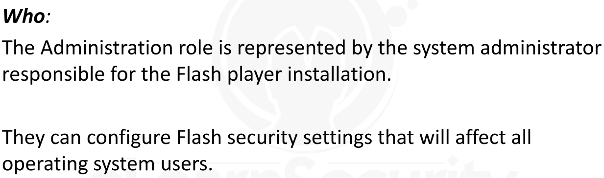
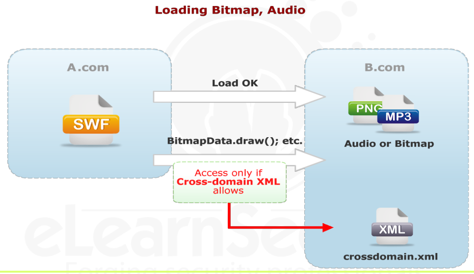
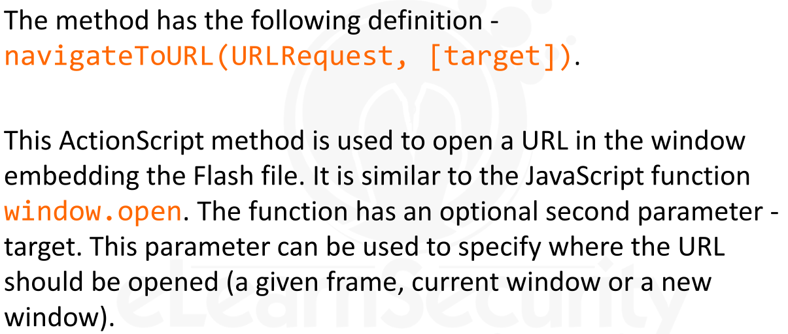

---


[TOC]

### Introduction


> Adobe Flash is technology => used to create video, animations and other rich content.

> Flash Files => can be used as standalone application or be embedded in HTML pages

> The contents can be developed using several tools:The contents can be developed using several tools:
>
> 
>
> * Adobe Flash Professional
> * Flash develop
> * Ajax Animator
> * Flash Minibuilder
> * etc


To build the logic of the application, Adobe provides a scripting language called => **ActionScript**

This language is based on **ECMA-262** specs and is very similar to JavaScript.


* ### Compiling and Decompiling

  * Flash ActionScript needs to be compiled before execution
  * The compiled object is in SWF format (Shockwave Flash).
  * Once Compiled -> it is very difficult to obtain the exact source code of the application
  * Many commercial tools known as **Flash decompilers** have been built for this purpose.
    * http://www.sothink.com/product/flashdecompiler/
    * http://www.flash-decompiler.com/


> To embed a Flash animation within a web page => can use object element with type **application/x-shockwave-Flash**

**Example**


* ### allowScriptAccess Attribute

  * The HTML page can embed the Flash animation and specify a **param** element with the **allowScriptAccess** to 
    * describe the policy for communication between the animation and the parent HTML page.
  * 


> 3 Methods by which we can pass arguments to **Flash files**


----


### Flash Security Model


> Sandbox and stakeholder are two important concepts in the Flash security paradigm.


* ### Sadboxes

  * 
  * The set of accessible resources comprises the Flash sandbox.
  * Access control is performed by stakeholders that can restrict or retract the default policies.

* ### Stakeholders

  * When a Flash animation is started by a player, different security controls are performed at different levels.

  * Stakeholders describe different roles (human or not) involved in the control of security settings.

  * 

  * 

  * 

  * 

  * 

    

    

  * 

  * 

  * 

    

    

  * 

  * 

  * 

  * 

  * 

  * 

  * 

  * 

  * 

    

    

    

  * 

  * 

  * 

  * 

    

    

    

  * 

  * 

  * 

  * 

  * 

  * 


* 
* When Flash animations are embedded in HTML pages, ActionScript code (available in the SWF file) can call the parent page’s JavaScript code by using the **ExternalInterface** class.
* example of JavaScript code execution launched by a Flash animation (Flash.SWF):
  * 
* When Flash animations are embedded in HTML pages, JavaScript code can call Actionscript code included in the embedded Flash file
* 


* 
* 
* 
* 


* 

* Flash features an internal storage mechanism based on Local Shared Objects.

* Local Shared Objects are similar to browser cookies:

  * They can be used to track user activity or to store preferences.
  * They are read-only by subdomains that have set them.

* 

* 

* 

* To create or retrieve a local shared object with ActionScript:

  * ```
    var myCookie:SharedObject = SharedObject.getLocal("information");
    ```

  * If the shared object information exists, its properties are retrieved and saved into the object **myCookie**; otherwise, an empty **sharedObject** will be created.


---


### Flash Vulnerabilities


* ### 1. Flash Parameter Injection

  * A Flash Parameter injection vulnerability occurs when:
    * The attacker can insert malicious code into the web application
    * The web application passes the input provided by the attacker to the Flash animation without any significant sanitization.
    * The Flash animation, embedded in the HTML page, does not  sanitize input parameters.
    * The SWF source code allows HTML injections or XSS.
  * 
  * 
  * 
  * 

  

  

  

* ### 2. Fuzzing Flash with **SWFInvestigator**

  * SWFinvestigator is an interesting tool which allows researchers to **analyze the quality and the security aspects of SWF files.**
  * It contains a fuzzer that searches for XSS vulnerabilities.
  * SFWInvestigator Features =>
    * 1. Actionscript 2/3 disassembling
      2. SWF tag viewing
      3. Local Shared Object (LSO) analyzing
      4. Dynamic function calling

  

  

  

  

* ### 3. Finding Hardcoded Sensitive Information

  * Many Flash developers believe that it is impossible to obtain the source code of the Flash application once compiled.
  * They are often misled by this idea, and may, in turn, hardcode information:
    * URLs of hidden resources 
      * Resources that should be hidden to regular users
    * Credentials of services
  * An attacker could use a decompiler to decompile the SWF files, obtain the source code and find credentials and other useful information.


----

 

### Pentesting Flash Application


* Main areas to check are:
  * Client-side components (SWF files and container page)
  * The Communication protocol between the client side player and the server-side components
  * Server-side components


* ### 1. Analyzing Client-Side Components

  * Static analysis of the SWF source code:
    * Obtain the source code of the SWF files and search for interesting hard-coded information
      * URL, credentials info, etc
    * Check if input parameters are sanitized
  * Analysis of the container page (generally the HTML page containing the Flash SWF file) :
    * Check the  **allowScriptAccess** parameter
    * Check if input arguments that will be passed to the Flash are sanitized.
  * Analysis of the website hosting the Flash application
    * Check if the policy file ( **crossdomain.xml** ) is configured properly
  * Search for common vulnerabilities
    * If the input is not sanitized, we must check whether an attacker can take advantage of it
    * Check for common vulnerabilities (HTML Injections, XSS)
    * We could use the  **SWFinvestigator’s XSS fuzzer.**

  

  

  

* ### 2. Identifying Communication  Protocol

  * A complex Flash application may make use of web services
  * So each request could be sent according to a given protocol:
    * SOAP
    * AMF
  * It define the structure of the requests [including our payloads] that we need to use to check server-side components


* ### 3. Analyzing Server Side Components

  * In order to enumerate all backend functions (services), we have to test each of them against common server-side vulnerabilities (SQL Injections, RFI etc)


----


