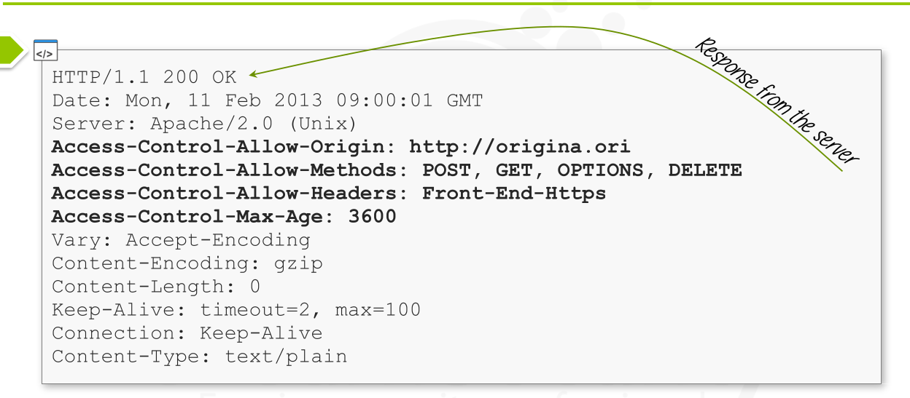
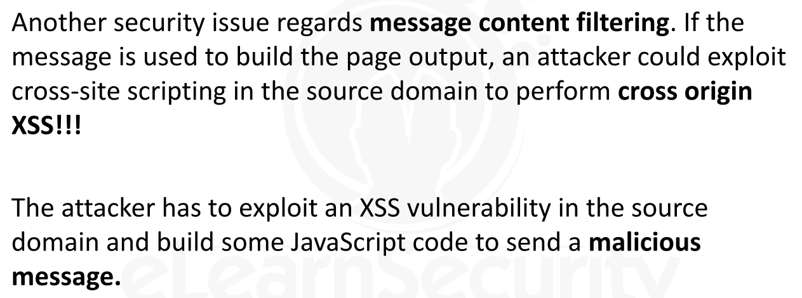
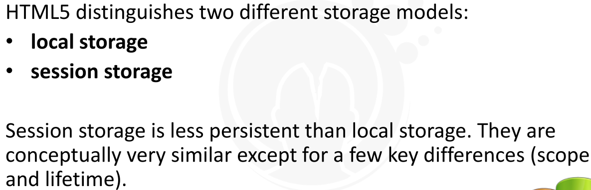
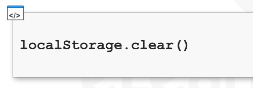

---


[TOC]


### CORS [Cross Origin Resource Sharing]


* 
* The **Same Origin Policy [SOP]**  is a policy implemented by browsers to 
  * prevent interactions between resources of different origin.
* CSS Stylesheets, images and scripts are loaded without checking the SOP
* The Same Origin Policy is consulted when **cross-site HTTP requests**  are initiated by client-side scripts
* Example
  * Browsers check the SOP when performing AJAX requests.
* 
* Although SOP is necessary for many reasons, it becomes very restrictive when two entities hosted on different domains **need to establish** some kind of interaction.
* Two different origins cannot interact one with each other even if they have mutual trust.


* 
* Within the Flash security model, a method to bypass the same origin policy has already been developed.
* 
* 


* 
* **CORS** is a mechanism that enables **client-side cross-origin requests**.
* Document describes how the browser and the web server must cimmunicate one with each other to *bypass* the **SOP**
* It als explains which HTTP headers must be used to do so.
  * These HTTP headers are not part of the HTTP/1.1 standard.
  * They are called **Control Access Headers** 
* 
* 
* According to [http://caniuse.com/] , currently, CORS is supported by all browsers except Opera Mini.


* JavaScript Code to perform a cross-origin AJAX request

  * ```
    function crossOriginXHRGet(){
    var xmlhttpr = new XMLHttpRequest();
    var url = 'http://originb.ori/page.html'; <- 
    	xmlhttpr.open('GET', url, true);
    	xmlhttpr.onreadystatechange = handler;
    	xmlhttpr.send(body);
    	}
    ```

  * Suppose **crossOriginXHRGet** function defined into the page at the URL **http://origina.ori/index.html**

* The Ajax request is cross-origin because the requester origin is different from the target origin:

  * Requester origin: http://origin**a**.ori
  * Target origin: http://origin**b**.ori

* Abiding by SOP, the function handler cannot use JavaScript to read the page contents at

  *  http://origin**b**.ori/page.html.

* This kind of access to a resource is possible only if the HTTP CORS headers are used and set properly.

* First, we need to know the different types of cross-origin requests that a browser can send.

* Depending upon the request type, the exchanged headers will vary. They are :

  * Simple Rrequests
  * Preflight Requests
  * Requests with credentials

* 

* 

  * 
  * 
  * 
  * 
  * 
  * 
  * 
  * 
  * 
  * 
  * 
  
* 

* 


* 

* Access control headers dictate how the browser has to treat cross origin requests.

* Headers :

  * Access-Control-Allow Origin
  * Access-Control-Allow-Credentials
  * Access-Control-Allow-Headers
  * Access-Control-Allow-Methods
  * Access-Control-Max-Age
  * Access-Control-Expose-Headers
  * Origin
  * Access-Control-Request-Method
  * Access-Control-Request-Header

* ### 1. Header => Access-Control-Allow-Origin

  * **Access-Control-Allow-Origin** is the most important HTTP response header

  * It's set by target origin to allow access from a specific requester origin

  * Format => 

    * ```
      Access-Control-Allow-Origin: <allowedOrigin>
      ```

  * Example

    * 
    * 

  * The target origin can specify a **wildcard (*).**

    * This would permit external scripts hosted on any site to access resources from the target origin.

  * Example

    * 

  * A typical security issue occurs when an origin containing sensitive documents can be accessed by all origins.

  * This would permit an attacker to steal all information contained in the origin simply by getting the victim to visit a crafted website  under his control.

  

  

  

* ### 2. Header => Access-Control-Allow-Credentials

  * The **ACAO [Access-Control-Allow-Credentials** HTTP response header sent by the target origin to the requester indicates that the actual request can be made with credentials

  * By default -> the requester origin (requester's browser) does not send credentials to the target origin

  * 

  * ### Example

    * 
    * 
    * 
    * 

  * For security reasons, a target origin cannot specify that  **a resource is both accessible by any other origin and that it accepts credentials**

  * 


* ### 3. Header => Access-Control-Allow-Headers

  * The **Access-Control-Allow-Headers** HTTP response header is sent by the target origin to the requester during preflight request.
  * It indicates which non-standard HTTP headers can be sent in the actual request
  * 
  * 


* ### 4. Header => Access-Control-Max-Age

  * The **Access-Control-Max-Age** HTTP response header is sent by the target origin to the requester during preflight request.
  * It indicates how long the results of a preflight request can be cached.
  * 


* ### 5. Header => Access-Control-Expose-Headers

  * The **Access-Control-Expose-Headers**  HTTP response header sent by the target origin to the requester indicates which headers can be accessed by the browser
  * 


* ### 6. Header => Origin

  * A cross-origin request includes an extra HTTP header named **Origin**
  * This header is always sent and contains the origin (protocol, domain name, and port) of the request
  * Although it is always sent, it is useless for the authorization protocol.


* ### 7. Header => Access-Control-Request-Method

  * The **Access-Control-Request-Method** HTTP request header is sent by the requester origin during preflight requests.
  * It is sent within the **OPTIONS**  request and specifies what method the requester is going to use during the actual request.
  * 
  * The browser will analyze the  **Access-Control-Allow-Methods** HTTP response header to check whether the method is considered safe or not.


* ### 8. Header => Access-Control-Request-Headers

  * The **Access-Control-Request-Headers** HTTP request header is sent by the requester origin during preflight requests.
  * It is sent with **OPTIONS** request and specifies which non-standard headers the requester is going to use during the actual request
  * 
  * 


---


### Cross Windows Messaging


> HTML5 allows *iframes, frames, popups and the current window* to communicate one with each other regardless of the same origin policy, by using  a mechanism as **Cross Window Messaging**


> So, Cross Window Messaging =>  realted to => **iframes,frames,popups and current window** => to communicate with each other => with keep in mind about *SOP*


> When using this feature, two windows that have some kind of **relationship** can exchange messages.


* ### Relationship between Windows

  * Typical **relationships** between two windows are:
    * A main window including an iframe
    * A main window including some HTML code that generates a popup
  * A window or a tab in our browser cannot interact with other windows unless they have a relationship.

* ### Sending Messages

  * A window can send messages to another window by using the **postMessage** API call
  * The sender window **(hosted at http://domain1.com)**  will run some code similar to the following.
    * 

* ### Receiving Messages

  * Analogously, a window is allowed to receive messages from another window if a handler, related to the message event, has been installed.
  * 

* ### Security Issues

  * Security Issues occurs when the receiver window does not check the origin of the sender when receiving a message

  * With this poor configuration,  the receiver window could interact with any sender regardless of whether it is trusted or not.

  * 

  * 

  * 

    

    

    

    

    

  * ### Cross Domain XSS

    * 


----


### Web Storage


> HTML5 allows websites to **store data locally** in the browser.

> This is done by accessing  the **localStorage**  and the **sessionStorage**  objects via JavaScript.


> The concept of persistent data in the browser environment could mistakenly lead us to associate this type of storage with cookies.





* ### Local Storage

  * Local storage is a **persistent** JavaScript object used as local repository.
  * 
  * 


* ### Session Storage

  * 
  * 
  * 


* Local storage can be accessed via JavaScript through the **localStorage object.**

* Web developers do not need to manage this storage directly, but they can add and remove elements using the web storage API.

* ### Adding an Item

  * We can **add** an item to **localStorage**  by using the  **setItem** API call by providing a key and a value for inserted element
  * 
  * So ,  setItem = Add Item = with key and value pair

* ### Retrieving an Item

  * To **retrieve** an item from the **localStorage**,  we can use thee **getItem** API call => specifying the key of the element we want to retrieve
  * 

* ### Removing an Item

  * To **remove** an item from the **localStorage**, we can use **removeItem** API Call
  * 

* ### Removing all Items

  * To **clear** the **localStorage** content,  we can use **clear** API Call. => All items in the **localStorage** will be deleted
  * 


* Session storage can be accessed via JavaScript through the  **sessionStorage** object
* Web Developers can manage the **sessionStorage** via the same API interface of the **localStorage**:
  * setItem
  * getItem
  * removeItem
  * clear


* ### Security Issues

  * 

  * 

    

    

    

  * 

  * 


---


### Web Sockets


> During the evolution of the web, the need for low latency and high throughput applications such as social network chats emerged.


> In past, these applications were relying on polling done by means of standard HTTP Requests


> This method had a huge overhead on the network and added latency issues.


> To overcome these limitations, **W3C** group make new protocol to meet real-time web application needs => **WebSockets**


* ### WebSocket Benefits

  * 


* ### WebSocket API

  * 
  * 


* 
* **WebSockets** do not create security pitfalls per se, as much as HTTP does not pose security issues
* What they carry from a domain to another one is a completely different thing.
* If developers **do not sanitize**  the content of the message exchanged  via **WebSockets**, could permit be used to perform a variety of attack such as **XSS, localStorage stealing, SQLi and more depending on the specific web application**


---


### Sandboxed Frames


> 
>
> 
>
>
> Security issues which fixed with HTML5 


* ### 1. Redirection

  * A classic issue occurs when a website hosts 3rd-party contents through **iframes**

  * Despite **SOP** , the *location* property  of each document is always *writable* (location is an exception to the SOP)

    * this could be dangerous for the website which includes an iframe
    * 

  * ### Examples

    * 
    * 
    * 

  * ### Prevention

    * Install  a special event (**onbeforeunload**) in the main document hosting the iframes
    * The event  will be triggered when the attacker's iframe tries to change the parent document location property
    * By using this technique, the main document can only inform the  visitor that the page is being changed.
      * 
    * This is not a real solution
      * however, it is a way to inform the visitor that someone is trying to redirect him.
      * It actually does not even block the redirection


* ### 2. Accessing the Parent Document from the Iframe

  * If the **main document** and the **iframe** are *located* on the **same origin**, they can access each other
  * The **iframe** document could *change* the contents of the **main document**, using the same technique used by the  *defacement-via-XSS* attack family
  * 
  * This could be dangerous in the presence of multiple vulnerabilities.
  * For example, in a scenario where:
    * the attacker succeeds in exploiting a persistent XSS in the **vulnerable.html** page
    * the **vulnerable.html** page is included through an iframe into  the **index.html** page
  * 
  * 
  * 
  * Before  HTML5, the main document was not able to prevent **iframe** from running *JavaScript*


> The **sandbox** attribute  is a new attribute of the element *iframe*


> It has been introduced by the HTML5  specs and it enables ->  **restrictions on iframe contents.**


---

